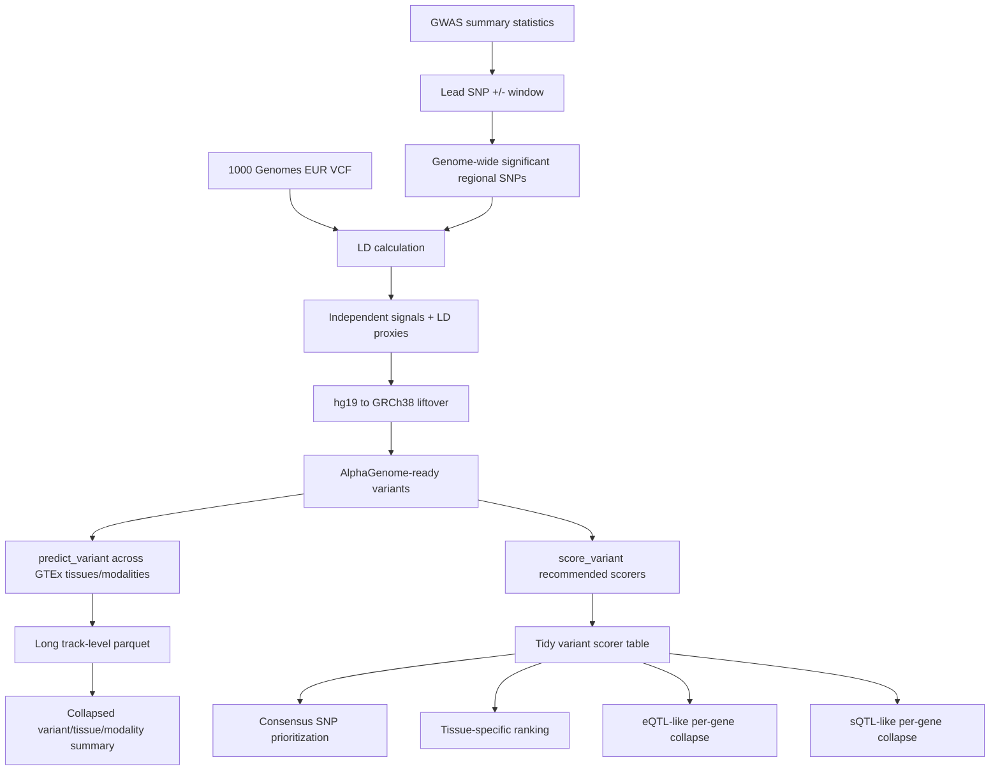

# alphagenome-test

> Python pipeline for prioritizing candidate variants at a GWAS locus using AlphaGenome regulatory effect predictions.

## Overview

`alphagenome-test` is a computational biology pipeline for following up a genome-wide significant estimated bone mineral density locus with AlphaGenome. Starting from GWAS summary statistics and a lead SNP, it extracts significant regional variants, identifies independent signals, collects LD proxies from 1000 Genomes European samples, lifts coordinates from hg19 to GRCh38, calls AlphaGenome across GTEx tissues and output modalities, and produces prioritized variant tables for downstream functional follow-up.

The project is a useful case study because it combines traditional genetics workflow steps with a modern sequence-to-function model. The engineering work is not only "call a model"; it includes genomic data preparation, coordinate-system handling, allele normalization, API checkpointing, long-format prediction storage, calibrated variant scorers, consensus ranking, and eQTL/sQTL-style result collapses.

## Table Of Contents

- [Problem Statement](#problem-statement)
- [Features](#features)
- [Access And Getting Started](#access-and-getting-started)
- [Tech Stack](#tech-stack)
- [Architecture](#architecture)
- [Pipeline And Workflow](#pipeline-and-workflow)
- [Project Structure](#project-structure)
- [Configuration](#configuration)
- [Testing And Validation](#testing-and-validation)
- [Security And Privacy](#security-and-privacy)
- [Key Design Decisions](#key-design-decisions)
- [Tradeoffs](#tradeoffs)
- [What I Learned](#what-i-learned)
- [Next Improvements](#next-improvements)
- [Contribution Model](#contribution-model)
- [License](#license)
- [Acknowledgements](#acknowledgements)
- [Author](#author)
- [Links](#links)

## Problem Statement

GWAS can identify disease- or trait-associated loci, but the lead SNP is not always the causal variant. A significant locus often contains multiple correlated variants, regulatory elements, nearby genes, and tissue-specific mechanisms. For noncoding or regulatory loci, the follow-up question becomes: which variants are most likely to change molecular function, in which tissue, and through which modality?

The pipeline decomposes that problem into a reproducible analysis:

1. Load published GWAS summary statistics for the target locus.
2. Identify genome-wide significant SNPs in a window around the lead SNP.
3. Use 1000 Genomes European samples to estimate LD.
4. Clump regional signals into independent index SNPs.
5. Collect high-LD proxy variants for each independent signal.
6. Lift variants from hg19 to GRCh38 for AlphaGenome compatibility.
7. Reverse-complement alleles when liftover changes strand.
8. Run AlphaGenome `predict_variant()` across GTEx tissues and available output modalities.
9. Summarize local reference-versus-alternate deltas around each variant.
10. Run AlphaGenome recommended variant scorers with retry/checkpoint support.
11. Rank SNPs by scorer-specific and consensus effects.
12. Collapse gene-linked RNA/splicing signals into eQTL-like and sQTL-like tables.

## Features

- Locus-centered GWAS summary-statistics parsing.
- LD clumping with configurable thresholds.
- 1000 Genomes Phase 3 European sample filtering.
- Remote VCF slicing through `bcftools`.
- Biallelic SNP and MAF filtering.
- Union of high-LD proxy variants across independent signals.
- hg19-to-GRCh38 liftover using `pyliftover`.
- Strand-aware allele reverse-complement handling.
- AlphaGenome API calls through the official Python client.
- Enumeration of GTEx tissues from AlphaGenome output metadata.
- Calls across all available output modalities in the installed client.
- Local window summarization around each variant.
- Long-format parquet output for track-level predictions.
- Collapsed per-variant/tissue/modality CSV summaries.
- Checkpoint/resume support for expensive API calls.
- AlphaGenome recommended variant scorer workflow.
- Consensus SNP ranking across scorers.
- Tissue-specific prioritization tables.
- Per-SNP-per-gene eQTL-like and sQTL-like score tables.

## Access And Getting Started

Source repo: [aa9gj/alphagenome-test](https://github.com/aa9gj/alphagenome-test)

Typical setup:

```bash
git clone git@github.com:aa9gj/alphagenome-test.git
cd alphagenome-test
pip install pandas numpy cyvcf2 pyliftover alphagenome pyarrow
```

Required external resources include:

- GWAS summary statistics for the locus being analyzed.
- UCSC hg19-to-hg38 liftover chain file.
- `bcftools` for remote 1000 Genomes VCF slicing.
- AlphaGenome API key in `ALPHA_GENOME_API_KEY`.

Run order:

```bash
python 01_prepare_snps_for_alphagenome.py
python 01B_liftover_hg19_hg38.py
python 02_run_alphagenome_alltiss_allmodal.py
python 02B_recollapse_from_long.py
python 03_score_variant.py
python 04_rank_prioritization.py
python 05_collapse_eqtl_sqtl.py
```

## Tech Stack

| Area | Stack |
|---|---|
| Language | Python |
| Data handling | pandas, NumPy |
| Variant/VCF processing | cyvcf2, bcftools |
| Coordinate liftover | pyliftover, UCSC chain files |
| Variant effect model | AlphaGenome Python client |
| Genomic model objects | `alphagenome.data.genome` |
| Variant scoring | AlphaGenome recommended variant scorers |
| Output storage | CSV, parquet, pyarrow |
| Reference data | GWAS summary statistics, 1000 Genomes Phase 3, GTEx metadata exposed by AlphaGenome |
| Robustness | retry loops, checkpoint CSVs, resume-aware scripts |

Deeper stack notes: [stack.md](stack.md).

## Architecture



The architecture keeps model calls downstream of genetics preprocessing. That matters because AlphaGenome needs GRCh38 coordinates and allele-consistent variants, while GWAS summary statistics and LD references may start in hg19.

Full architecture notes: [architecture.md](architecture.md).

## Pipeline And Workflow

| Stage | Purpose |
|---|---|
| Regional variant extraction | Load GWAS summary statistics and identify significant SNPs near the lead SNP |
| LD proxy selection | Use 1000 Genomes EUR samples to clump signals and collect high-LD proxy variants |
| Liftover | Convert hg19 coordinates to GRCh38 and fix strand-flipped alleles |
| AlphaGenome prediction | Run `predict_variant()` across GTEx tissues and output modalities |
| Recollapse | Rebuild collapsed summaries from long parquet without re-calling the API |
| Variant scoring | Run AlphaGenome recommended scorers through `score_variant()` |
| Ranking | Aggregate scorer-specific rankings into consensus and tissue-specific prioritization |
| eQTL/sQTL collapse | Convert tidy scorer rows into per-SNP-per-gene RNA/splicing signal tables |

Full pipeline notes: [pipelines.md](pipelines.md).

## Project Structure

The repo is intentionally script-based, with numbered stages that pass files through the working directory.

Detailed project map: [project-structure.md](project-structure.md).

## Configuration

Important configuration surfaces include:

- `SUMSTATS`
- `LEAD_RSID`
- `WINDOW_BP`
- `GW_SIG`
- `CLUMP_R2`
- `PROXY_R2`
- `MAF_MIN`
- 1000 Genomes panel and VCF URLs
- liftover chain file path
- `ALPHA_GENOME_API_KEY`
- AlphaGenome window size
- local summary window size
- retry counts
- checkpoint frequency
- optional debug caps for variants and tissues

## Testing And Validation

The repo does not currently include a formal automated test suite. It does include important runtime safeguards:

- Required input files are checked before each stage.
- Required columns are validated before downstream processing.
- 1000 Genomes panel schemas are handled with fallbacks.
- Too-few selected European samples triggers a hard error.
- Missing lead SNP or missing seed variants stop the pipeline.
- Liftover failures are counted and excluded from GRCh38 output.
- API keys are required before AlphaGenome calls.
- AlphaGenome calls use retry loops with backoff.
- Prediction and scoring stages use checkpoint files so interrupted runs can resume.
- Long parquet output can be re-collapsed without new API calls.

The next validation step would be adding small synthetic GWAS/VCF/liftover fixtures and unit tests for LD calculation, allele normalization, liftover strand handling, variant input normalization, checkpoint loading, and ranking aggregation.

## Security And Privacy

This project uses public genetics resources, but it still requires care around API keys, local paths, downloaded GWAS files, generated predictions, and large intermediate data. The portfolio writeup focuses on architecture and avoids local machine paths or private credentials.

Full notes: [security-privacy.md](security-privacy.md).

## Key Design Decisions

| Decision | Rationale |
|---|---|
| Start with LD proxies, not only the lead SNP | Captures correlated candidate variants that may be more functionally plausible than the lead marker |
| Separate hg19 preprocessing from GRCh38 model input | Keeps GWAS/LD reference coordinates explicit while meeting AlphaGenome coordinate requirements |
| Include strand-aware allele handling | Prevents flipped liftover hits from producing wrong reference/alternate alleles |
| Query all GTEx tissues and output modalities | Lets downstream interpretation discover tissue/modality-specific signals rather than assuming them upfront |
| Store long parquet output | Preserves track-level model evidence for later re-analysis |
| Add collapsed summaries | Makes large model output easier to rank and review |
| Use recommended variant scorers | Leverages calibrated AlphaGenome scoring instead of only raw track deltas |
| Use checkpointing | Makes expensive, interruptible API workflows practical |

## Tradeoffs

- A script-based workflow is transparent and easy to inspect, but a workflow engine would make dependencies and reruns safer.
- Public GWAS and 1000 Genomes resources improve reproducibility, but external downloads and remote VCF streams can fail.
- Running all tissues and modalities is comprehensive, but API cost and runtime can be large.
- Long-format parquet preserves detail, but it can become large and requires parquet tooling.
- Rank aggregation gives a useful short list, but AlphaGenome predictions are functional hypotheses, not causal proof.
- Hard-coded local paths in source scripts make the first version quick to run, but should become config parameters for portability.

## What I Learned

- How to connect GWAS locus follow-up with sequence-to-function variant effect models.
- Why coordinate systems and allele orientation matter before model inference.
- How LD proxy selection changes the candidate variant set.
- How to design checkpointed API workflows for expensive genomics predictions.
- How to summarize model outputs across tissues, modalities, tracks, and genes.
- How to convert model scores into reviewer-friendly prioritization tables.

## Next Improvements

- Move all local paths and constants into a single config file or CLI interface.
- Add a `Makefile`, Snakemake workflow, or Nextflow wrapper for stage dependencies.
- Add synthetic test fixtures for LD, liftover, and ranking logic.
- Add API dry-run mode and call-count estimation.
- Add plots for top variants by tissue/modality/scorer.
- Add provenance metadata to every output table.
- Add optional gene annotation overlays for prioritized variants.

## Contribution Model

This is a personal research pipeline. Contributions should focus on portability, config cleanup, automated tests, workflow orchestration, provenance, and result visualization.

## License

No standalone license file was visible in the source repository snapshot I reviewed. The source README notes that AlphaGenome predictions are generated under Google DeepMind's terms.

## Acknowledgements

The pipeline builds on AlphaGenome, Google DeepMind, 1000 Genomes Phase 3, GTEx metadata, UCSC liftOver resources, bcftools, pandas, NumPy, cyvcf2, pyliftover, and pyarrow.

## Author

Arby Abood

## Links

- Source repository: [aa9gj/alphagenome-test](https://github.com/aa9gj/alphagenome-test)
- Portfolio index: [../../README.md](../../README.md)
