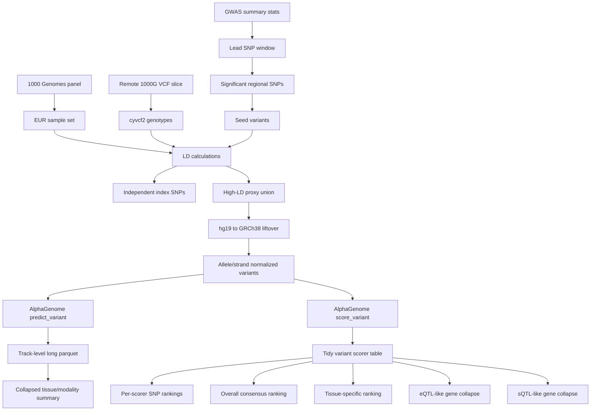

# Architecture

`alphagenome-test` is a staged regulatory-variant prioritization workflow. It starts with GWAS and LD evidence, transforms variants into AlphaGenome-compatible coordinates, then uses model predictions and variant scorers to generate prioritization tables.

## System Shape

## Layer Responsibilities

| Layer | Responsibility |
|---|---|
| GWAS parsing | Read summary statistics in chunks, normalize columns, identify lead and significant regional SNPs |
| LD processing | Use 1000 Genomes EUR samples to identify independent signals and high-LD proxies |
| Coordinate conversion | Lift proxy variants from hg19 to GRCh38 and handle strand flips |
| Model prediction | Call AlphaGenome across GTEx tissues and available output types |
| Model summarization | Store track-level outputs and collapse local reference/alternate deltas |
| Variant scoring | Run AlphaGenome recommended variant scorers for calibrated per-gene/per-track scores |
| Prioritization | Aggregate score ranks across scorers and tissues |
| Signal collapse | Produce eQTL-like and sQTL-like per-SNP-per-gene tables |

## Data Flow

1. `01_prepare_snps_for_alphagenome.py` defines the GWAS locus, extracts significant SNPs, downloads/uses the 1000 Genomes panel, streams a regional VCF, computes LD, and writes proxy variants.
2. `01B_liftover_hg19_hg38.py` converts proxy coordinates to GRCh38 and preserves allele correctness.
3. `02_run_alphagenome_alltiss_allmodal.py` normalizes variant inputs, discovers GTEx tissues from AlphaGenome metadata, calls `predict_variant()`, and writes long and collapsed outputs.
4. `02B_recollapse_from_long.py` rebuilds collapsed summaries from parquet if the collapse logic changes.
5. `03_score_variant.py` calls AlphaGenome recommended scorers and writes tidy score rows.
6. `04_rank_prioritization.py` turns score rows into per-scorer, consensus, and tissue-specific SNP priorities.
7. `05_collapse_eqtl_sqtl.py` filters scorer rows into RNA/splicing-focused per-SNP-per-gene tables.

## Robustness Patterns

| Pattern | Where It Appears | Why It Matters |
|---|---|---|
| Chunked GWAS reading | Step 01 | Handles large summary-statistics files |
| Schema fallback | 1000 Genomes panel parsing | Supports multiple panel-column formats |
| Input-column normalization | Model and scorer steps | Accepts common column aliases |
| Retry loops | AlphaGenome prediction/scoring | Handles transient API failures |
| Checkpoint CSVs | Prediction and scoring stages | Supports interrupted long-running runs |
| Recollapse utility | Step 02B | Avoids repeated API calls when summary logic changes |
| Runtime hard errors | Missing lead/API/input files | Prevents downstream silent corruption |

## Important Boundaries

- GWAS summary statistics are the source of association evidence.
- 1000 Genomes LD is used only to construct a candidate proxy set.
- AlphaGenome predictions provide functional hypotheses.
- Variant scorers and rank aggregation prioritize candidates, but do not prove causality.
- Final outputs are designed for biological follow-up, not final clinical interpretation.

## Interview Signal

This project shows:

- End-to-end regulatory variant follow-up from GWAS to model-based prioritization.
- Awareness of LD, reference builds, allele orientation, and tissue-specific interpretation.
- Practical API engineering for expensive genomics model calls.
- Large-output handling with parquet and collapsed summaries.
- Thoughtful ranking tables for downstream decision-making.
