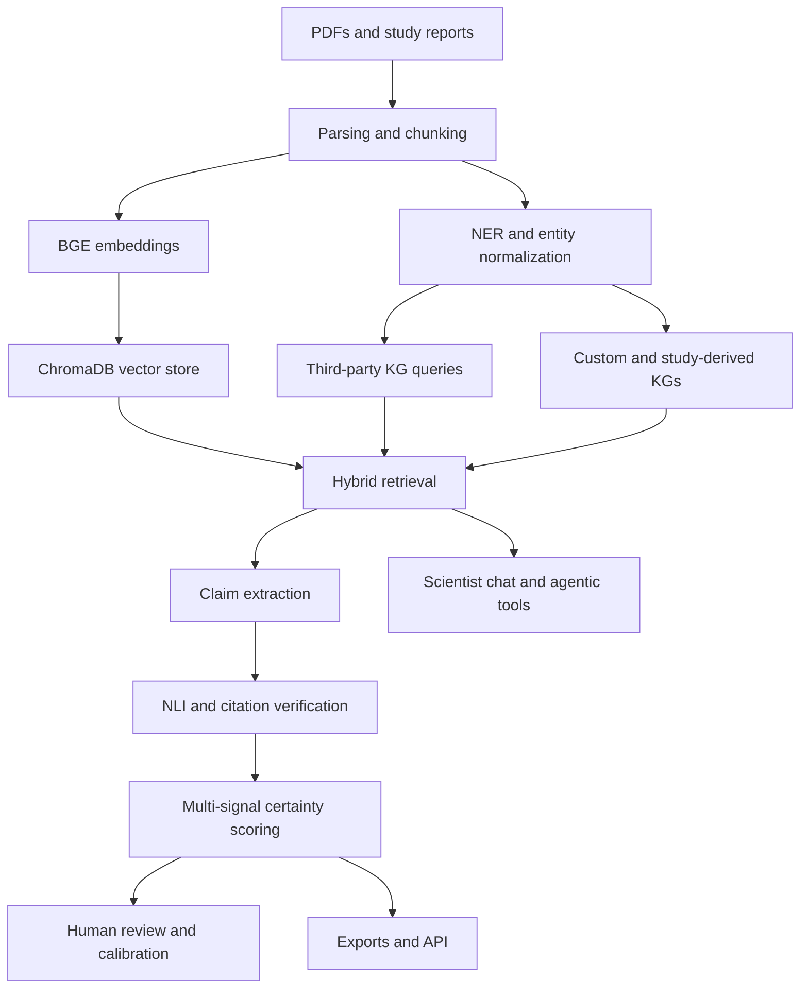

# Bio Claims App

> Biomedical claim extraction, GraphRAG grounding, and scientist-facing evidence review.

## Overview

Bio Claims App is a biomedical RAG platform that ingests scientific PDFs and study-report corpora, retrieves relevant evidence, extracts structured scientific claims, and grounds those claims against multiple third-party knowledge graphs.

The interesting engineering work is the hybrid architecture: vector search retrieves source text, entity normalization maps raw mentions to canonical biomedical concepts, third-party knowledge graphs provide independent structured evidence, and claim verification combines LLM extraction with NLI, graph support, citations, and human review.

This writeup is intentionally organization-neutral. It focuses on the reusable RAG, GraphRAG, claim verification, evaluation, and review architecture.

## Table Of Contents

- [Problem Statement](#problem-statement)
- [Features](#features)
- [Access And Getting Started](#access-and-getting-started)
- [Tech Stack](#tech-stack)
- [Architecture](#architecture)
- [Pipeline And Workflow](#pipeline-and-workflow)
- [Project Structure](#project-structure)
- [Configuration](#configuration)
- [Testing And Evaluation](#testing-and-evaluation)
- [Security And Privacy](#security-and-privacy)
- [Key Design Decisions](#key-design-decisions)
- [Tradeoffs](#tradeoffs)
- [What I Learned](#what-i-learned)
- [Next Improvements](#next-improvements)
- [Contribution Model](#contribution-model)
- [License](#license)
- [Acknowledgements](#acknowledgements)
- [Author](#author)
- [Links](#links)

## Problem Statement

Scientific teams often need to answer high-stakes biomedical questions from dense PDFs, tables, figures, study reports, and external biomedical knowledge bases. Plain RAG can retrieve useful passages, but it often lacks structured grounding, provenance, contradiction detection, and repeatable review workflows.

Bio Claims App treats the problem as a multi-evidence verification system:

1. Parse biomedical PDFs into searchable text, tables, figures, and metadata.
2. Embed source chunks for semantic retrieval.
3. Extract and normalize biomedical entities.
4. Query third-party knowledge graphs for corroborating, contradictory, or missing relationships.
5. Extract claims with citations and study metadata.
6. Score claims using multiple independent signals.
7. Route uncertain results into human review and calibration workflows.
8. Export validated claims in interoperable formats.

## Features

- PDF ingestion with chunking, embeddings, ChromaDB vector storage, and optional layout-aware parsing.
- Hybrid retrieval that combines vector search, entity normalization, and knowledge graph context.
- Domain-aware query routing that weights KGs differently based on the question's domain and intent.
- Third-party KG grounding across iKraph, FoodAtlas, GENA, MeNuGUIDE, Monarch, and HALD.
- Custom KG upload support for session-scoped entity-relationship triples.
- Study-derived internal KG support for GraphRAG retrieval expansion.
- Multi-hop graph pathfinding up to three hops for indirect biomedical relationships.
- Structured claim extraction with entity pairs, relationship types, evidence, study metadata, and citations.
- Multi-signal certainty scoring using source count, KG support, NLI, study quality, and embedding similarity.
- Citation verification and evidence provenance labels for body text, tables, figure captions, figure summaries, OCR, and mixed evidence.
- Human-in-the-loop claim review with accept/reject/modify actions, calibration feedback, and reviewer statistics.
- RAGAS-style evaluation, NLI verification, retrieval benchmarks, KG-grounding benchmarks, and PDF parsing benchmarks.
- Agentic research mode with tool calls for paper search, KG queries, claim verification, literature discovery, pathfinding, and hypothesis generation.
- Export formats including CSV, TSV, Nanopublication, RDF Turtle, BEL, and JSON-LD.
- FastAPI wrapper for programmatic access.

## Access And Getting Started

Source repo: [aa9gj/bio-claims-app](https://github.com/aa9gj/bio-claims-app)

The source README supports this local setup flow:

```bash
git clone git@github.com:aa9gj/bio-claims-app.git
cd bio-claims-app
python -m venv venv
source venv/bin/activate
pip install -r requirements.txt
cp .env.template .env
streamlit run app.py
```

The app requires model/API configuration and local paths for whichever knowledge graphs are enabled. GPU acceleration is recommended for local biomedical NER, embeddings, and layout-aware PDF parsing, but lighter fallbacks exist for some paths.

## Tech Stack

| Area | Stack |
|---|---|
| Runtime | Python 3.10+ |
| UI | Streamlit |
| API | FastAPI, Uvicorn |
| LLM access | LiteLLM with OpenAI-compatible models |
| Embeddings | BAAI/bge-base-en-v1.5 through sentence-transformers |
| Vector database | ChromaDB |
| Local storage | SQLite for evaluation, workspaces, chat history, caches, and ledgers |
| PDF parsing | pypdf, pdfplumber, pytesseract, pdf2image, optional Nemotron Parse VLM |
| Entity extraction | LLM NER, OpenBioNER, biomedical gazetteers |
| Entity normalization | Exact, case-insensitive, fuzzy, alias, and ontology cross-reference matching |
| Knowledge graphs | iKraph, FoodAtlas, GENA, MeNuGUIDE, Monarch, HALD, custom uploaded KGs |
| Verification | NLI cross-encoder, KG pair checks, multi-hop graph traversal, multi-agent review |
| Evaluation | pytest, RAGAS, BEIR-style retrieval benchmarks, SciFact, PubMedQA, MedNLI, NER benchmarks |
| Observability | Phoenix and Langfuse integrations |

Deeper stack notes: [stack.md](stack.md).

## Architecture



The core design is dual-evidence retrieval: every generated answer or extracted claim can be grounded in source text and compared against structured KG relationships.

Full architecture notes: [architecture.md](architecture.md).

## Pipeline And Workflow

| Pipeline | Purpose |
|---|---|
| Ingestion | Parse PDFs, chunk text, embed passages, extract entities, normalize concepts |
| Hybrid retrieval | Combine vector hits with KG facts, query routing, and provenance metadata |
| Claim extraction | Convert retrieved context into structured claims with citations and study metadata |
| Claim verification | Use NLI, graph grounding, citation checks, and contradiction detection |
| Human review | Let domain experts accept, reject, modify, and recalibrate scoring |
| Evaluation | Benchmark retrieval, NER, KG grounding, NLI, PDF parsing, and RAG quality |
| Export/API | Serve validated claims through files and FastAPI endpoints |

Full pipeline notes: [pipelines.md](pipelines.md).

## Project Structure

The source repo is organized around `core/` services, Streamlit `tabs/`, benchmark scripts, tests, and an optional FastAPI wrapper.

Detailed project map: [project-structure.md](project-structure.md).

## Configuration

The app is configured through environment variables in `.env`:

- LLM API keys and model choices.
- NER mode and device placement.
- PDF parsing mode and parser device.
- Knowledge graph paths for enabled KGs.
- Optional internal study-derived KG node/edge paths.
- Observability endpoints.
- API security settings such as bearer token, CORS origins, rate limit, and upload size limit.

KGs can be enabled independently, which makes the app useful even when only a subset of graph datasets is available.

## Testing And Evaluation

The project has both unit tests and benchmark-oriented evaluation:

- pytest coverage for ingestion, retrieval, claim extraction, verification, NLI, KG adapters, usage tracking, evidence provenance, annotation, and evaluation helpers.
- Retrieval benchmarks for embeddings and chunking.
- Biomedical NER benchmarks.
- SciFact-style claim verification comparison between NLI-only and KG-augmented modes.
- KG grounding benchmarks for entity resolution and graph support.
- PDF parsing benchmarks comparing lightweight and layout-aware extraction.
- RAGAS-style checks for faithfulness, answer relevance, context precision, recall, factual correctness, entity recall, noise sensitivity, and semantic similarity.

This matters because the system is evaluated as a pipeline, not just a prompt.

## Security And Privacy

The source repo includes a security review covering OWASP-style risks and Python-specific issues. Remediations include bearer-token API auth, configurable CORS, upload-size limits, rate limiting, secure session IDs, safer SQL migration patterns, path escaping for DuckDB reads, `.env` hygiene, exception-safe tracing initialization, and prompt-injection hardening through separated instruction/data messages.

Full notes: [security-privacy.md](security-privacy.md).

## Key Design Decisions

| Decision | Rationale |
|---|---|
| Use hybrid RAG instead of vector-only RAG | Biomedical claims need structured corroboration and contradiction checks, not just similar passages |
| Treat KGs as secondary evidence | KG relationships help distinguish corroborated, novel, and contradicted claims |
| Add query routing | Different questions benefit from different KG priorities |
| Use multi-hop pathfinding | Some biomedical relationships are indirect and need short graph paths rather than direct edges |
| Preserve evidence provenance | Researchers need to know whether support came from body text, tables, figures, OCR, or graph facts |
| Keep human review central | Domain experts remain responsible for final acceptance, rejection, and calibration |
| Support custom and study-derived KGs | The architecture can ingest project-specific graph structure instead of relying only on public KGs |
| Benchmark components separately | Retrieval, NER, NLI, parsing, KG grounding, and RAG quality fail in different ways |

## Tradeoffs

- The architecture is powerful but operationally heavier than a simple RAG app.
- Third-party KGs improve grounding, but coverage varies by domain and dataset freshness.
- Layout-aware PDF parsing improves evidence quality, but requires more compute than text-only extraction.
- Multi-hop KG traversal can surface useful mechanisms, but needs stopwording, confidence thresholds, and path limits to avoid noisy graph chains.
- Human review makes the workflow more reliable, but adds process overhead.
- Local SQLite and ChromaDB are practical for a research workstation, while a multi-user hosted deployment would need stronger persistence, queues, and access control.

## What I Learned

- How to design a RAG system where source text and graph evidence play distinct roles.
- How to route biomedical questions across multiple third-party KGs.
- How to convert unstructured scientific PDFs into traceable claims with citations, study metadata, and evidence modality labels.
- How to combine LLM extraction with deterministic scoring, NLI verification, KG grounding, and human review.
- How to evaluate a research AI system through benchmark slices instead of relying on demo outputs.
- How to think about GraphRAG as retrieval expansion and claim validation, not just graph visualization.

## Next Improvements

- Add a hosted multi-user deployment model with role-based access and persistent job queues.
- Add stronger KG freshness/version metadata in claim outputs.
- Expand benchmark dashboards so evaluation trends are visible over time.
- Add contract tests around each KG adapter and each source parser.
- Improve redacted sample outputs and screenshots for public portfolio review.
- Explore graph database backends for larger custom and study-derived KGs.

## Contribution Model

This is primarily a personal research-engineering project. Useful contribution areas would include:

- New KG adapters.
- Better biomedical entity normalization.
- Evaluation fixtures and benchmark datasets.
- Redacted UI examples.
- Security hardening for deployment.
- Export format improvements.

## License

See the source repository for the current license. This case study is a public technical summary, not a redistribution of any private data, model outputs, or configured knowledge graph assets.

## Acknowledgements

The project builds on biomedical NLP datasets, third-party knowledge graphs, open source retrieval tooling, Python scientific libraries, Streamlit, FastAPI, ChromaDB, LiteLLM, Phoenix, Langfuse, and the broader RAG evaluation ecosystem.

## Author

Arby Abood

## Links

- Source repo: [aa9gj/bio-claims-app](https://github.com/aa9gj/bio-claims-app)
- Supporting docs in this case study:
  - [Architecture](architecture.md)
  - [Pipelines](pipelines.md)
  - [Stack](stack.md)
  - [Security and privacy](security-privacy.md)
  - [Project structure](project-structure.md)
