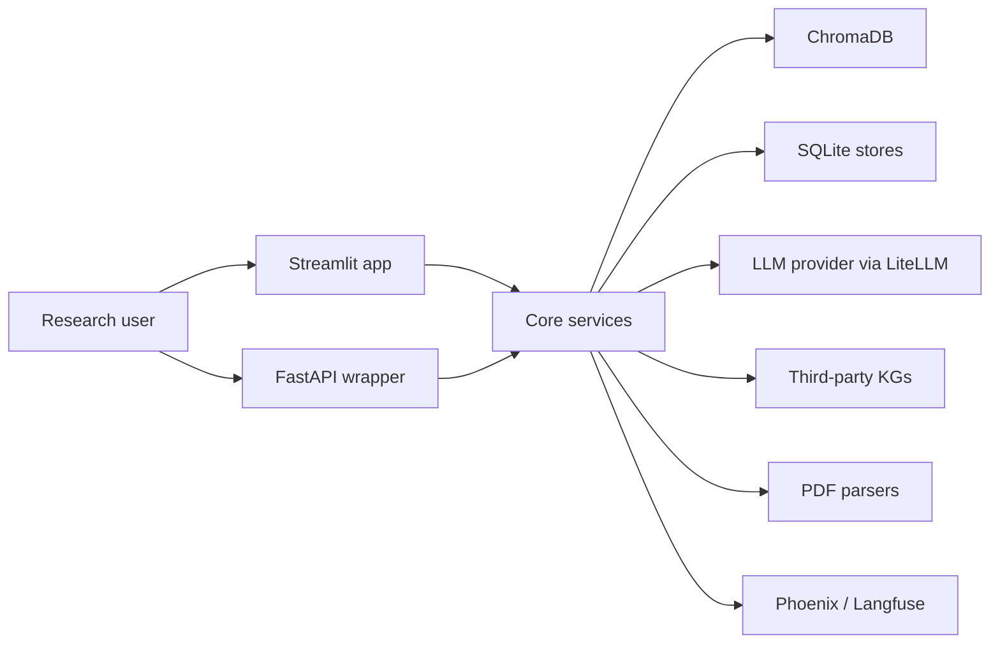
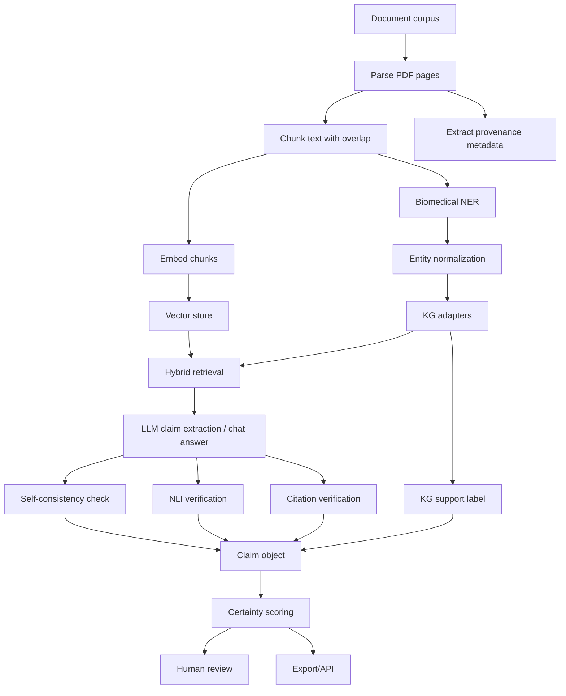

# Bio Claims App Architecture

## System Context

Bio Claims App is a local-first biomedical RAG and claim verification platform. It combines document retrieval, LLM-based extraction, third-party knowledge graph grounding, NLI verification, provenance tracking, human review, and export/API surfaces.

## Core Architecture

## Retrieval Model

The retrieval layer fuses three kinds of context:

| Context | Source | Role |
|---|---|---|
| Text evidence | ChromaDB vector search over ingested chunks | Provides source-grounded passages and citations |
| Graph evidence | Third-party KGs and custom KGs | Provides structured relationships, probabilities, and contradiction checks |
| Study-derived graph paths | Optional internal KG exports | Expands retrieval with graph-derived queries tied back to source evidence |

The result is formatted into a prompt context with paper evidence, KG facts, evidence provenance, and a fusion summary.

## Query Routing

`core/query_router.py` classifies queries by domain and intent. Domains include nutrition, microbiome, genetics, disease, and metabolomics. Intents include lookup, mechanism, association, comparison, and intervention.

The router maps those signals into KG weights so a question about mechanisms or disease can prioritize different graph sources than a question about nutrients or food-compound relationships.

## Knowledge Graph Layer

The KG layer is adapter-based:

| KG | Storage/Access Pattern | Primary Use |
|---|---|---|
| iKraph | DuckDB | Broad biomedical relationship grounding |
| FoodAtlas | TSV/CSV-derived local tables | Food, chemical, and disease relationships |
| GENA | CSV | Nutrition and mental-health relationships |
| MeNuGUIDE | Preprocessed CSV tables | Food, compound, disease, and metabolic paths |
| Monarch | SQLite via kgw | Cross-species gene, disease, and phenotype context |
| HALD | SQLite via kgw | Aging and longevity disease context |
| Custom KG | Uploaded CSV/TSV triples | User-provided entity-relationship evidence |
| Study-derived KG | CSV/TSV/JSON/JSONL nodes and edges | GraphRAG retrieval expansion from project-specific study structure |

## Multi-Hop Pathfinding

Direct KG edges are not always enough. `core/multihop.py` supports bidirectional BFS up to three hops:

- 2-hop paths find shared intermediates between entity A and entity B.
- 3-hop paths expand the best candidates when weak 2-hop paths are insufficient.
- Generic stop-intermediates prevent noisy paths through uninformative concepts.
- Confidence thresholds filter weaker third-party KG edges.

This makes indirect mechanism discovery possible while keeping graph traversal bounded.

## Claim Model

Extracted claims preserve structured fields:

- Claim text.
- Entity A and Entity B.
- Relationship type.
- Certainty score and tier.
- Evidence summary.
- Citations with paper title, page, and quote.
- KG support label: corroborated, novel, or contradicted.
- Study type, sample size, p-value, effect size, confidence interval, organism/population, and finding direction.
- NLI and RAGAS/evaluation metadata when available.

## Scoring Model

The scoring layer blends multiple signals:

| Signal | Purpose |
|---|---|
| Source multiplicity | Rewards support across independent documents |
| KG corroboration | Rewards graph-backed entity relationships |
| NLI entailment | Checks whether retrieved evidence semantically supports the claim |
| Study quality | Weights stronger study designs more heavily |
| Embedding similarity | Captures semantic closeness between evidence and claim |
| Contradiction caps | Prevents contradicted claims from receiving high certainty |

The system is designed so scores can be decomposed rather than accepted as opaque model output.

## Human Review Loop

Claims flow into a review database where domain experts can accept, reject, modify, comment, override scores, and calibrate thresholds. Reviewer feedback can inform later weighting and threshold choices.

## API And UI Surfaces

| Surface | Purpose |
|---|---|
| Streamlit app | Interactive ingestion, chat, claims, review, verification, visualization, literature discovery, logs |
| FastAPI wrapper | Programmatic extraction, verification, review, claims retrieval, and export |
| Benchmark scripts | Offline evaluation of retrieval, NER, KG grounding, PDF parsing, and RAG quality |

## Architectural Theme

The central pattern is "evidence before answer":

1. Retrieve source passages.
2. Resolve entities.
3. Query structured graphs.
4. Generate claims or answers.
5. Verify citations and entailment.
6. Score transparently.
7. Let humans review.
