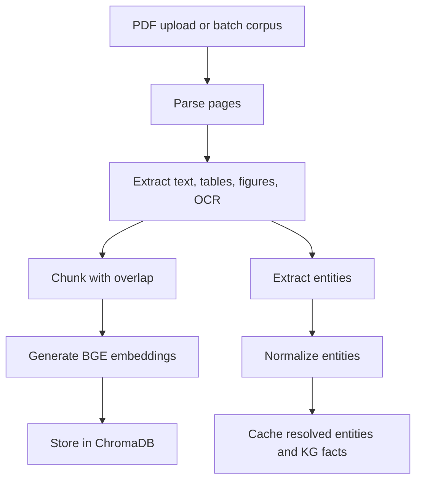
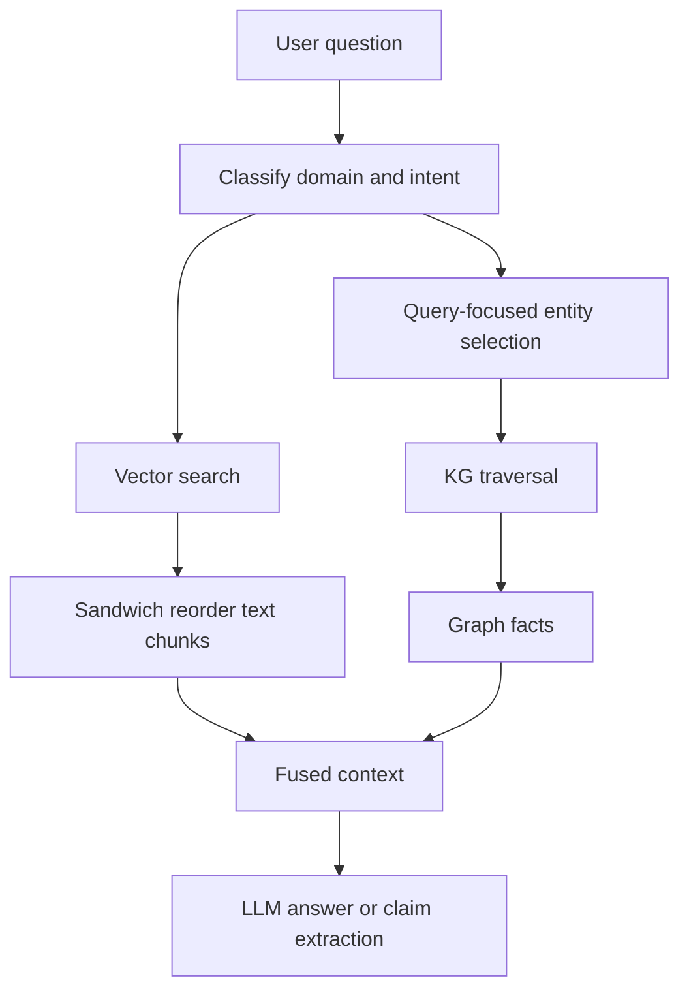
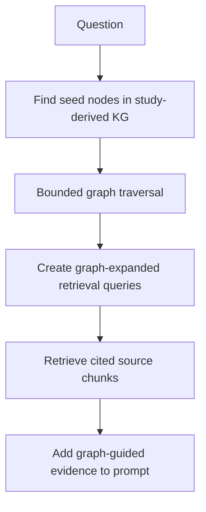
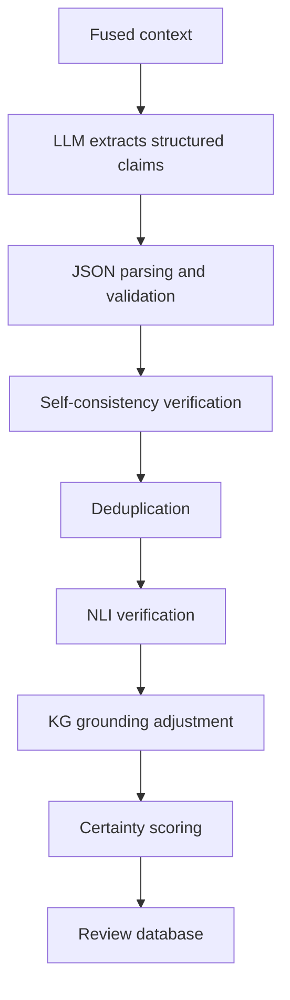

# Bio Claims App Pipelines

## Ingestion Pipeline

The ingestion pipeline prepares documents for both semantic retrieval and graph grounding. Content-addressed hashing avoids re-processing duplicate PDFs.

## Hybrid Retrieval Pipeline

Notable retrieval details:

- BGE embeddings drive semantic search.
- Query routing weights KGs by domain relevance.
- Entity selection prevents a large corpus entity cache from overwhelming KG lookups.
- "Lost in the middle" mitigation reorders chunks so high-relevance evidence appears near context edges.
- KG facts are appended as structured evidence for the generator.

## GraphRAG Expansion Pipeline

This makes a study-derived KG act as a retrieval map. The graph itself does not replace citations; it expands retrieval so answers can still point back to source passages.

## Claim Extraction Pipeline

Claim extraction outputs structured claim objects rather than free-form summaries. Unsupported claims can be rewritten or removed during self-consistency checks.

## Claim Verification Pipeline

1. Parse claim entities and relationship.
2. Normalize entities.
3. Query enabled KGs for direct relationships.
4. Search retrieved document evidence.
5. Run NLI over claim/evidence pairs.
6. Apply KG and NLI contradiction caps.
7. Generate a verdict with citations, support status, and caveats.

## Human Review Pipeline

| Step | Purpose |
|---|---|
| Save claims | Persist extracted claims for review |
| Triage | Accept/reject/modify individual claims or batches |
| Annotate | Add reviewer comments and score overrides |
| Calibrate | Compare predicted certainty against reviewer decisions |
| Learn | Suggest better signal weights after enough reviewed examples |

The human review layer turns model output into a domain-expert workflow instead of treating generation as final.

## Evaluation Pipeline

The benchmark suite evaluates separate risk areas:

| Benchmark Area | What It Measures |
|---|---|
| NER | Entity extraction quality on biomedical datasets |
| Embeddings | Retrieval quality across embedding models and BEIR-style datasets |
| Chunking | Retrieval quality, entity preservation, and pair co-location |
| KG grounding | Entity resolution, graph coverage, and support classification |
| Claim verification | NLI-only versus NLI-plus-KG behavior |
| PDF parsing | Text/table extraction quality and processing time |
| RAGAS | Faithfulness, relevance, context precision/recall, factual correctness, entity recall |

## API Pipeline

The FastAPI wrapper exposes programmatic endpoints for:

- PDF ingestion.
- Claim extraction.
- Single-claim verification.
- Claim review.
- Calibration report.
- Claims export.

API controls include bearer-token authentication, rate limiting, CORS configuration, upload size limits, and secure session IDs.

## Observability Pipeline

The project includes optional tracing and usage monitoring:

- LiteLLM usage and cost tracking.
- Phoenix tracing for retrieval and generation workflows.
- Langfuse tracing with safer initialization.
- SQLite-ledger style storage for answer evidence snapshots.

## Operations Notes

This project has research-platform complexity:

- Some features require local KG datasets.
- Some parsing paths benefit from GPU acceleration.
- Benchmark runs can be long-running.
- A production deployment would need persistent storage, queueing, authentication, TLS, and role-based review workflows.
