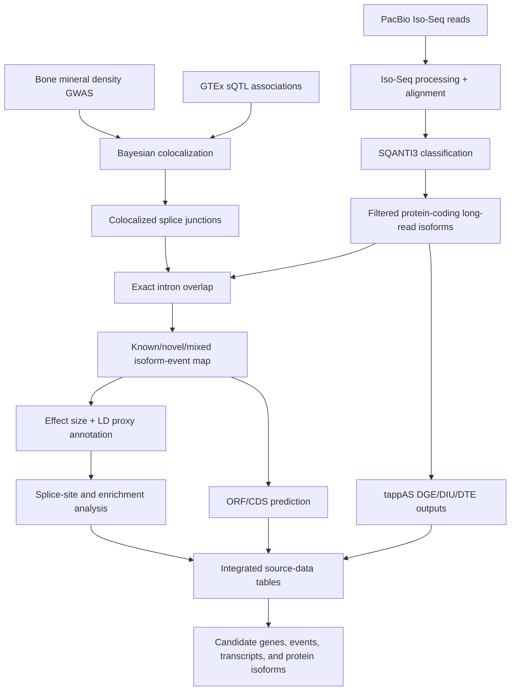

# Bone_proteogenomics_manuscript

> Manuscript-grade computational biology workflow connecting disease-associated splicing QTLs to long-read transcript isoforms and predicted protein consequences.

## Overview

`Bone_proteogenomics_manuscript` contains the analysis code accompanying a long-read proteogenomics study of disease-associated splicing QTLs. The workflow combines public GWAS summary statistics, GTEx splicing QTL resources, PacBio Iso-Seq transcript discovery, SQANTI3 isoform classification, expression filtering, colocalization, isoform mapping, effect-size annotation, enrichment analysis, tappAS differential isoform analyses, and ORF/protein consequence prediction.

The portfolio value is the decomposition. The repo turns a broad genetics question into a staged evidence-building system: identify colocalized splicing events, test whether those events are represented in a disease-relevant long-read transcriptome, classify the affected isoforms as known or novel, annotate variant direction and LD proxies, evaluate splice-site and RNA-binding-protein context, integrate orthogonal disease evidence, and produce source-data tables for manuscript interpretation.

## Table Of Contents

- [Problem Statement](#problem-statement)
- [Features](#features)
- [Access And Getting Started](#access-and-getting-started)
- [Tech Stack](#tech-stack)
- [Architecture](#architecture)
- [Pipeline And Workflow](#pipeline-and-workflow)
- [Project Structure](#project-structure)
- [Configuration](#configuration)
- [Testing And Validation](#testing-and-validation)
- [Security And Privacy](#security-and-privacy)
- [Key Design Decisions](#key-design-decisions)
- [Tradeoffs](#tradeoffs)
- [What I Learned](#what-i-learned)
- [Next Improvements](#next-improvements)
- [Contribution Model](#contribution-model)
- [License](#license)
- [Acknowledgements](#acknowledgements)
- [Author](#author)
- [Links](#links)

## Problem Statement

GWAS loci often point to noncoding regions, and even when a locus colocalizes with a molecular QTL, the downstream biological effector can remain unclear. For splicing QTLs, the key question is not only whether a variant affects a splice junction, but which full-length transcript isoforms contain that junction, whether those isoforms are known or novel, whether the direction of effect is interpretable, and whether the change has a plausible protein consequence.

The workflow decomposes that into a reproducible analysis:

1. Download and harmonize public GWAS, GTEx sQTL, long-read RNA-seq, GENCODE, and manuscript-supporting datasets.
2. Run Bayesian colocalization between bone mineral density GWAS signals and sQTL events across GTEx tissues.
3. Generate and filter a PacBio Iso-Seq reference transcriptome with SQANTI3 and cDNA_Cupcake outputs.
4. Keep expressed protein-coding isoforms using TPM, isoform-percentage, replicate, and DESeq2-normalized count criteria.
5. Map colocalized splice junctions to exact introns in full-length long-read isoforms.
6. Classify events as represented by known isoforms, novel isoforms, or both.
7. Add GWAS and sQTL effect direction, LD proxy context, splice-site overlap, and enrichment annotations.
8. Use tappAS outputs to integrate differential gene expression, transcript expression, and isoform usage.
9. Predict ORF/CDS consequences for affected isoforms using a long-read proteogenomics workflow.
10. Generate integrated source-data tables for prioritizing candidate genes, events, transcripts, and protein isoforms.

## Features

- Bayesian coloc analysis joining GWAS and GTEx sQTL evidence.
- Chromosome/tissue-oriented scripting for large summary-statistic inputs.
- PacBio Iso-Seq workflow notes from raw reads through clustering, alignment, collapse, and SQANTI3 classification.
- cDNA_Cupcake count integration.
- Long-read isoform filtering against GENCODE protein-coding genes.
- TPM and isoform-percentage filtering to reduce artifacts and low-support isoforms.
- DESeq2 size-factor normalization for long-read count matrices.
- Exact intron matching between colocalized sQTL junctions and full-length isoforms.
- Known, novel, and mixed event classification.
- hg19/hg38 liftover for GWAS and sQTL coordinate reconciliation.
- Effect-size annotation from GWAS and sQTL summary statistics.
- LD proxy retrieval and filtering for downstream annotation.
- Splice donor/acceptor overlap analysis.
- RNA-binding-protein and eCLIP-style enrichment analysis.
- tappAS-compatible custom annotation generation through IsoAnnotLite.
- Differential gene expression, transcript expression, and isoform usage integration.
- Source-data generation combining molecular evidence, disease evidence, eQTL evidence, monogenic disease genes, and tissue counts.
- ORF/CDS prediction with a long-read proteogenomics workflow.
- UCSC track preparation for visual inspection of colocalized sQTLs and long-read isoforms.

## Access And Getting Started

Source repo: [aa9gj/Bone_proteogenomics_manuscript](https://github.com/aa9gj/Bone_proteogenomics_manuscript)

Typical setup:

```bash
git clone git@github.com:aa9gj/Bone_proteogenomics_manuscript.git
cd Bone_proteogenomics_manuscript
Rscript setup_r_env.R
```

Important external resources include:

- Zenodo data bundle for manuscript inputs and intermediate files.
- Raw long-read sequencing data from GEO.
- GTEx v8 sQTL association files.
- Bone mineral density GWAS summary statistics.
- GENCODE v26 and v38 annotations, depending on the stage.
- UCSC liftover chain files for hg19/hg38 coordinate conversion.
- SQANTI3, cDNA_Cupcake, IsoSeq, tappAS/IsoAnnotLite, and long-read proteogenomics tooling.
- SLURM or an equivalent batch system for large chromosome/tissue loops.

High-level run order:

```bash
# 1. Run sQTL/GWAS colocalization by tissue/chromosome.
# 2. Generate and classify the long-read reference transcriptome.
# 3. Filter expressed long-read isoforms.
# 4. Map colocalized sQTL events to full-length isoforms.
# 5. Add effect sizes, LD proxies, and event annotations.
# 6. Run tappAS analyses and integrate outputs.
# 7. Predict ORFs/CDS and generate source-data tables.
```

## Tech Stack

| Area | Stack |
|---|---|
| Languages | R, Python, Bash |
| Batch execution | SLURM scripts and chromosome/tissue loops |
| Colocalization | `coloc`, GTEx sQTL files, GWAS summary statistics |
| Long-read RNA-seq | PacBio Iso-Seq, pbmm2/minimap2, cDNA_Cupcake |
| Isoform classification | SQANTI3 |
| Genomic ranges | GenomicRanges, plyranges, rtracklayer |
| Expression analysis | DESeq2, tappAS, MaSigPro through tappAS |
| Annotation | GENCODE v26/v38, UCSC liftover chains, Ensembl LD REST API |
| Protein consequence | Long-read proteogenomics ORF/CDS workflow, CPAT-style ORF calling |
| Data handling | data.table, dplyr, tidyr, tidyverse |
| Visualization/reporting | pheatmap, ggtranscript, UCSC custom tracks |
| Data sources | Zenodo, GEO, GTEx, GEFOS/GWAS summary statistics, IMPC-style phenotype evidence, curated disease-gene resources |

Deeper stack notes: [stack.md](stack.md).

## Architecture



The architecture separates statistical association, transcript discovery, isoform-event mapping, and biological interpretation. That separation is important because each layer has different coordinate systems, evidence thresholds, and failure modes.

Full architecture notes: [architecture.md](architecture.md).

## Pipeline And Workflow

| Stage | Purpose |
|---|---|
| sQTL/GWAS colocalization | Identify splice junctions whose sQTL signal colocalizes with GWAS loci |
| Iso-Seq reference generation | Process long-read RNA-seq into classified full-length transcript isoforms |
| Long-read filtering | Remove likely artifacts and low-support isoforms while retaining expressed protein-coding transcripts |
| sQTL-to-isoform mapping | Test whether colocalized junctions exactly match introns in long-read isoforms |
| Effect annotation | Add GWAS/sQTL direction, p-value context, and lead/proxy SNP information |
| Event enrichment | Analyze splice-site overlap, lead/proxy context, and RNA-binding-protein enrichment |
| tappAS analysis | Integrate differential expression and differential isoform usage across the long-read transcriptome |
| Source-data generation | Combine molecular, functional, disease, and literature evidence into interpretable tables |
| ORF/protein analysis | Predict protein-coding consequences for affected long-read isoforms |
| UCSC tracks | Prepare genomic browser tracks for visual inspection and communication |

Full pipeline notes: [pipelines.md](pipelines.md).

## Project Structure

The repo is organized by analysis track and manuscript stage.

Detailed project map: [project-structure.md](project-structure.md).

## Configuration

Configuration is primarily file-based. Important surfaces include:

- Zenodo input file locations.
- GEO raw-read accessions.
- GTEx tissue and chromosome file lists.
- GWAS summary-statistic inputs.
- GENCODE release selection.
- UCSC liftover chain files.
- SQANTI3/cDNA_Cupcake/IsoSeq output paths.
- SLURM resource settings and per-chromosome loops.
- tappAS design, expression, and annotation files.
- ORF/CDS workflow references and coding-score thresholds.

## Testing And Validation

The repository is an analysis companion to a manuscript, so validation is mostly embedded in the workflow rather than packaged as a formal unit-test suite. Important validation signals include:

- Explicit input provenance for each stage.
- Coordinate liftover before cross-build comparisons.
- Protein-coding gene filtering before downstream interpretation.
- Expression and isoform-percentage thresholds to remove weak long-read candidates.
- Exact intron matching between sQTL events and isoforms.
- Known versus novel isoform classification.
- Counts of retained genes, events, and isoforms after major filters.
- LD proxy thresholds for variant context.
- Separation of regenerable heavy intermediates from Zenodo-downloadable outputs.
- Source-data tables that expose the evidence supporting prioritization.

Future validation could add lightweight fixture-based tests for event parsing, coordinate adjustment, intron matching, effect-size joins, and source-data feature flags.

## Security And Privacy

The project uses public manuscript, genomics, and annotation resources. The main public-portfolio concern is not human subject privacy so much as reproducibility hygiene: avoiding local machine paths, avoiding credentials, documenting external data sources clearly, and distinguishing public source-data artifacts from heavyweight local intermediates.

Full notes: [security-privacy.md](security-privacy.md).

## Key Design Decisions

| Decision | Rationale |
|---|---|
| Use colocalization before isoform interpretation | Reduces the candidate space to splice events with shared genetic signal evidence |
| Use long-read isoforms for event interpretation | Full-length reads connect junction-level sQTLs to transcript structures more directly than short-read junction tables alone |
| Require exact intron matches | Keeps event-to-isoform mapping conservative and interpretable |
| Track known and novel isoforms separately | Preserves discovery value while distinguishing established annotations from long-read novel candidates |
| Add direction and LD context after mapping | Keeps interpretation tied to variants and effects rather than only event presence |
| Integrate tappAS and ORF analysis downstream | Moves from association to transcript usage and plausible protein consequences |
| Generate source-data tables | Makes prioritization auditable for manuscript figures, supplements, and follow-up experiments |

## Tradeoffs

- The analysis is highly reproducible but depends on large public resources that are impractical to vendor into Git.
- Some long-running chromosome/tissue loops are documented as scripts rather than packaged as a single workflow engine.
- Using exact intron matches improves specificity but can miss partial or more complex transcript-event relationships.
- Downloadable Zenodo intermediates make the analysis more accessible, but they also require careful version tracking.
- GUI-driven tappAS analysis adds biological functionality while limiting full command-line automation.

## What I Learned

- How to connect GWAS/sQTL statistical genetics to full-length transcript and protein isoform interpretation.
- How much of genomics engineering is coordinate hygiene, file provenance, and conservative joins.
- Why long-read transcriptomics changes the shape of splicing-QTL interpretation.
- How to structure a manuscript-scale analysis so intermediate evidence can become source data, figures, tracks, and follow-up hypotheses.
- Where workflow packaging would most improve maintainability for future users.

## Next Improvements

- Add a small reproducible toy dataset that exercises each major stage without downloading the full public resources.
- Wrap chromosome/tissue colocalization jobs in a workflow manager such as Nextflow or Snakemake.
- Add automated checks for event ID parsing, genome-build conversion, exact-overlap logic, and table schemas.
- Containerize the R, Python, SQANTI3, IsoSeq, tappAS-adjacent, and ORF-calling dependencies.
- Add a manifest that pins public data versions, download URLs, checksums, and expected row counts.

## Contribution Model

This repo primarily supports a published analysis. Contributions should preserve data provenance, avoid rewriting historical manuscript logic without explanation, and document any changed public resource versions.

## License

MIT License.

## Acknowledgements

The workflow builds on public genomics resources and community tools including GTEx, GENCODE, GEO, Zenodo, coloc, SQANTI3, cDNA_Cupcake, tappAS, and long-read proteogenomics tooling.

## Author

Arby Abood.

## Links

- Source repo: [aa9gj/Bone_proteogenomics_manuscript](https://github.com/aa9gj/Bone_proteogenomics_manuscript)
- Manuscript DOI: `10.1016/j.ajhg.2024.03.001`
- Project architecture: [architecture.md](architecture.md)
- Pipeline notes: [pipelines.md](pipelines.md)
- Stack notes: [stack.md](stack.md)
