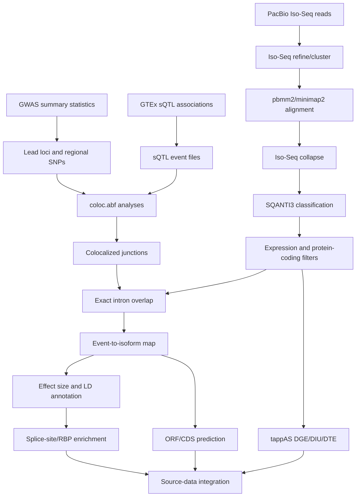

# Architecture

## System Shape

This project is a manuscript-scale analysis system. It is organized around evidence layers rather than a single executable application:

1. Association evidence from GWAS and GTEx sQTL summary statistics.
2. Transcript-structure evidence from PacBio Iso-Seq, SQANTI3, and cDNA_Cupcake outputs.
3. Event-to-isoform evidence from exact intron matching.
4. Directional variant evidence from GWAS/sQTL effect-size joins and LD proxies.
5. Functional interpretation from splice-site overlap, enrichment analysis, tappAS outputs, and ORF/CDS prediction.
6. Source-data synthesis for candidate prioritization and manuscript reporting.

The core architectural choice is to keep those layers separate until each one has been cleaned, filtered, and coordinate-harmonized.

## Data Flow

## Component Responsibilities

| Component | Responsibility |
|---|---|
| `sQTL_colocalization_analysis/Step0_Colocalization` | Prepare GWAS/sQTL event files and run coloc analyses across tissue/chromosome slices |
| `Reference_transcriptome_generation/Isoseq_analysis` | Document raw long-read processing, clustering, alignment, collapse, and SQANTI3 classification |
| `Reference_transcriptome_generation/Step1_Long-read_RNAseq_filtering_in_hFOBs` | Filter and normalize long-read isoform counts against protein-coding annotations |
| `sQTL_to_isoform_mapping/Step2_sQTL_coloc_res_hFOBs_isoforms` | Map colocalized splice junctions onto exact introns in filtered long-read isoforms |
| `sQTL_to_isoform_mapping/Step3_Add_effect_size` | Add GWAS and sQTL effect-size context from summary statistics |
| `sQTL_to_isoform_mapping/Step4_event_annotaion_and_enrichment` | Annotate events with LD proxy, splice-site, and enrichment information |
| `sQTL_to_isoform_mapping/Step5_tappAS_analysis` | Prepare and consume tappAS analysis outputs for expression and isoform-usage interpretation |
| `sQTL_to_isoform_mapping/Step6_Generation_of_source_data` | Combine molecular, disease, literature, and tissue evidence into prioritization tables |
| `sQTL_to_isoform_mapping/Step7_generation_of_ORFs` | Predict ORF/CDS consequences for affected transcripts |
| `sQTL_to_isoform_mapping/create_ucsc_hfob_sqtl_track` | Prepare visual inspection tracks for genome-browser review |

## Evidence Model

The analysis can be read as an evidence graph:

- A GWAS locus contributes a disease or trait association signal.
- A GTEx sQTL contributes a splice-junction association signal.
- Coloc links those signals statistically.
- PacBio Iso-Seq supplies full-length transcript models.
- Exact intron overlap links the colocalized junction to one or more isoforms.
- SQANTI3 labels those isoforms as known, novel-in-catalog, novel-not-in-catalog, and related classes.
- Effect-size and LD annotations add directionality and variant context.
- tappAS and ORF/CDS analysis add transcript-level and protein-level interpretation.
- Source-data generation integrates external disease and functional evidence for prioritization.

## Boundary Conditions

The hardest technical boundaries are:

- Genome build differences between GWAS, GTEx, GENCODE, and long-read transcript annotations.
- Very large summary-statistic and splicing-QTL files.
- Long-running per-chromosome and per-tissue jobs.
- GUI-assisted tappAS analysis that is useful biologically but not fully script-native.
- Dependencies spread across R/Bioconductor, Python, command-line genomics tools, and external APIs.

## Why This Architecture Works

The staged design keeps biological interpretation downstream of conservative data joins. This reduces the risk of making claims from mismatched genome builds, weakly expressed isoforms, ambiguous splice events, or untracked intermediate files.
