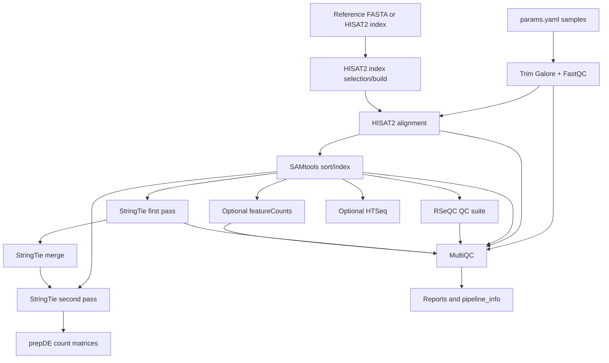

# bulk-rnaseq-nf

> Reproducible Nextflow pipeline for bulk RNA-seq processing, QC, alignment, transcript assembly, and count-matrix generation.

## Overview

`bulk-rnaseq-nf` is a Nextflow DSL2 workflow for paired-end bulk RNA-seq analysis. It takes FASTQ files and reference annotations as input, performs trimming, alignment, BAM processing, RSeQC diagnostics, StringTie transcript assembly/quantification, optional gene-counting methods, and MultiQC reporting.

The project is intentionally focused on producing analysis-ready artifacts for downstream differential expression workflows such as DESeq2, edgeR, or limma. It does not try to hide bioinformatics decisions behind a black box; it exposes reference inputs, library strandedness, quantification choices, execution profiles, and QC outputs.

## Table Of Contents

- [Problem Statement](#problem-statement)
- [Features](#features)
- [Access And Getting Started](#access-and-getting-started)
- [Tech Stack](#tech-stack)
- [Architecture](#architecture)
- [Pipeline And Workflow](#pipeline-and-workflow)
- [Project Structure](#project-structure)
- [Configuration](#configuration)
- [Testing And Validation](#testing-and-validation)
- [Security And Privacy](#security-and-privacy)
- [Key Design Decisions](#key-design-decisions)
- [Tradeoffs](#tradeoffs)
- [What I Learned](#what-i-learned)
- [Next Improvements](#next-improvements)
- [Contribution Model](#contribution-model)
- [License](#license)
- [Acknowledgements](#acknowledgements)
- [Author](#author)
- [Links](#links)

## Problem Statement

Bulk RNA-seq analysis is easy to run once and hard to run reproducibly. The workflow spans many tools, large files, reference genomes, resource-heavy alignment jobs, QC diagnostics, and downstream count formats. Manual shell scripts often make it difficult to resume failed work, audit parameters, compare QC across samples, or move between local, containerized, and HPC environments.

`bulk-rnaseq-nf` decomposes the problem into a reusable workflow:

1. Define samples and references in a parameter file.
2. Trim reads and collect initial QC.
3. Align to a reference genome with HISAT2.
4. Sort and index BAM files.
5. Run alignment-level QC with RSeQC.
6. Assemble and quantify transcripts with StringTie.
7. Generate gene/transcript count matrices.
8. Optionally run featureCounts or HTSeq for alternative gene-level counts.
9. Aggregate QC outputs and execution metadata with MultiQC and Nextflow reports.

## Features

- Modular Nextflow DSL2 workflow with separate process modules.
- Paired-end FASTQ processing.
- Support for samples with comma-separated multi-lane FASTQ inputs.
- Trim Galore plus FastQC for adapter trimming and read-level QC.
- HISAT2 alignment with either a prebuilt index or a genome FASTA used to build one.
- SAMtools sorting, indexing, and alignment statistics.
- RSeQC modules for strandedness, read distribution, insert size, gene body coverage, BAM stats, and TIN scores.
- Two-pass StringTie workflow for transcript assembly, merged annotation, and quantification.
- `prepDE.py` output for gene-level and transcript-level count matrices.
- Optional featureCounts and HTSeq quantification paths.
- MultiQC aggregation.
- Nextflow timeline, execution report, trace file, and DAG output.
- Docker, Singularity, Conda, local, SLURM, PBS, AWS Batch, and test profiles.
- GitHub Actions workflow to build and publish a Docker image to GitHub Container Registry.

## Access And Getting Started

Source repo: [aa9gj/bulk-rnaseq-nf](https://github.com/aa9gj/bulk-rnaseq-nf)

Typical containerized run:

```bash
git clone git@github.com:aa9gj/bulk-rnaseq-nf.git
cd bulk-rnaseq-nf
nextflow run workflows/main.nf -params-file params.yaml -profile docker
```

Typical HPC run:

```bash
nextflow run workflows/main.nf -params-file params.yaml -profile slurm
```

The parameter file defines samples, reference genome/index paths, GTF annotation, output directory, strandedness, and optional quantification modes. Large data files and result directories are intentionally excluded from git.

## Tech Stack

| Area | Stack |
|---|---|
| Workflow engine | Nextflow DSL2 |
| Read trimming/QC | Trim Galore, Cutadapt, FastQC |
| Alignment | HISAT2 |
| BAM processing | SAMtools |
| Transcript assembly/quantification | StringTie, prepDE.py |
| Gene-level quantification | featureCounts/Subread, HTSeq |
| Alignment QC | RSeQC |
| QC aggregation | MultiQC |
| Environments | Conda, Docker, Singularity |
| Execution | local, SLURM, PBS/Torque, AWS Batch |
| Container publishing | GitHub Actions, Docker Buildx, GitHub Container Registry |

Deeper stack notes: [stack.md](stack.md).

## Architecture



The architecture separates reusable process modules from workflow orchestration. That makes it easier to add, replace, or skip individual steps without rewriting the whole pipeline.

Full architecture notes: [architecture.md](architecture.md).

## Pipeline And Workflow

| Stage | Purpose |
|---|---|
| Parameter validation | Fail early if samples, GTF, or reference/index inputs are missing |
| Preprocessing | Trim adapters and run read-level QC |
| Alignment | Map reads to reference genome with HISAT2 |
| BAM processing | Sort, index, and collect alignment stats |
| QC diagnostics | Run RSeQC modules to detect library and sample quality issues |
| Assembly | Run StringTie first pass per sample |
| Merge | Build a unified transcript annotation |
| Quantification | Re-estimate abundance with merged annotation |
| Count generation | Produce gene/transcript matrices for DE analysis |
| Optional counting | Run featureCounts and/or HTSeq for alternative count outputs |
| Reporting | Aggregate QC with MultiQC and Nextflow execution reports |

Full pipeline notes: [pipelines.md](pipelines.md).

## Project Structure

The repo follows a simple Nextflow DSL2 layout: one main workflow, reusable modules grouped by domain, config profiles, environment definitions, and citation/documentation files.

Detailed project map: [project-structure.md](project-structure.md).

## Configuration

Configuration is split between `nextflow.config` and `params.yaml`:

- `nextflow.config` defines defaults, resource labels, process overrides, execution profiles, reports, trace fields, and max-resource helper logic.
- `params.yaml` defines run-specific samples, reference files, output directory, strandedness, and optional quantification flags.

Important parameters include:

- `samples`
- `gtf_annotation`
- `hisat2_index` or `genome_fasta`
- `outdir`
- `threads`, `max_cpus`, `max_memory`, `max_time`
- `skip_rseqc`
- `run_featurecounts`
- `run_htseq`
- `strandedness`

## Testing And Validation

The repo currently emphasizes workflow reproducibility through Nextflow reports, process-level resource controls, containerization, and MultiQC/RSeQC outputs. GitHub Actions builds and publishes the Docker image when dependency files change.

The next validation step would be adding a tiny public test dataset plus automated Nextflow smoke tests or `nf-test` checks so the full DAG can be exercised in CI.

## Security And Privacy

Bulk RNA-seq data can contain sensitive sample identifiers, organism/study context, paths, and large derived files. The repo gitignores FASTQ, BAM, SAM, FASTA, GTF/GFF, results, work directories, Nextflow caches, and reports.

Full notes: [security-privacy.md](security-privacy.md).

## Key Design Decisions

| Decision | Rationale |
|---|---|
| Use Nextflow DSL2 | Gives resumability, channel-based orchestration, portable execution profiles, and modular processes |
| Stop at count matrices | Keeps the pipeline focused on reproducible preprocessing/QC and leaves statistical modeling to DESeq2/edgeR/limma |
| Include RSeQC heavily | QC is not just pass/fail; TIN, strandedness, coverage bias, and read distribution help explain PCA outliers |
| Support multiple quantifiers | StringTie, featureCounts, and HTSeq serve different downstream and reproducibility needs |
| Provide container and HPC profiles | Makes the same workflow runnable on a laptop, container runtime, or cluster |
| Publish Docker image through CI | Reduces dependency setup friction and improves reproducibility |
| Generate execution reports | Timeline, report, trace, and DAG files help debug resource use and workflow behavior |

## Tradeoffs

- HISAT2/StringTie is transparent and widely used, but pseudoalignment tools may be faster for some expression-only workflows.
- Building a HISAT2 index inside the pipeline is convenient, but large genomes can require substantial memory.
- A single container is simpler to publish, while per-process containers could improve modularity and version isolation.
- The pipeline produces count matrices but does not yet include differential expression modeling, contrasts, or visualization.
- SLURM profile settings are useful for a specific HPC style, but cluster names, queues, and accounts usually need local edits.
- Current CI validates the container build, not the full workflow DAG on example FASTQs.

## What I Learned

- How to decompose a bioinformatics analysis into modular, resumable Nextflow processes.
- How to balance local, containerized, and HPC execution needs in one workflow.
- How RNA-seq QC metrics connect to downstream analysis problems like PCA outliers.
- How to expose alternative quantification methods without complicating the main path.
- How to package scientific software dependencies with Conda and Docker for reproducible use.
- How to think about pipeline outputs as audit artifacts, not just final count tables.

## Next Improvements

- Add a small public test dataset and CI smoke test.
- Add `nf-test` or Nextflow validation around process modules.
- Split example parameters from run-specific private parameters.
- Add schema validation for `params.yaml`.
- Add optional DESeq2/edgeR downstream reporting as a separate module.
- Add sample sheet support for larger studies.
- Add per-process containers or nf-core style module metadata.
- Add a release checklist that includes container digest pinning and test-run artifacts.

## Contribution Model

Useful contribution areas would include:

- Additional aligner or quantifier modules.
- Small test datasets.
- Nextflow module tests.
- More portable cluster profiles.
- Parameter schema validation.
- Documentation around strandedness and QC interpretation.

## License

The source repository is licensed under the MIT License.

## Acknowledgements

The pipeline builds on Nextflow and established RNA-seq tools including Trim Galore, FastQC, HISAT2, SAMtools, StringTie, RSeQC, featureCounts/Subread, HTSeq, MultiQC, Conda/Bioconda, Docker, and Singularity/Apptainer-style HPC container workflows.

## Author

Arby Abood

## Links

- Source repo: [aa9gj/bulk-rnaseq-nf](https://github.com/aa9gj/bulk-rnaseq-nf)
- Supporting docs in this case study:
  - [Architecture](architecture.md)
  - [Pipelines](pipelines.md)
  - [Stack](stack.md)
  - [Security and privacy](security-privacy.md)
  - [Project structure](project-structure.md)
