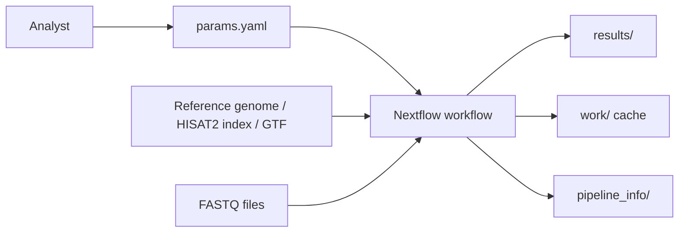
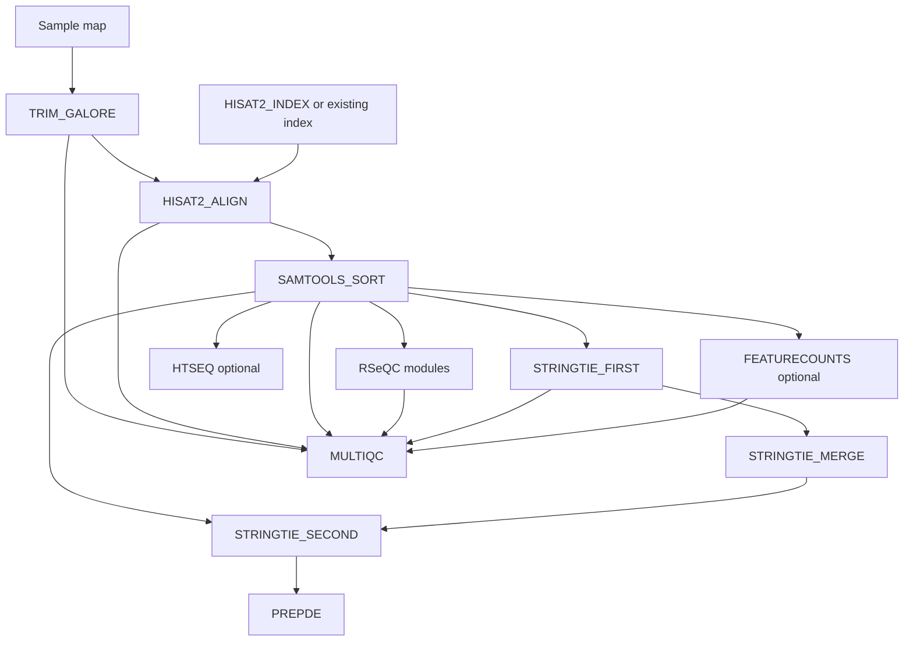

# bulk-rnaseq-nf Architecture

## System Context

`bulk-rnaseq-nf` is a local/HPC bioinformatics workflow. It consumes paired-end FASTQ files, a genome reference or prebuilt HISAT2 index, and a GTF annotation. It produces QC reports, aligned BAMs, transcript assemblies, count matrices, and Nextflow execution metadata.

## Workflow Shape

The project uses Nextflow DSL2 with a main workflow in `workflows/main.nf` and reusable process modules under `modules/`.

## Module Boundaries

| Module Group | Responsibility |
|---|---|
| `preprocess/` | Concatenate lanes and trim paired FASTQs |
| `align/` | Build HISAT2 index, align reads, sort/index BAMs |
| `qc/` | Convert annotation for RSeQC, run RSeQC modules, aggregate MultiQC |
| `transcript_assembly/` | Run StringTie first pass, merge assemblies, quantify, create count matrices |
| `quantification/` | Optional featureCounts and HTSeq gene-count paths |

## Channel Strategy

The workflow creates sample tuples from the `params.samples` map:

- `sample_id`
- R1 file list
- R2 file list

Those tuples flow through trimming, alignment, BAM sorting, QC, assembly, and quantification. Reference inputs such as HISAT2 index and GTF annotation are represented as value channels and combined with sample outputs when needed.

## Reference Strategy

The pipeline supports two reference modes:

| Mode | Use Case |
|---|---|
| Existing `hisat2_index` | Faster production runs where index is already built |
| `genome_fasta` input | One-off or reproducible runs where the pipeline builds the index |

The GTF annotation is required for StringTie, RSeQC conversion, featureCounts, and HTSeq.

## QC Architecture

RSeQC modules run after sorted BAM generation. The workflow converts GTF to BED12 once, then fans out multiple QC modules in parallel:

- BAM statistics.
- Library strandedness inference.
- Read distribution across genomic features.
- Inner distance / insert size.
- Gene body coverage.
- Transcript Integrity Number.

This is designed to identify technical drivers of downstream PCA outliers before differential expression modeling.

## Quantification Architecture

The default quantification path uses StringTie:

1. First pass per sample with reference-guided assembly.
2. Merge assemblies across samples.
3. Second pass quantification against the merged annotation.
4. `prepDE.py` count matrices for downstream DE tools.

Optional paths provide gene-level count alternatives:

- featureCounts for fast gene-level assignment.
- HTSeq for compatibility with older or publication-standard workflows.

## Execution Profiles

Profiles in `nextflow.config` target different execution environments:

| Profile | Purpose |
|---|---|
| `standard` | Local execution |
| `docker` | GitHub Container Registry image through Docker |
| `singularity` | Container execution on HPC systems without Docker |
| `conda` | Conda-managed tool environment |
| `slurm` | SLURM cluster execution with module loading |
| `pbs` | PBS/Torque cluster execution |
| `awsbatch` | AWS Batch execution |
| `test` | Lower resource defaults for lightweight runs |

## Resource Model

Processes use labels and process-specific overrides:

- Low, medium, and high labels define CPU/memory/time defaults.
- HISAT2 index and alignment receive higher resource allocations.
- RSeQC TIN and gene body coverage receive dedicated overrides.
- `check_max` caps requested CPU, memory, and time against global parameters.
- Retry behavior scales memory/time by task attempt for many processes.

## Reporting Model

The pipeline emits both biological QC reports and workflow execution reports:

- MultiQC report and data directory.
- Nextflow timeline.
- Nextflow execution report.
- Trace file with resource metrics.
- DAG SVG.

This gives both science-facing and operations-facing views of a run.
