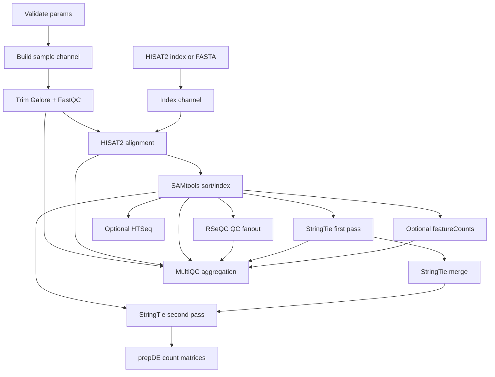
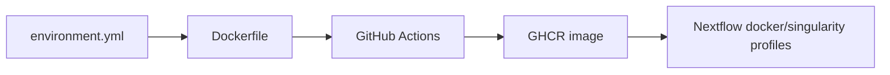

# bulk-rnaseq-nf Pipelines

## Runtime Pipeline

## Input Pipeline

`params.yaml` is the run contract:

| Input | Purpose |
|---|---|
| `samples` | Maps sample IDs to paired R1/R2 FASTQ paths |
| `gtf_annotation` | Reference annotation for assembly, counting, and RSeQC conversion |
| `hisat2_index` | Optional existing HISAT2 index |
| `genome_fasta` | Optional genome FASTA used to build an index when no index is supplied |
| `strandedness` | Controls featureCounts and HTSeq strandedness behavior |

## Preprocessing Pipeline

Trim Galore runs paired-end adapter trimming and calls FastQC. Outputs include trimmed FASTQs, FastQC reports, and trimming logs. These feed both alignment and MultiQC.

## Alignment Pipeline

HISAT2 aligns trimmed paired reads and streams output into SAMtools to write BAM files. SAMtools then sorts and indexes alignments for QC, assembly, and quantification.

## QC Pipeline

RSeQC is included because RNA-seq outliers often come from technical artifacts rather than biology.

| RSeQC Module | Diagnostic Value |
|---|---|
| `bam_stat.py` | Basic alignment statistics |
| `infer_experiment.py` | Library strandedness consistency |
| `read_distribution.py` | Exonic/intronic/intergenic read allocation |
| `inner_distance.py` | Insert size distribution |
| `geneBody_coverage.py` | 3-prime/5-prime coverage bias |
| `tin.py` | Transcript Integrity Number for RNA degradation/outlier detection |

MultiQC aggregates RSeQC and other tool outputs for side-by-side sample comparison.

## Transcript Assembly And Quantification Pipeline

StringTie uses a two-pass strategy:

1. Assemble transcripts per sample with reference guidance.
2. Merge per-sample assemblies into a unified annotation.
3. Quantify each sample against the merged annotation.
4. Use `prepDE.py` to generate gene and transcript count matrices.

The resulting matrices are suitable for downstream differential expression analysis.

## Optional Count Pipelines

| Method | Why It Exists |
|---|---|
| featureCounts | Fast, memory-efficient gene-level count matrix generation |
| HTSeq | Familiar per-sample counting path used by many older workflows |

These are toggled through `run_featurecounts` and `run_htseq`.

## Container Pipeline

The Docker image is built from `environment.yml` using a micromamba base image. The Dockerfile verifies key tools during build. GitHub Actions publishes the image to GitHub Container Registry on relevant changes or releases.

## Execution Metadata Pipeline

Nextflow emits:

- `timeline.html`
- `report.html`
- `trace.txt`
- `dag.svg`

Those artifacts make the pipeline easier to debug, profile, and explain after a run.

## Validation Gap

The main remaining pipeline gap is automated workflow testing. The Docker publish workflow validates container construction, but a tiny FASTQ/GTF/reference fixture plus a Nextflow smoke test would validate the DAG itself.
