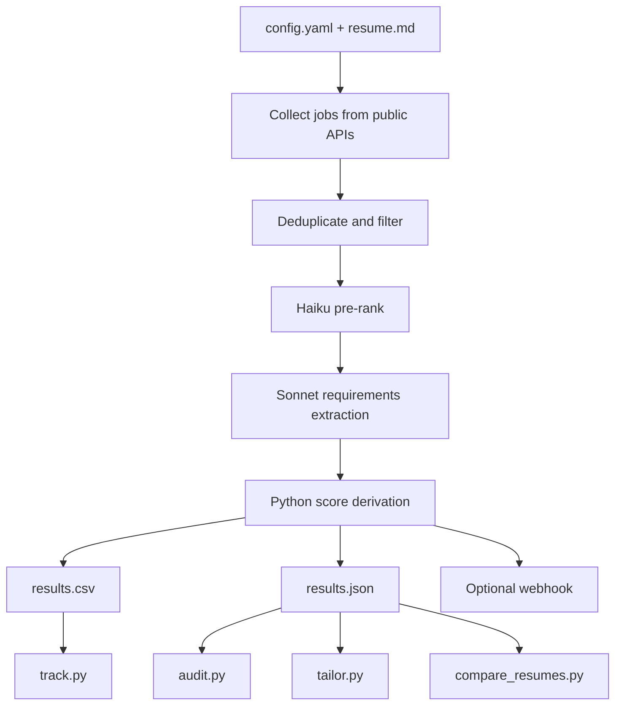

# FitCast

> Forecast your fit for jobs.

## Overview

FitCast is a Python CLI for job-search decision support. It scrapes public job boards, extracts the real requirements from each posting, scores a resume against those requirements, and produces ranked job matches with auditable evidence.

It also supports score audits, truthful resume tailoring, resume A/B testing, application tracking, recurring runs, and webhook notifications.

The source repository is private during early development. This folder is the public case study: the problem statement, stack, architecture, pipelines, tradeoffs, and lessons learned.

## Table Of Contents

- [Problem Statement](#problem-statement)
- [Features](#features)
- [Access And Getting Started](#access-and-getting-started)
- [Tech Stack](#tech-stack)
- [Architecture](#architecture)
- [Pipeline And Workflow](#pipeline-and-workflow)
- [Project Structure](#project-structure)
- [Configuration](#configuration)
- [Testing And CI](#testing-and-ci)
- [Security And Privacy](#security-and-privacy)
- [Key Design Decisions](#key-design-decisions)
- [Tradeoffs](#tradeoffs)
- [What I Learned](#what-i-learned)
- [Next Improvements](#next-improvements)
- [Contribution Model](#contribution-model)
- [License](#license)
- [Acknowledgements](#acknowledgements)
- [Author](#author)
- [Links](#links)

## Problem Statement

Job seekers spend a lot of time manually scanning job boards, guessing whether they meet requirements, and rewriting resumes for roles that may not be worth the effort. Existing tools often hide their scoring logic, over-index on keyword stuffing, or require a subscription before proving value.

FitCast reframes the problem as a repeatable pipeline:

1. Find relevant jobs from sources with stable public APIs.
2. Filter out obvious noise before spending money on LLM calls.
3. Extract requirements and resume evidence in a structured way.
4. Derive fit scores deterministically so each result can be defended.
5. Produce useful artifacts: ranked CSV, full JSON audit trail, tailored resume drafts, and job tracking state.

## Features

- Scrapes Greenhouse, Lever, Ashby, and The Muse public job APIs.
- Filters by keywords, freshness window, location, salary range, applied jobs, and previously seen jobs.
- Uses a low-cost pre-rank pass before expensive deep analysis.
- Extracts job requirements and resume evidence with structured LLM output.
- Derives qualification and ATS scores in Python rather than asking the LLM for final numbers.
- Produces `results.csv` for quick review and `results.json` for full auditability.
- Provides `audit.py` to inspect one job's evidence and score math.
- Provides `tailor.py` to generate truthful tailored resume and cover letter drafts.
- Provides `compare_resumes.py` for resume version A/B testing.
- Tracks applied jobs with `track.py`.
- Supports cron-friendly recurring runs and optional Slack/Discord-style webhook notifications.
- Includes CI, unit tests, and a local smoke test with optional paid API checks.

## Access And Getting Started

The FitCast source repository is private. For interview review, access can be granted directly on GitHub or shared in a guided walkthrough.

The source README includes a local quickstart built around this flow:

```bash
git clone https://github.com/aa9gj/fitcast
cd fitcast
python3.11 -m venv .venv
source .venv/bin/activate
pip install -r requirements.txt
cp resume.example.md resume.md
export ANTHROPIC_API_KEY=sk-ant-...
python pipeline.py
```

For development, the repo supports editable installs:

```bash
pip install -e ".[dev]"
pytest tests/
```

The public case study intentionally does not include private resume content, generated results, API keys, or application history.

## Tech Stack

| Area | Stack |
|---|---|
| Runtime | Python 3.10+ |
| Packaging | `pyproject.toml`, setuptools, optional dependency groups |
| Config | YAML plus Pydantic strict validation |
| Job sources | Greenhouse, Lever, Ashby, The Muse public APIs |
| LLMs | Anthropic Claude Haiku for pre-rank, Claude Sonnet for extraction and tailoring |
| Deterministic scoring | Python formulas for qualification and ATS scoring |
| Skill ontology | O*NET skill catalog plus curated supplemental tech terms |
| Optional ML | `sentence-transformers/all-MiniLM-L6-v2` for domain fit |
| Outputs | CSV, JSON, Markdown, LaTeX, local state files |
| Testing | pytest, Python syntax checks, local smoke test |
| CI | GitHub Actions matrix on Python 3.10, 3.11, and 3.12 |

Deeper stack notes: [stack.md](stack.md).

## Architecture



The important architectural choice is separation of responsibilities: LLMs extract structured evidence, while deterministic Python code computes final scores. That keeps the system explainable and lowers the risk of arbitrary "AI score" behavior.

Full architecture notes: [architecture.md](architecture.md).

## Pipeline And Workflow

FitCast has several pipeline layers:

| Pipeline | Purpose |
|---|---|
| Runtime job pipeline | Scrape, filter, pre-rank, deep-analyze, score, write artifacts |
| Cost-control pipeline | Use local filters and cheap Haiku scoring before Sonnet analysis |
| CI pipeline | Run syntax checks and pytest across supported Python versions |
| Local smoke test | Validate environment, dependencies, files, syntax, tests, API reachability, config, state handling, and optional paid API paths |
| Maintenance pipeline | Refresh company slugs and O*NET skill catalog |
| Recurring workflow | Run via cron or watch mode, optionally notify via webhook |

Full pipeline notes: [pipelines.md](pipelines.md).

## Project Structure

FitCast is organized as a set of focused CLI modules rather than a framework-heavy application. The main orchestrator is `pipeline.py`; supporting commands own auditing, tailoring, resume comparison, application tracking, keyword extraction, company bootstrap, ontology bootstrap, and resume parser checks.

Detailed project map: [project-structure.md](project-structure.md).

## Configuration

The main configuration file is `config.yaml`. It controls:

- Job sources and company slugs.
- The Muse categories, levels, locations, and page count.
- Keyword filters.
- Maximum number of jobs to deep-analyze.
- Freshness windows such as `24h`, `7d`, or `1w`.
- Location include/exclude rules.
- Salary range filters.
- Pre-rank threshold and candidate cap.
- Optional webhook notification settings.

The config is validated with strict Pydantic models so typos fail fast instead of silently disabling a source or filter.

## Testing And CI

FitCast has three quality layers:

- Unit tests cover scoring formulas, filters, orchestration, source validation, bootstrap helpers, state handling, webhook behavior, and skill extraction.
- GitHub Actions runs package installation, `compileall`, and pytest across Python 3.10, 3.11, and 3.12.
- `smoke_test.sh` checks the real local environment, including imports, required files, syntax, pytest, skill catalog, API reachability, config validity, state files, and optional paid Anthropic calls.

This combination matters because FitCast is not just pure Python logic; it depends on local files, public APIs, optional dependencies, and paid model calls.

## Security And Privacy

FitCast handles resumes, job search state, API keys, tailored outputs, and webhook URLs. The implementation keeps personal artifacts local and gitignored, expects API keys through environment variables, avoids authentication-gated scraping, and does not auto-apply to jobs.

Full notes: [security-privacy.md](security-privacy.md).

## Key Design Decisions

| Decision | Rationale |
|---|---|
| Use public ATS APIs instead of LinkedIn/Indeed scraping | Cleaner data, no authentication, fewer anti-bot and Terms-of-Service concerns |
| Use LLMs for extraction, not final scoring | Improves reproducibility and makes scores easier to audit |
| Add a Haiku pre-rank stage | Scans more jobs while keeping Sonnet spend bounded |
| Store CSV and JSON instead of starting with a database | Keeps the tool inspectable and portable while the workflow is being validated |
| Use O*NET plus supplemental skills | Balances deterministic matching with modern technology vocabulary |
| Make embeddings optional | Avoids forcing a large ML dependency on the default install |
| Prefer cron for recurring runs | Fits a local tool better than a fragile long-running process |
| Include tailoring but forbid invention | Helps application quality without fabricating experience |

## Tradeoffs

- Public APIs are cleaner than scraped sites, but coverage is uneven.
- LLM extraction can vary, so the architecture confines variance to structured evidence rather than final arithmetic.
- CSV/JSON artifacts are simple and transparent, but a hosted version would likely need a database and queue.
- A local CLI is less polished than a web app, but it is faster to build, cheaper to run, and easier to trust during validation.
- A hybrid ATS score is broader than pure ontology matching, but not a perfect proxy for every real ATS.

## What I Learned

- How to design an LLM-assisted workflow where the model performs bounded extraction and deterministic code performs scoring.
- How to reduce operating cost by putting public APIs, local filters, and cheap pre-ranking before expensive analysis.
- How to make AI output inspectable through structured artifacts, score components, and evidence chains.
- How to build practical local automation with tests, smoke checks, state files, cron compatibility, and webhooks.
- How to set product boundaries: rank and explain opportunities, but keep the applicant responsible for applying.

## Next Improvements

- Add a lightweight web dashboard for reviewing ranked jobs and score explanations.
- Add contract tests around each public job source adapter.
- Persist historical results to SQLite or Postgres for trend analysis.
- Add evaluation fixtures to measure score stability across prompt and model changes.
- Add screenshots or sample redacted output once the public portfolio repo is ready.

## Contribution Model

FitCast is primarily a personal engineering project. External review is welcome, but contributions would be handled selectively because the project touches job-search workflows, resume data, and noncommercial licensing constraints.

Good contribution areas would include:

- Source adapter improvements.
- Tests for edge cases in filters or scoring.
- Documentation improvements.
- Redacted sample outputs.
- Evaluation fixtures for prompt/model changes.

## License

The FitCast source repository uses the PolyForm Noncommercial License 1.0.0. It is source-available for noncommercial use, research, education, and personal experimentation, but commercial use is not permitted without a separate arrangement.

This public case study is documentation for interview and portfolio review. It is not a replacement for reviewing the source repository directly.

## Acknowledgements

FitCast builds on public job-board APIs, the O*NET skills ontology, the Python packaging/testing ecosystem, and Anthropic's Claude models. The project also uses public company slug discovery patterns from the broader open source job-search tooling ecosystem.

## Author

Arby Abood

## Links

- Source repo: [aa9gj/fitcast](https://github.com/aa9gj/fitcast)
- Supporting docs in this case study:
  - [Architecture](architecture.md)
  - [Pipelines](pipelines.md)
  - [Stack](stack.md)
  - [Security and privacy](security-privacy.md)
  - [Project structure](project-structure.md)
- Main artifacts generated by the app: `results.csv`, `results.json`, tailored resume/cover letter outputs, audit reports.
- License model: source-available/noncommercial while the project is being developed.
