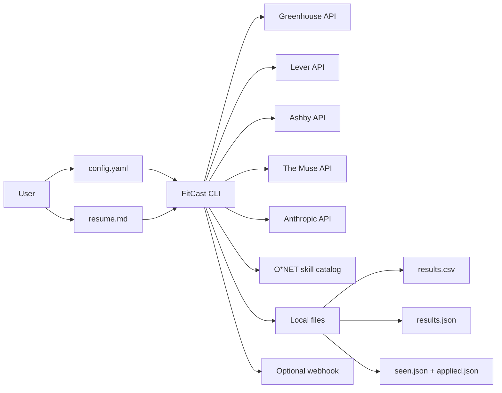
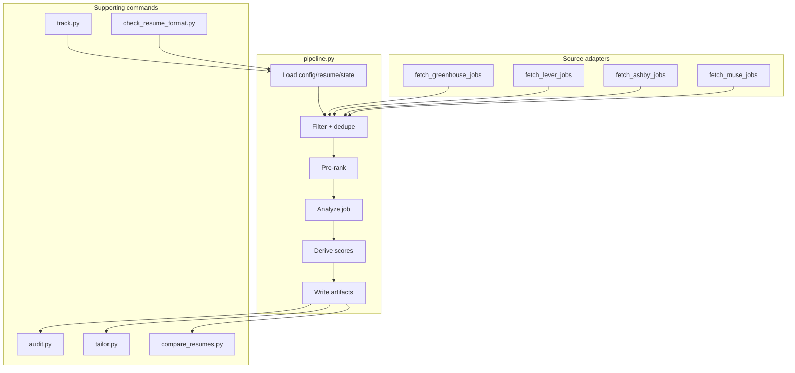

# FitCast Architecture

## System Context

FitCast is a local CLI application. It does not require hosted infrastructure for the core workflow. A user supplies a Markdown resume and a YAML config; FitCast gathers jobs from public APIs, evaluates them, writes local artifacts, and optionally sends a webhook notification.

## Boundaries

| Inside FitCast | Outside FitCast |
|---|---|
| Source adapters | Public job-board APIs |
| Filtering and deduplication | Anthropic API |
| Pre-rank orchestration | O*NET source data refresh |
| Structured requirements extraction | Slack/Discord/generic webhook receiver |
| Deterministic score derivation | Human decision to apply |
| Local artifact generation | Real ATS behavior after submission |
| State tracking | Company career site changes |

## Data Flow

1. Load `config.yaml`, validate the schema, and load `resume.md`.
2. Fetch jobs from enabled sources.
3. Normalize source-specific job objects into a shared internal shape.
4. Deduplicate by URL.
5. Apply filters for keywords, location, salary, freshness, applied jobs, and seen jobs.
6. Run a cheap Haiku pre-rank pass over the candidate pool.
7. Deep-analyze selected jobs with Sonnet.
8. Extract requirements, evidence, years, degree requirements, ATS keywords, and supporting fields.
9. Derive qualification and ATS scores in Python.
10. Optionally compute domain-fit score if the embedding extra is installed.
11. Write `results.csv` for scanning and `results.json` for full auditability.
12. Mark successfully analyzed jobs as seen.
13. Optionally POST a webhook payload when new high-scoring jobs appear.

## Component Model

## Scoring Architecture

FitCast deliberately avoids asking the LLM to produce final fit scores.

| Signal | Source | Why |
|---|---|---|
| `prerank_score` | Haiku judgment | Cheap relevance triage before expensive analysis |
| `score` | Python formula | Qualification score based on met requirements, degree fit, and years gap |
| `ats_score` | Python formula | Skill overlap based on O*NET plus LLM keyword extraction |
| `domain_fit_score` | Optional embedding model | Topical similarity between resume and posting |

The scoring design is meant to be auditable:

- The LLM extracts requirements and evidence.
- The formulas derive scores from explicit fields.
- `results.json` preserves the score components.
- `audit.py` can print the evidence chain for one job.

## Artifact Model

| Artifact | Purpose | Commit? |
|---|---|---|
| `config.yaml` | Source and filter configuration | Yes |
| `resume.example.md` | Safe example resume shape | Yes |
| `resume.md` | Real user resume | No |
| `results.csv` | Ranked job table | No |
| `results.json` | Full evidence and score data | No |
| `seen.json` | Jobs already analyzed | No |
| `applied.json` | Jobs the user marked as applied | No |
| `tailored/` | Tailored application materials | No |
| `data/skills.json` | Built O*NET plus supplement skill catalog | Yes |
| `data/.onet_db.zip` | Regenerable O*NET download cache | No |

## Failure Handling

FitCast treats many runtime failures as recoverable:

- Source APIs can 404 or fail without crashing the entire run.
- Webhook delivery failures are logged but do not invalidate successful results.
- Missing optional embeddings omit `domain_fit_score` without blocking core scoring.
- Config typos fail fast through strict validation.
- Paid API checks are isolated behind `smoke_test.sh --paid`.

## Why This Shape

The architecture optimizes for a local, trustworthy, cost-aware tool:

- Local files keep the workflow easy to inspect.
- Public APIs avoid brittle scraping where possible.
- Cheap pre-ranking limits model spend.
- Deterministic formulas make the output defensible.
- Separate helper commands keep the main pipeline focused.
