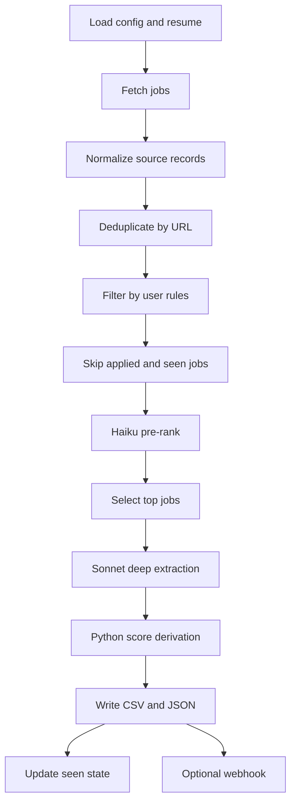
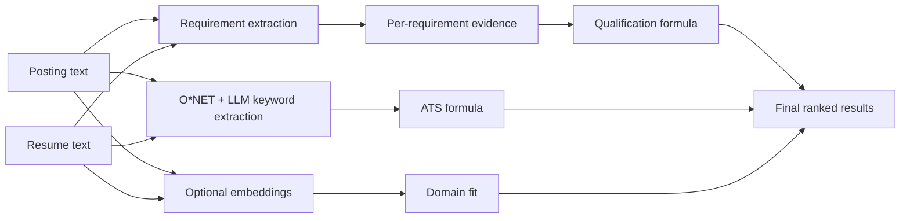

# FitCast Pipelines

## Runtime Pipeline



### Runtime Inputs

| Input | Purpose |
|---|---|
| `config.yaml` | Sources, filters, limits, pre-rank settings, webhook settings |
| `resume.md` | Canonical resume used for scoring and tailoring |
| `data/skills.json` | O*NET plus supplemental skill catalog |
| `applied.json` | User-managed list of applications to skip |
| `seen.json` | Jobs already analyzed in previous runs |
| `companies.bootstrap.yaml` | Optional generated source expansion |

### Runtime Outputs

| Output | Purpose |
|---|---|
| `results.csv` | Sorted table for quick job review |
| `results.json` | Full structured evidence and score details |
| `seen.json` | Updated after successful analysis |
| `tailored/` | Generated only by tailoring workflow |
| Webhook JSON | Optional notification for new high-score jobs |

## Cost-Control Pipeline

FitCast is designed so the most expensive step happens late.

1. Public API fetches are free.
2. Local filters remove obvious mismatches.
3. Haiku pre-rank scores a larger candidate pool cheaply.
4. Sonnet deep analysis runs only on selected jobs.
5. Tailoring runs only for jobs the user chooses.

This makes frequent use feasible. The tool can scan a broad source pool while keeping deep-analysis costs bounded by `max_jobs`.

## Scoring Pipeline



The LLM is responsible for interpretation; Python is responsible for score math.

## CI Pipeline

The GitHub Actions workflow runs on `push` and `pull_request`.

| Step | Purpose |
|---|---|
| Checkout | Pull repository contents |
| Setup Python | Test each matrix version: 3.10, 3.11, 3.12 |
| Install | Install package with the `dev` extra |
| Static syntax check | Run `python -m compileall -q .` |
| Unit tests | Run `python -m pytest tests/` |

This catches syntax, packaging, and pure-Python behavior regressions before changes land.

## Local Smoke Test Pipeline

`smoke_test.sh` is broader than CI because it checks the real local operating environment.

Default free checks include:

- Python version.
- Active virtualenv warning.
- Dependency imports.
- Required project files.
- Python syntax.
- pytest suite.
- Skill catalog presence.
- Public source API reachability.
- Config YAML validity.
- State file handling.

Optional paid checks with `--paid` include:

- Dry run through pre-rank.
- Minimal real pipeline run.
- Keyword extraction.
- Audit against the first result.

The split keeps normal validation cheap while preserving a path to real end-to-end verification.

## Maintenance Pipelines

| Script | Purpose |
|---|---|
| `bootstrap_companies.py` | Pulls public company slug lists from SimplifyJobs and expands Greenhouse/Lever/Ashby coverage |
| `scripts/bootstrap_ontologies.py` | Refreshes the O*NET skill catalog used for deterministic ATS matching |

These are intentionally separate from the main runtime. Source discovery and ontology refresh are maintenance concerns, not part of every job-search run.

## Recurring Workflow

The recommended recurring setup is cron:

```cron
0 7 * * * cd /path/to/fitcast && /path/to/.venv/bin/python pipeline.py >> "logs/$(date +\%F).log" 2>&1
```

Cron is preferred because it survives terminal closure and gives the user a familiar operations model. FitCast also supports an in-process watch mode for local development:

```bash
python pipeline.py --watch --interval 24h
```

Webhook notifications can send a compact JSON payload when new high-scoring jobs appear.

## Release Confidence

The project uses multiple checks because each catches a different failure mode:

- Unit tests catch deterministic logic errors.
- CI catches cross-version Python issues.
- Smoke tests catch local setup and integration issues.
- Optional paid checks catch real Anthropic-dependent paths.
- Gitignored state and output files reduce the chance of leaking personal data.
