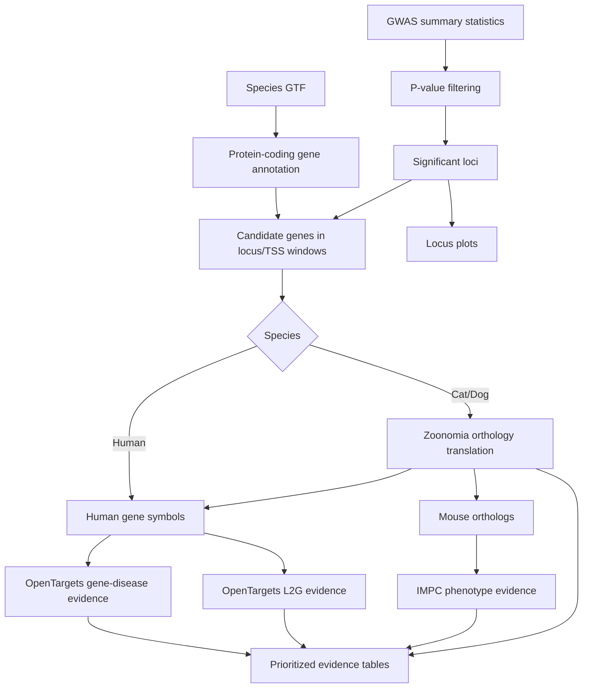

# GWASTargetChase

> R package for prioritizing candidate genes from GWAS loci using OpenTargets, IMPC mouse phenotype evidence, and Zoonomia cross-species orthology.

## Overview

`GWASTargetChase` is an R package for GWAS follow-up and target prioritization. It starts from GWAS summary statistics and a species GTF, identifies candidate genes near significant loci, translates non-human genes through Zoonomia orthology, and enriches the candidate list with disease associations, locus-to-gene evidence, and mouse knockout phenotype evidence.

The package has two usage modes:

- `TargetChase()`: API-based mode that queries OpenTargets Platform and IMPC directly.
- `TargetChaseManual()`: local-data mode for pre-downloaded OpenTargets and IMPC files.

That split gives users a fast path for exploratory analysis and a more reproducible path for larger or offline analyses.

## Table Of Contents

- [Problem Statement](#problem-statement)
- [Features](#features)
- [Access And Getting Started](#access-and-getting-started)
- [Tech Stack](#tech-stack)
- [Architecture](#architecture)
- [Pipeline And Workflow](#pipeline-and-workflow)
- [Project Structure](#project-structure)
- [Configuration](#configuration)
- [Testing And Validation](#testing-and-validation)
- [Security And Privacy](#security-and-privacy)
- [Key Design Decisions](#key-design-decisions)
- [Tradeoffs](#tradeoffs)
- [What I Learned](#what-i-learned)
- [Next Improvements](#next-improvements)
- [Contribution Model](#contribution-model)
- [License](#license)
- [Acknowledgements](#acknowledgements)
- [Author](#author)
- [Links](#links)

## Problem Statement

GWAS loci often point to broad genomic regions rather than obvious causal genes. Many associated variants are intronic or intergenic, so the closest gene is not always the best biological target. Human genetics has rich follow-up resources, but non-human species often have thinner disease and functional annotation resources.

`GWASTargetChase` decomposes that problem into a reusable target-prioritization workflow:

1. Read GWAS summary statistics with chromosome, position, p-value, and closest-gene fields.
2. Filter significant SNPs by a user-supplied p-value threshold.
3. Use a GTF to find protein-coding genes near significant loci or closest-gene TSS windows.
4. Translate non-human candidate genes to human orthologs for OpenTargets lookup.
5. Translate non-human candidate genes to mouse orthologs for IMPC phenotype lookup.
6. Retrieve or join OpenTargets gene-disease associations.
7. Retrieve or join OpenTargets locus-to-gene evidence.
8. Retrieve or join IMPC mouse knockout phenotype evidence.
9. Add orthology metadata so cross-species evidence is transparent.
10. Write evidence tables and locus plots for downstream review.

## Features

- R package with roxygen documentation, exported functions, data objects, example files, and a vignette.
- Main API-based workflow through `TargetChase()`.
- Offline/local-data workflow through `TargetChaseManual()`.
- OpenTargets Platform GraphQL integration for gene-disease associations.
- IMPC REST API integration for mouse knockout phenotypes.
- Zoonomia orthology files for cat/dog gene translation to human and mouse.
- GTF parsing through `rtracklayer`.
- Genomic interval operations through `GenomicRanges`.
- Significant-locus filtering from GWAS summary statistics.
- 500 kb candidate-gene windows around significant loci or closest-gene TSS positions.
- OpenTargets and IMPC result caching during API use.
- Local download/prep helper through `downloadData()`.
- Data-prep helpers for IMPC, OpenTargets association evidence, and OpenTargets locus-to-gene data.
- Example cat and dog GWAS/GTF inputs.
- Locus-level plots for significant regions.
- testthat coverage for input validation, helper logic, orthology mapping, mock offline workflows, and API behavior.

## Access And Getting Started

Source repo: [aa9gj/GWASTargetChase](https://github.com/aa9gj/GWASTargetChase)

Install from GitHub:

```r
if (!require("remotes", quietly = TRUE)) {
  install.packages("remotes")
}

remotes::install_github("aa9gj/GWASTargetChase")
```

API-based usage:

```r
library(GWASTargetChase)

TargetChase(
  sumStats = "my_gwas_results.tsv",
  gtf = "my_species.gtf",
  species = "cat",
  pval = 5e-8,
  ResultsPath = "results/"
)
```

Manual/local-data usage:

```r
paths <- downloadData(destdir = "GWASTargetChase_data")

TargetChaseManual(
  sumStats = "my_gwas_results.tsv",
  gtf = "my_species.gtf",
  species = "cat",
  pval = 5e-8,
  ResultsPath = "results/",
  impc = paths$impc,
  assocOT = paths$assoc,
  l2gOT = paths$l2g
)
```

## Tech Stack

| Area | Stack |
|---|---|
| Language/package | R package, roxygen2 docs, NAMESPACE exports |
| Genomic intervals | GenomicRanges, S4Vectors |
| Annotation parsing | rtracklayer, GTF files |
| Data handling | data.table, dplyr, arrow, jsonlite |
| External evidence | OpenTargets Platform GraphQL API, OpenTargets bulk downloads, IMPC REST/FTP data |
| Orthology | Zoonomia orthology files |
| Visualization | ggplot2, ggpubr, patchwork, base PDF device |
| Testing | testthat |
| Documentation | README, vignette, Rd man pages |

Deeper stack notes: [stack.md](stack.md).

## Architecture



The package is best understood as an evidence-integration layer for GWAS interpretation. It does not run the GWAS itself; it takes GWAS outputs and helps make the target-prioritization step more systematic.

Full architecture notes: [architecture.md](architecture.md).

## Pipeline And Workflow

| Stage | Purpose |
|---|---|
| Input validation | Check summary statistics, GTF, output path, p-value threshold, and required columns |
| GWAS filtering | Select significant SNPs/loci from `p_wald` |
| Gene-window construction | Use GTF protein-coding annotations and 500 kb windows to collect candidate genes |
| Orthology translation | Map cat/dog candidates to human genes for OpenTargets and mouse genes for IMPC |
| API evidence retrieval | Query OpenTargets and IMPC directly for online workflows |
| Local evidence retrieval | Join against pre-downloaded/prepared OpenTargets and IMPC files for offline workflows |
| Evidence merge | Add disease, L2G, phenotype, and orthology metadata to candidate genes |
| Reporting | Write TSV outputs and locus plots |

Full pipeline notes: [pipelines.md](pipelines.md).

## Project Structure

The repo follows a standard R package structure:

- `R/` exported functions and helpers.
- `data/` bundled package data.
- `inst/extdata/` example GWAS/GTF files and orthology files.
- `tests/testthat/` unit and integration tests.
- `vignettes/` package walkthrough.
- `man/` generated Rd documentation.
- `data-raw/` scripts for preparing package data.

Detailed project map: [project-structure.md](project-structure.md).

## Configuration

The primary user-controlled parameters are:

- `sumStats`
- `gtf`
- `species`
- `pval`
- `ResultsPath`
- `zoo_dir`
- `impc`
- `assocOT`
- `l2gOT`
- `destdir`
- OpenTargets Platform release version for bulk download workflows.
- GENCODE release version for human GTF download workflows.

The package expects GWAS summary statistics to include at least:

- `chr`
- `ps`
- `p_wald`
- `gene`

## Testing And Validation

The test suite covers:

- Missing-file and empty-path validation.
- Required summary-statistics columns.
- No-significant-locus behavior.
- Chromosome conversion logic.
- 500 kb window calculation.
- GTF parsing and TSS handling.
- Zoonomia loading and translation behavior.
- Orthology metadata joins.
- Exact gene matching for helper functions.
- Mocked/local `TargetChaseManual()` workflows.
- API-fetch caching behavior.
- Online API behavior when network access is available.

The tests are especially useful because they separate deterministic package logic from network-dependent API checks.

## Security And Privacy

GWAS summary statistics, phenotype labels, sample metadata, and downstream target-prioritization outputs can be sensitive. The portfolio writeup focuses on the package architecture and public data integrations, not private study results.

Full notes: [security-privacy.md](security-privacy.md).

## Key Design Decisions

| Decision | Rationale |
|---|---|
| Build as an R package | Makes the workflow installable, documentable, testable, and reusable from scripts or notebooks |
| Provide API and manual modes | Supports quick exploration while preserving an offline/reproducible path for larger analyses |
| Use GTF-based gene windows | Keeps candidate-gene discovery tied to species-specific genome annotation rather than hard-coded gene lists |
| Use Zoonomia orthology | Allows cat/dog GWAS signals to be interpreted through richer human and mouse evidence resources |
| Join IMPC phenotypes | Adds functional knockout evidence that complements human disease associations |
| Include example data | Makes package behavior easier to test and demonstrate without private GWAS files |

## Tradeoffs

- API mode is convenient but depends on external service availability, schema stability, and network access.
- Manual mode is more reproducible, but OpenTargets and IMPC downloads can be large and require preprocessing.
- Closest-gene/TSS-window heuristics are useful for triage but cannot prove causality.
- Cross-species orthology enables translational interpretation but can introduce ambiguity for non-one-to-one mappings.
- R/Bioconductor is natural for genomic intervals and package distribution, but very large local evidence tables need careful memory management.
- The package prioritizes evidence gathering and interpretation, not full statistical fine-mapping.

## What I Learned

- How to turn GWAS follow-up into an installable R package rather than a one-off notebook.
- How to combine genomic interval logic with external biomedical evidence APIs.
- How OpenTargets, IMPC, and Zoonomia can be composed for translational target prioritization.
- How to design online and offline modes for the same scientific workflow.
- How to test deterministic logic separately from network-dependent API behavior.
- How to make species-specific analysis more reusable through GTF and orthology inputs.

## Next Improvements

- Add stronger species validation so unsupported species fail early with a clear message.
- Add ranking/scoring output that combines p-value, locus-to-gene, disease association, phenotype, and orthology evidence.
- Add retry/backoff controls for API calls.
- Add schema-version checks for OpenTargets responses.
- Add a small static mock API fixture for fully offline CI.
- Add a command-line wrapper for non-R users.
- Add an HTML report that summarizes loci, candidate genes, evidence tables, and plots.

## Contribution Model

This is a personal scientific software package. Contributions should focus on test fixtures, data-source versioning, clearer validation, documentation, and reproducibility improvements.

## License

The source repository is MIT licensed.

## Acknowledgements

The package builds on OpenTargets, IMPC, Zoonomia, Bioconductor, GenomicRanges, rtracklayer, data.table, dplyr, and testthat.

## Author

Arby Abood

## Links

- Source repository: [aa9gj/GWASTargetChase](https://github.com/aa9gj/GWASTargetChase)
- Portfolio index: [../../README.md](../../README.md)
