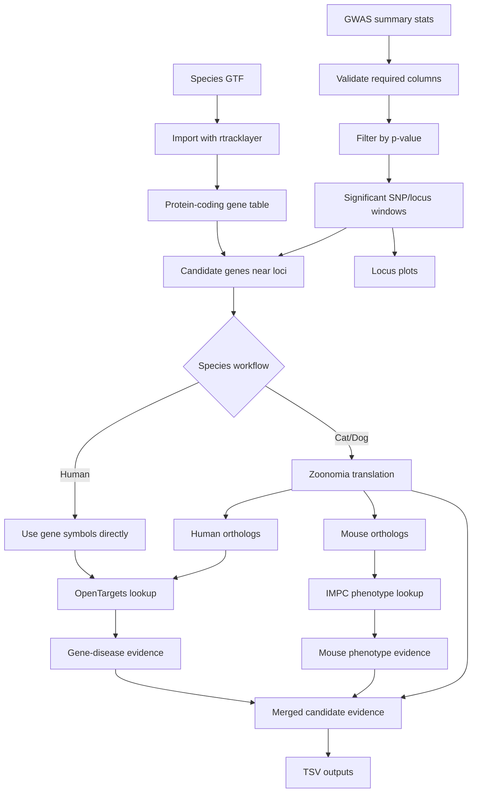

# Architecture

`GWASTargetChase` is an R package that sits downstream of GWAS and upstream of biological target review. Its job is to convert significant loci into evidence-rich candidate gene tables.

## System Shape

## Core Components

| Component | Responsibility |
|---|---|
| `TargetChase()` | Main online workflow for summary stats, GTF parsing, candidate genes, API calls, evidence joins, and plots |
| `TargetChaseManual()` | Offline/local workflow using pre-downloaded OpenTargets and IMPC files |
| `fetch_opentargets()` | OpenTargets Platform GraphQL lookup with caching |
| `fetch_impc()` | IMPC REST lookup with caching |
| `translate_genes()` | Cross-species orthology mapping through Zoonomia files |
| `downloadData()` | Large-data download and processing helper for manual workflows |
| `geneticAssocPrep()` | OpenTargets genetic association preprocessing |
| `l2gPrep()` | OpenTargets locus-to-gene preprocessing |
| `IMPCprep()` | IMPC phenotype preprocessing |
| tests | Validation of inputs, deterministic helper logic, offline workflows, and network-dependent behavior |

## Online Mode

`TargetChase()` is optimized for exploratory use:

1. Load summary statistics.
2. Filter significant loci.
3. Parse the species GTF.
4. Find candidate protein-coding genes near significant loci or closest-gene TSS windows.
5. Translate non-human genes to human and mouse orthologs.
6. Query OpenTargets for gene-disease associations.
7. Query IMPC for mouse knockout phenotypes.
8. Merge orthology metadata into outputs.
9. Write result tables and plots.

The API fetchers cache results under a temporary package cache to reduce repeated calls during a session.

## Manual Mode

`TargetChaseManual()` is designed for reproducibility and larger analyses:

1. Users prepare or download OpenTargets and IMPC files.
2. The package reads local association, L2G, and phenotype tables.
3. Candidate genes are matched against local evidence files.
4. Results are written without depending on live API calls.

This mode is useful when API schemas change, when network access is limited, or when the user wants a fixed data release.

## Evidence Model

| Evidence | Source | Why It Matters |
|---|---|---|
| Significant loci | User GWAS summary stats | Defines the genomic regions requiring interpretation |
| Protein-coding candidate genes | Species GTF | Connects loci to genes in the relevant genome assembly |
| Human orthologs | Zoonomia | Enables lookup in human disease genetics resources |
| Mouse orthologs | Zoonomia | Enables functional phenotype lookup in IMPC |
| Gene-disease associations | OpenTargets Platform | Adds human disease and genetic association evidence |
| Locus-to-gene scores | OpenTargets Genetics bulk data | Adds model-derived gene prioritization evidence |
| Mouse phenotypes | IMPC | Adds knockout phenotype context |

## Failure Boundaries

| Boundary | Failure Mode | Mitigation |
|---|---|---|
| Input files | Missing summary stats or GTF | Explicit file checks |
| Required columns | Missing `gene`, `chr`, `ps`, or `p_wald` | Test coverage and runtime errors |
| No hits | P-value threshold too strict | Clear error suggesting threshold review |
| GTF mismatch | Closest gene absent from annotation | Warning and skip behavior |
| Orthology | No cross-species mapping | Warning and fallback/empty evidence behavior |
| APIs | Network failure or schema drift | try/catch warnings, empty data frames, cache support |
| Large downloads | OpenTargets/IMPC files are large | Manual mode and helper functions isolate the preprocessing step |

## Interview Signal

This project shows:

- Translational genetics product thinking.
- R package engineering rather than notebook-only analysis.
- API integration with live biomedical data sources.
- Cross-species orthology reasoning.
- Genomic interval work with Bioconductor.
- Test design for both deterministic and network-dependent scientific software.
