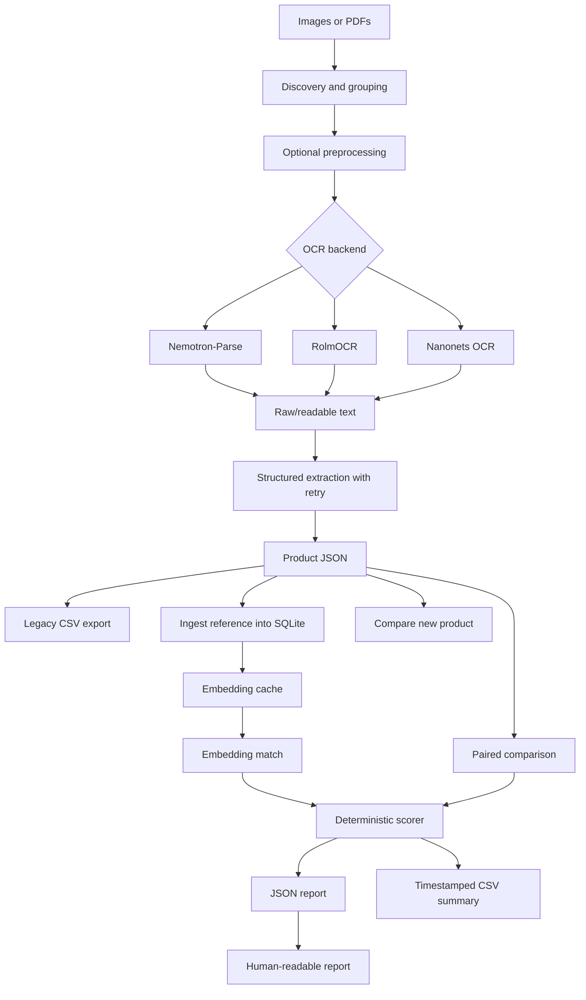

# image-to-text-analysis

> Applied AI pipeline for extracting structured product data from packaging images and detecting product changes against known references.

## Overview

`image-to-text-analysis` is a Python pipeline that turns product packaging images or PDFs into structured data, stores known reference products, and compares new packages against those references. It combines local OCR/VLM models, OpenAI-based JSON structuring, embedding retrieval, SQLite persistence, deterministic comparison scoring, and human-readable reporting.

The project is useful as an Applied AI case study because it is not just a prompt wrapper. It handles image grouping, multi-page PDFs, GPU OCR model selection, structured extraction retries, malformed-output failure capture, baseline ingestion, embedding-based match retrieval, paired comparison, scoring, and reviewer-facing reports.

## Table Of Contents

- [Problem Statement](#problem-statement)
- [Features](#features)
- [Access And Getting Started](#access-and-getting-started)
- [Tech Stack](#tech-stack)
- [Architecture](#architecture)
- [Pipeline And Workflow](#pipeline-and-workflow)
- [Project Structure](#project-structure)
- [Configuration](#configuration)
- [Testing And Validation](#testing-and-validation)
- [Security And Privacy](#security-and-privacy)
- [Key Design Decisions](#key-design-decisions)
- [Tradeoffs](#tradeoffs)
- [What I Learned](#what-i-learned)
- [Next Improvements](#next-improvements)
- [Contribution Model](#contribution-model)
- [License](#license)
- [Acknowledgements](#acknowledgements)
- [Author](#author)
- [Links](#links)

## Problem Statement

Manual review of product packaging is slow, error-prone, and hard to scale when the important information is spread across front, back, side, nutrition, and ingredient panels. OCR alone is not enough because extracted text must be normalized into fields, compared against a reference, and presented in a way a reviewer can trust.

The pipeline decomposes that into a practical applied-AI workflow:

1. Accept images and PDFs from an input directory or CLI arguments.
2. Group related package sides into one product.
3. Run OCR using a selected local model.
4. Save raw and readable OCR text for traceability.
5. Send readable OCR text to a structured extraction model.
6. Retry extraction on malformed JSON or transient API failures.
7. Convert extracted fields into CSV/JSON outputs.
8. Ingest reference products into SQLite.
9. Compute and cache enriched description embeddings.
10. Match new products to likely references using cosine similarity.
11. Filter candidates by extracted categorical fields and a secondary brand check.
12. Score product differences deterministically across ingredients, calories, and macro-style numeric fields.
13. Write machine-readable JSON, timestamped CSV summaries, and human-readable reports.
14. Support direct paired comparison when a worker already knows the correct reference product.

## Features

- CLI with `legacy`, `ingest-original`, `compare`, and `compare-paired` modes.
- OCR backends for Nemotron-Parse, RolmOCR, and Nanonets OCR.
- Optional `--model all` mode for legacy side-by-side OCR comparison.
- Multi-image product grouping by filename prefix.
- PDF page rendering at high resolution for OCR.
- Optional image preprocessing with grayscale, CLAHE contrast, and deskew correction.
- Structured JSON extraction with OpenAI model, `seed=42`, and retry/backoff.
- Explicit `ExtractionError` that preserves the last raw model output for debugging.
- `failed_ingests.csv` for failed product extractions instead of silent drops.
- SQLite reference store for products, ingredients, source images, raw OCR text, extraction JSON, and embeddings.
- Enriched embedding text using brand, product line, and description.
- Embedding cache in SQLite plus in-process LRU cache.
- Matching threshold with category-style filtering and secondary string-compatible brand filtering.
- Paired-comparison mode that skips embedding lookup when the correct reference is supplied.
- Deterministic comparison score using rank-biased ingredient overlap with fuzzy matching, calories, and macro-style numeric values.
- JSON reports plus timestamped summary CSVs.
- `report.py` for reviewer-friendly terminal summaries.

## Access And Getting Started

Source repo: [aa9gj/image-to-text-analysis](https://github.com/aa9gj/image-to-text-analysis)

Typical setup:

```bash
git clone git@github.com:aa9gj/image-to-text-analysis.git
cd image-to-text-analysis
python -m venv image2text
source image2text/bin/activate
pip install -r requirements.txt
```

GPU dependencies are installed separately so PyTorch can match the machine's CUDA version.

Environment variables:

```bash
HF_HOME=/scratch/<user>/.cache/huggingface
OPENAI_API_KEY=<api-key>
```

Common workflows:

```bash
# Extract only
python pipeline.py legacy --model nemotron input/*

# Ingest known references
python pipeline.py ingest-original --model nemotron input/known/*

# Compare new packages against the reference database
python pipeline.py compare --model nemotron input/new/*

# Compare a known reference and new package directly
python pipeline.py compare-paired --original old_front.jpg old_back.jpg --new new_front.jpg new_back.jpg
```

## Tech Stack

| Area | Stack |
|---|---|
| Language | Python |
| OCR/VLM backends | NVIDIA Nemotron-Parse, RolmOCR, Nanonets OCR |
| GPU runtime | PyTorch, CUDA, Hugging Face Transformers, Accelerate |
| Structured extraction | OpenAI GPT-5 with JSON response format |
| Embeddings | OpenAI `text-embedding-3-small` |
| Persistence | SQLite, normalized product/ingredient/embedding tables |
| Similarity | NumPy cosine similarity, RapidFuzz, rank-biased overlap |
| Image/PDF processing | Pillow, OpenCV, PyMuPDF |
| Configuration | `.env`, `python-dotenv`, `config.py` |
| Outputs | JSON, CSV, terminal report formatting |

Deeper stack notes: [stack.md](stack.md).

## Architecture



The core design separates probabilistic extraction from deterministic review logic. OCR and structured extraction are AI-assisted, while matching thresholds, candidate filters, scoring, and reporting are explicit Python logic.

Full architecture notes: [architecture.md](architecture.md).

## Pipeline And Workflow

| Mode | Purpose |
|---|---|
| `legacy` | OCR plus structured CSV extraction for one-off runs |
| `ingest-original` | Extract structured product records and store them as references |
| `compare` | Extract a new product, retrieve the closest reference, score differences, and write reports |
| `compare-paired` | Extract supplied old/new images and compare them directly without database lookup |

Full pipeline notes: [pipelines.md](pipelines.md).

## Project Structure

The repo is a compact CLI-oriented Python project with separate modules for OCR backends, structuring, embeddings, persistence, comparison, and reporting.

Detailed project map: [project-structure.md](project-structure.md).

## Configuration

Important configuration values include:

- `OPENAI_API_KEY`
- `OPENAI_MODEL`
- `OPENAI_SEED`
- `OPENAI_MAX_RETRIES`
- `EMBED_MODEL`
- `NEMOTRON_MODEL_PATH`
- `INPUT_DIR`
- `OUTPUT_DIR`
- `ORIGINALS_DB_PATH`
- `COMPARISONS_DIR`
- supported image and PDF extensions
- CLI `--model`, `--preprocess`, `--threshold`, `--db`, and `--output-dir`

## Testing And Validation

The repo does not currently include a formal automated test suite. It does include runtime validation and traceability features:

- Missing input paths fail early.
- CSV output is validated for parseability and column consistency.
- Structured extraction retries malformed JSON and transient API errors.
- Failed extractions are recorded with reason and raw model output.
- Raw OCR and readable OCR are saved for inspection.
- SQLite foreign keys are enabled.
- Embeddings are recomputed when the hash of match text changes.
- Reports include alternative ingredient metrics for reviewer inspection.

The next quality step would be adding small synthetic image/text fixtures and unit tests for grouping, JSON validation, comparison scoring, SQLite upserts, embedding text construction, and report formatting.

## Security And Privacy

Image-to-text pipelines can expose product names, manufacturer information, packaging text, internal reference databases, and API outputs. The public portfolio case study describes the architecture and avoids private source images, client context, and proprietary result values.

Full notes: [security-privacy.md](security-privacy.md).

## Key Design Decisions

| Decision | Rationale |
|---|---|
| Keep multiple OCR backends | Allows model comparison and fallback when one OCR model struggles |
| Save raw and readable OCR | Preserves traceability when structured extraction looks wrong |
| Use JSON extraction instead of ad hoc parsing | Product labels vary too much for brittle regex-only extraction |
| Add retries and failure CSV | Keeps malformed model output from silently corrupting the dataset |
| Store references in SQLite | Provides a lightweight baseline database without introducing service infrastructure |
| Embed enriched product text | Reduces collisions between similar sibling products |
| Separate paired comparison from retrieval | Avoids nearest-neighbor ambiguity when a human already knows the reference |
| Use deterministic scoring | Makes review outcomes explainable after probabilistic extraction |

## Tradeoffs

- Local OCR models reduce dependency on hosted vision APIs, but require GPU setup and CUDA-compatible PyTorch.
- GPT-based structuring is flexible, but needs retries, traceability, and failure capture.
- SQLite is simple and portable, but not designed for concurrent multi-user review workflows.
- Embedding retrieval helps match references, but can confuse closely related products without filters.
- Paired comparison is more reliable when the reference is known, but requires worker input.
- Deterministic scoring is explainable, but it depends on the quality of extracted structured fields.

## What I Learned

- How to turn OCR output into structured product data with traceable failure handling.
- How to combine local VLM/OCR models with hosted language-model structuring.
- How to design Applied AI systems where probabilistic and deterministic components have clear boundaries.
- How embeddings can support baseline retrieval while still needing filters and thresholds.
- How rank-aware fuzzy matching can make ingredient-style ordered lists more robust to OCR noise.
- How to build reviewer-facing artifacts instead of stopping at raw model output.

## Next Improvements

- Add automated tests for grouping, scoring, database writes, and report generation.
- Add a small synthetic fixture set with expected OCR/JSON outputs.
- Add confidence and provenance fields per extracted attribute.
- Add batch-level QA dashboards for failed extractions and match distributions.
- Add a lightweight UI for reviewing comparison reports.
- Add pluggable extractors so non-product packaging domains can reuse the same architecture.
- Add explicit schema migrations for SQLite changes.

## Contribution Model

This is a personal Applied AI pipeline. Contributions should focus on reliability, tests, fixture data, model abstraction, prompt/schema hardening, and review ergonomics.

## License

No license file was visible in the source repository snapshot I reviewed.

## Acknowledgements

The project builds on OpenAI APIs, NVIDIA Nemotron-Parse, RolmOCR, Nanonets OCR, Hugging Face Transformers, PyTorch, RapidFuzz, SQLite, OpenCV, Pillow, and PyMuPDF.

## Author

Arby Abood

## Links

- Source repository: [aa9gj/image-to-text-analysis](https://github.com/aa9gj/image-to-text-analysis)
- Portfolio index: [../../README.md](../../README.md)
