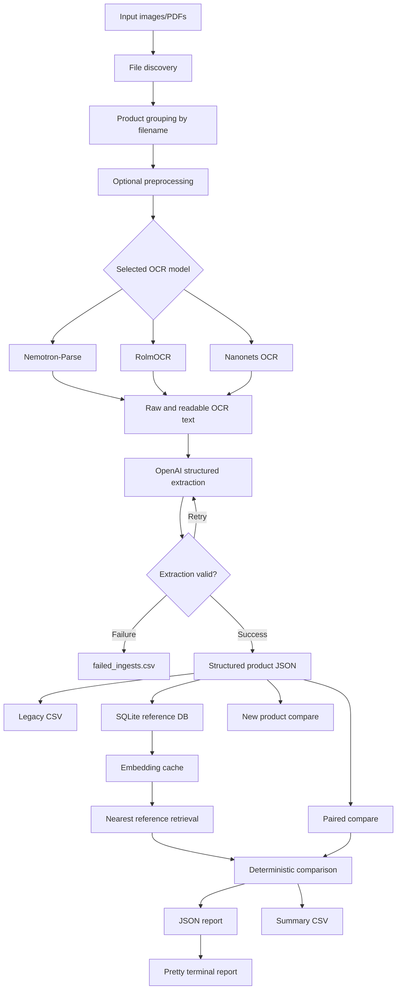

# Architecture

`image-to-text-analysis` is an Applied AI pipeline with four major layers:

1. Image/PDF ingestion.
2. OCR/VLM text extraction.
3. Structured data extraction.
4. Retrieval, comparison, and reporting.

## System Shape

## Layer Responsibilities

| Layer | Responsibility |
|---|---|
| Ingestion | Discover image/PDF files, validate paths, group multiple package sides into product groups |
| Preprocessing | Optionally deskew and improve contrast before OCR |
| OCR | Convert visual packaging text into raw and readable text using selected local model |
| Structuring | Convert OCR text into schema-bound JSON with model retries |
| Persistence | Store reference products, ingredients, raw text, extraction JSON, and embeddings in SQLite |
| Retrieval | Use enriched text embeddings to find likely reference products |
| Comparison | Produce deterministic field and formulation-style similarity scores |
| Reporting | Write JSON reports, timestamped CSV summaries, and human-readable terminal output |

## Key Components

| Module | Role |
|---|---|
| `pipeline.py` | CLI, file grouping, workflow orchestration, summary CSV output |
| `llm_structurer.py` | OpenAI JSON extraction, CSV flattening, retry logic, extraction errors |
| `embeddings.py` | Embedding text construction, OpenAI embeddings, vector cache, best-match search |
| `originals_db.py` | SQLite schema, product upserts, ingredient storage, embedding persistence |
| `comparator.py` | Ingredient, calorie, numeric-field, and informational comparison logic |
| `report.py` | Human-readable formatting for JSON comparison reports |
| OCR parser modules | Model-specific loading and image parsing wrappers |
| `utils.py` | Image/PDF handling, preprocessing, CSV validation, GPU memory helpers |

## Retrieval Architecture

The reference matching path uses an enriched embedding string built from extracted product identity fields. Stored reference vectors live in SQLite as normalized float32 blobs. Query vectors are computed on demand and compared by dot product, which is equivalent to cosine similarity after L2 normalization.

Candidate retrieval is intentionally constrained:

- Category-style extracted fields can filter impossible matches.
- Brand compatibility is checked after vector ranking.
- A configurable cosine threshold prevents weak matches from being accepted.
- Direct paired comparison exists when retrieval is not needed.

## Scoring Architecture

The comparison score is deterministic once structured fields exist. The main signals are:

- Rank-biased fuzzy ingredient overlap.
- Comparable calorie values.
- Numeric macro-style fields with tolerance.

Signals that cannot be compared are dropped and remaining weights are normalized. Informational fields such as description, brand, category, package size, and extracted labels are displayed side by side but do not necessarily drive the score.

## Failure Boundaries

| Boundary | Failure Mode | Mitigation |
|---|---|---|
| File inputs | Missing or unsupported image/PDF paths | Explicit path checks and extension filtering |
| OCR | GPU memory pressure or poor text extraction | Multiple backends, preprocessing, raw/readable text outputs |
| Structured extraction | Malformed JSON or missing `products` field | Retry/backoff and explicit `ExtractionError` |
| Ingestion | Product cannot be structured | `failed_ingests.csv` with reason and raw output |
| Retrieval | Wrong nearest neighbor | Similarity threshold, category filter, brand filter, paired mode |
| Scoring | Missing or incomparable fields | Null-aware subscores and weight renormalization |
| Review | JSON too dense for humans | `report.py` pretty-printer and summary CSV |

## Interview Signal

This project shows:

- Applied AI workflow design beyond one-shot prompting.
- Practical OCR/VLM model integration.
- Structured extraction and schema control.
- Retrieval-augmented matching with embeddings.
- Deterministic comparison logic layered after probabilistic extraction.
- Error handling and traceability for real-world AI pipelines.
