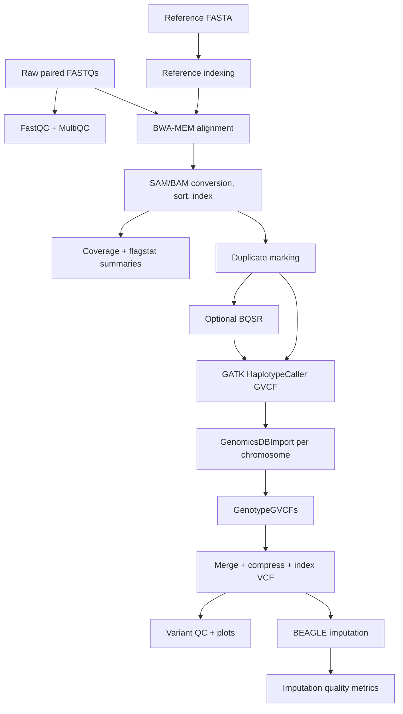

# low-pass-WGS-pipeline

> Modular SLURM workflow for low-pass whole-genome sequencing alignment, QC, variant calling, joint genotyping, and imputation.

## Overview

`low-pass-WGS-pipeline` is a research-oriented HPC pipeline for low-pass whole-genome sequencing analysis. It decomposes the workflow into documented SLURM modules for raw FASTQ QC, reference indexing, BWA alignment, coverage estimation, BAM processing, GATK variant calling, VQSR-style filtering, VCF merging/indexing, and BEAGLE genotype imputation.

The project is not a single monolithic workflow engine. It is a practical, modular collection of cluster-ready jobs with shared configuration, setup validation, reusable shell utilities, module-level documentation, and a small test suite for parsing alignment statistics.

## Table Of Contents

- [Problem Statement](#problem-statement)
- [Features](#features)
- [Access And Getting Started](#access-and-getting-started)
- [Tech Stack](#tech-stack)
- [Architecture](#architecture)
- [Pipeline And Workflow](#pipeline-and-workflow)
- [Project Structure](#project-structure)
- [Configuration](#configuration)
- [Testing And Validation](#testing-and-validation)
- [Security And Privacy](#security-and-privacy)
- [Key Design Decisions](#key-design-decisions)
- [Tradeoffs](#tradeoffs)
- [What I Learned](#what-i-learned)
- [Next Improvements](#next-improvements)
- [Contribution Model](#contribution-model)
- [License](#license)
- [Acknowledgements](#acknowledgements)
- [Author](#author)
- [Links](#links)

## Problem Statement

Low-pass WGS reduces sequencing cost by using shallow coverage, often around 0.1x to 5x, while still supporting genome-wide analyses when paired with cohort-level variant calling and imputation. The engineering challenge is that the workflow spans many tools, large files, array jobs, reference assets, species-specific known sites, quality thresholds, and downstream imputation resources.

The pipeline breaks that into manageable stages:

1. Validate tools, reference files, sample lists, output paths, and SLURM availability.
2. Run FASTQ-level QC and aggregate reports.
3. Index the reference genome for BWA, SAMtools, and GATK.
4. Align paired reads with BWA-MEM through SLURM array jobs.
5. Convert, sort, index, and summarize BAM files.
6. Estimate coverage for low-pass quality checks.
7. Mark duplicates and optionally run BQSR when known sites exist.
8. Call per-sample GVCFs with GATK HaplotypeCaller.
9. Joint genotype across chromosomes with GenomicsDBImport and GenotypeGVCFs.
10. Merge, compress, index, and QC joint VCFs.
11. Impute missing genotypes with BEAGLE and extract imputation quality metrics.

## Features

- Modular SLURM scripts organized by pipeline stage.
- Shared Bash utility functions for logging, validation, command checks, array-index bounds, module loading, and cleanup.
- Central configuration template for references, samples, chromosomes, resource defaults, tool modules, VQSR inputs, temporary directories, and imputation resources.
- Setup validation script that checks required tools, optional tools, config values, reference indexes, pipeline structure, SLURM commands, and disk space.
- FASTQ QC with FastQC and MultiQC.
- Reference indexing for BWA, SAMtools FASTA index, and GATK sequence dictionary.
- BWA-MEM paired-end alignment using SLURM arrays.
- Alignment-stat extraction into compact TSV summaries.
- Coverage and depth estimation for low-pass sequencing quality checks.
- Duplicate marking and optional BQSR for species with reliable known-sites resources.
- GATK GVCF calling, GenomicsDBImport, and joint genotyping.
- VCF merge/index workflow with BCFtools and tabix.
- Raw variant QC and R-based variant QC plots.
- BEAGLE imputation and imputation-quality extraction.
- bats test coverage for alignment-stat parsing.

## Access And Getting Started

Source repo: [aa9gj/low-pass-WGS-pipeline](https://github.com/aa9gj/low-pass-WGS-pipeline)

Typical setup:

```bash
git clone git@github.com:aa9gj/low-pass-WGS-pipeline.git
cd low-pass-WGS-pipeline
cp config/pipeline.config.example config/pipeline.config
./scripts/validate_setup.sh
```

After setup validation, users run the module scripts in workflow order, usually through `sbatch` on a SLURM cluster.

## Tech Stack

| Area | Stack |
|---|---|
| Orchestration | Bash, SLURM, SLURM array jobs |
| Shared utilities | Bash strict mode, reusable validation/logging helpers |
| Raw read QC | FastQC, MultiQC |
| Reference prep | BWA index, SAMtools `faidx`, Picard/GATK sequence dictionary |
| Alignment | BWA-MEM |
| BAM processing | SAMtools, GATK/Picard duplicate marking, optional BQSR |
| Variant calling | GATK HaplotypeCaller, GenomicsDBImport, GenotypeGVCFs |
| Variant operations | BCFtools, htslib/tabix |
| Variant filtering/QC | VQSR-style scripts, R QC plotting |
| Imputation | BEAGLE |
| Testing | bats |

Deeper stack notes: [stack.md](stack.md).

## Architecture



The architecture is stage-oriented rather than engine-oriented. Each module owns one operational step and has companion README documentation.

Full architecture notes: [architecture.md](architecture.md).

## Pipeline And Workflow

| Module | Purpose |
|---|---|
| `00_fastq_qc` | Raw read QC and MultiQC aggregation |
| `01_reference` | Reference genome indexing |
| `02_alignment` | BWA alignment, depth calculation, alignment statistics |
| `04_coverage` | Detailed coverage analysis |
| `05_processing` | Duplicate marking, BQSR, insert size, alignment metrics |
| `06_variant_calling` | GVCF calling, joint genotyping, VQSR/filtering, VCF merge/index, variant QC |
| `09_imputation` | BEAGLE imputation and quality extraction |

Full pipeline notes: [pipelines.md](pipelines.md).

## Project Structure

The repo is organized by pipeline stage under `Modules/`, with `docs/`, `scripts/`, `config/`, and `tests/` supporting the operational workflow.

Detailed project map: [project-structure.md](project-structure.md).

## Configuration

`config/pipeline.config.example` defines:

- Reference genome path.
- Known-sites VCF for BQSR.
- Raw FASTQ and output directories.
- Derived output subdirectories.
- Sample list and sample count.
- Chromosome list.
- SLURM partition/account defaults.
- Thread and memory settings.
- Tool module names.
- VQSR training resources.
- BEAGLE JAR and reference panel.
- Temporary directory.

The design makes environment-specific details explicit rather than burying them inside individual scripts.

## Testing And Validation

The repo includes two validation layers:

- `scripts/validate_setup.sh` checks tools, config, reference indexes, sample list, pipeline directories, SLURM commands, and disk space.
- bats tests validate the alignment-stat extraction helper against example `samtools flagstat` output.

Future CI could add shell linting, bats execution, and containerized dry-run checks around selected modules.

## Security And Privacy

Whole-genome sequencing data is sensitive. This case study avoids sample IDs, real file paths, genotype outputs, and project-specific biological results. The pipeline template uses placeholder paths and the repo excludes large sequencing/intermediate outputs by convention.

Full notes: [security-privacy.md](security-privacy.md).

## Key Design Decisions

| Decision | Rationale |
|---|---|
| Use modular SLURM scripts | Fits HPC environments where analysts run staged jobs and inspect outputs between steps |
| Add shared Bash utilities | Reduces repeated logging, file checks, array validation, and command validation code |
| Add setup validation before analysis | Catches missing tools, missing indexes, bad config, and inaccessible paths early |
| Keep BQSR optional | Known-sites resources are not equally reliable across species |
| Use GVCF plus joint genotyping | Supports cohort-level variant calling and chromosome-level parallelism |
| Include imputation | Low-pass WGS relies on genotype imputation to recover missing genotype information |
| Document every module | Makes each stage inspectable for analysts who need to run or modify one step at a time |

## Tradeoffs

- SLURM/Bash modules are easy to inspect but less automatically composable than Nextflow or Snakemake.
- Manual stage execution gives control, but increases the chance of running steps out of order.
- BQSR and VQSR can improve quality for well-resourced species, but are risky when known-sites resources are weak.
- GATK workflows are familiar and robust, but computationally heavy for large cohorts.
- BEAGLE imputation improves low-pass utility, but depends heavily on reference-panel quality and ancestry/species match.

## What I Learned

- How to structure an HPC genomics workflow around operational checkpoints.
- How low-pass WGS shifts emphasis from raw depth to cohort calling, QC, and imputation quality.
- How to make fragile shell pipelines safer with shared validation and strict-mode helpers.
- How reference resources and species support shape BQSR, VQSR, and imputation decisions.
- How to document bioinformatics modules so another analyst can run, debug, and adapt them.

## Next Improvements

- Convert the staged SLURM scripts into a Nextflow or Snakemake workflow for stronger dependency tracking.
- Add a sanitized example config and tiny test fixture.
- Add shellcheck and bats to CI.
- Add sample sheet validation.
- Add automatic chromosome-list generation from FASTA index.
- Add better provenance around reference genome, known-sites, and imputation panel versions.
- Add an end-to-end dry-run mode that validates module inputs without submitting cluster jobs.

## Contribution Model

Useful contribution areas would include:

- More portable cluster profiles.
- Additional imputation workflows.
- Better VCF QC reporting.
- Small synthetic test fixtures.
- Documentation improvements for species-specific references.
- Migration toward a workflow engine.

## License

The source repository is available for academic and research use.

## Acknowledgements

The pipeline builds on BWA, SAMtools, GATK, Picard, BCFtools, htslib/tabix, FastQC, MultiQC, BEAGLE, R, bats, and SLURM-based HPC workflows.

## Author

Arby Abood

## Links

- Source repo: [aa9gj/low-pass-WGS-pipeline](https://github.com/aa9gj/low-pass-WGS-pipeline)
- Supporting docs in this case study:
  - [Architecture](architecture.md)
  - [Pipelines](pipelines.md)
  - [Stack](stack.md)
  - [Security and privacy](security-privacy.md)
  - [Project structure](project-structure.md)
