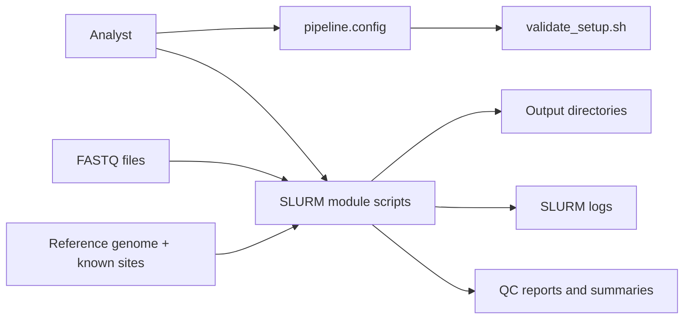
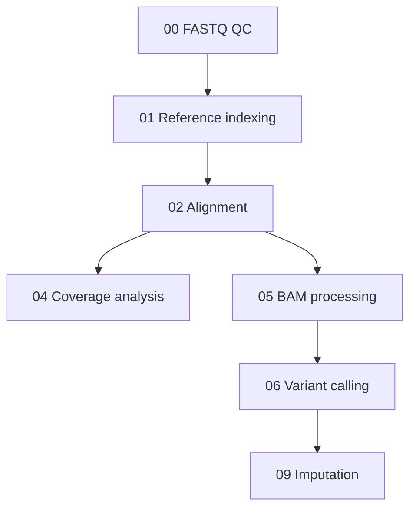
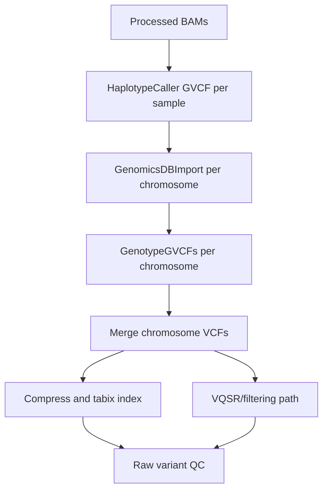
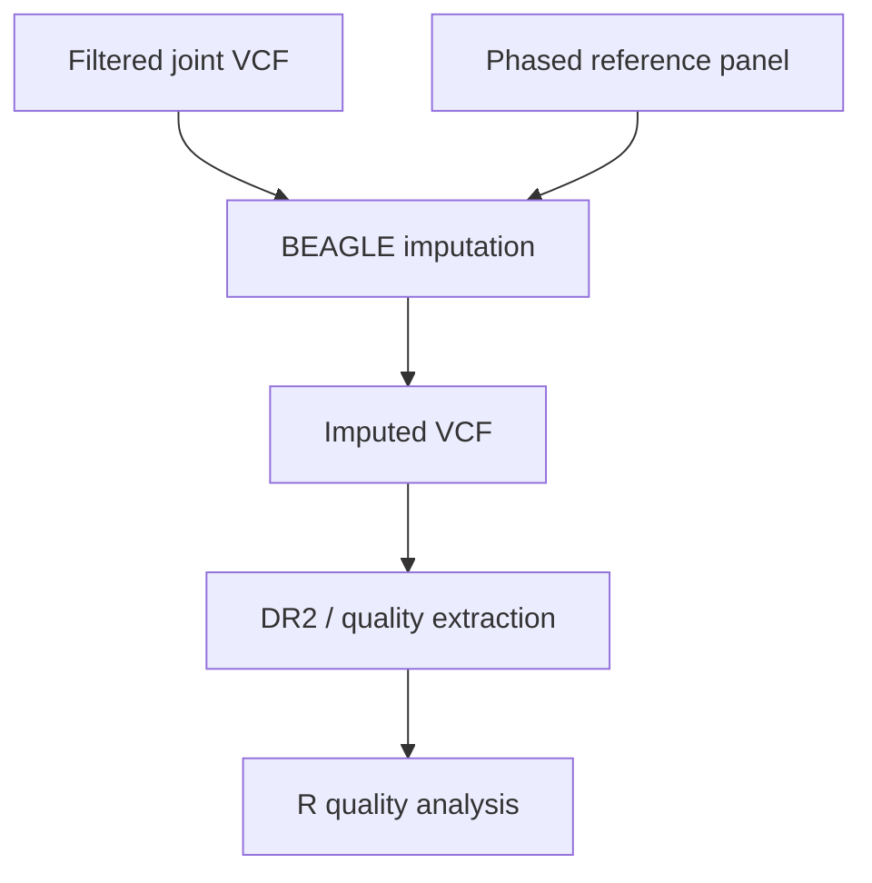

# low-pass-WGS-pipeline Architecture

## System Context

`low-pass-WGS-pipeline` is an HPC-oriented genomics workflow built from SLURM job scripts. It runs in staged modules, with analysts validating setup, submitting jobs, inspecting outputs, and advancing to the next stage.

## Stage Architecture

Each stage is represented by one or more SLURM scripts and a module README. The pipeline favors operational transparency over hidden orchestration.

## Module Groups

| Module Group | Responsibility |
|---|---|
| `00_fastq_qc` | FastQC per sample and MultiQC report aggregation |
| `01_reference` | BWA, SAMtools, and GATK reference indexes |
| `02_alignment` | BWA-MEM alignment, coverage, flagstat metrics, summary extraction |
| `04_coverage` | Coverage/depth analysis |
| `05_processing` | Duplicate marking, optional BQSR, insert size, alignment metrics |
| `06_variant_calling` | GVCF calling, GenomicsDBImport, joint genotyping, VQSR/filtering, VCF merge/index, QC plots |
| `09_imputation` | BEAGLE imputation and imputation-quality metrics |

## Shared Utility Layer

`scripts/common.sh` provides a small framework for safer shell execution:

- `set -euo pipefail`.
- Timestamped logging.
- File and directory validation.
- Command availability checks.
- SLURM array-job validation.
- Array-index bounds checks.
- Module loading wrapper.
- Job info and summary printing.
- Cleanup traps.

This is the reliability layer that keeps individual module scripts from each reinventing error handling.

## Configuration Layer

`config/pipeline.config.example` centralizes:

- Reference paths.
- Known-sites resources.
- Input/output directories.
- Sample list metadata.
- Chromosome list.
- SLURM defaults.
- Tool module names.
- GATK Java options.
- BEAGLE reference panel paths.
- VQSR resource paths.
- Temporary directory.

The goal is to make environment-specific settings explicit and easier to audit.

## Variant Calling Architecture

The design uses GVCFs and joint genotyping so cohort information can inform genotype calls, which is especially important when coverage is low.

## Imputation Architecture

Imputation is a core downstream step because low-pass sequencing intentionally accepts sparse direct observation in exchange for lower cost and broader cohort scale.

## Validation Architecture

The setup validator checks:

- Required tools: BWA, SAMtools, GATK, Picard, BCFtools, tabix, Java.
- Optional tools: FastQC, MultiQC, R.
- Configuration file existence.
- Reference FASTA, `.fai`, BWA index, and sequence dictionary.
- Output directory accessibility.
- Sample list existence.
- Required module directories.
- SLURM command availability.
- Disk space visibility.

## Architecture Theme

The pipeline is built around explicit checkpoints:

1. Validate.
2. Submit a stage.
3. Inspect outputs.
4. Continue.

That is a pragmatic architecture for exploratory genomics work on shared HPC systems.
