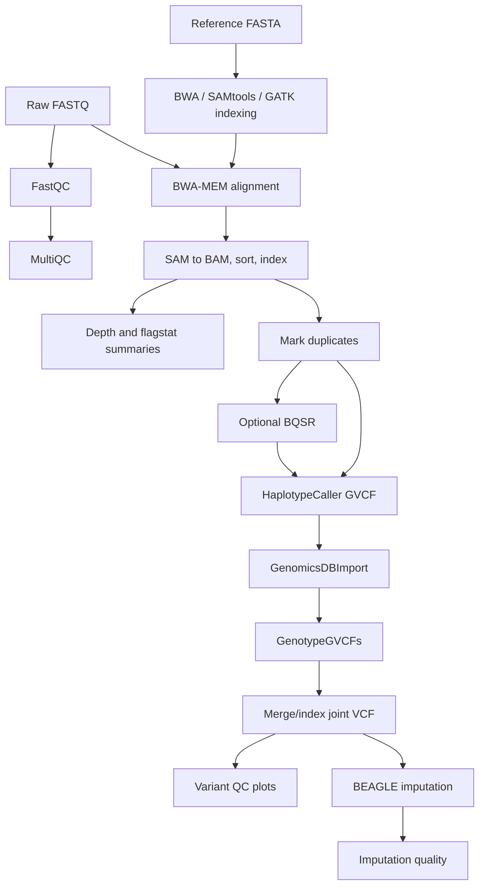

# low-pass-WGS-pipeline Pipelines

## End-To-End Workflow

## Setup Validation Pipeline

Before analysis, `validate_setup.sh` checks the environment:

| Check | Why It Matters |
|---|---|
| Required tools | Prevents late failures after long cluster jobs |
| Optional tools | Warns when QC/reporting extras are missing |
| Config file | Ensures paths and settings are available |
| Reference indexes | Confirms BWA, SAMtools, and GATK reference prep |
| Output directory | Confirms writable storage |
| Sample list | Confirms job-array inputs |
| Pipeline structure | Confirms expected module directories exist |
| SLURM commands | Confirms cluster submission path |
| Disk space | Surfaces large-data risk early |

## FASTQ QC Pipeline

Raw paired FASTQs are processed with FastQC and aggregated with MultiQC. This catches read quality, adapter contamination, sequence duplication, and other input issues before alignment.

## Alignment Pipeline

BWA-MEM aligns paired FASTQs to the indexed reference genome. SLURM arrays process many samples in parallel. Alignment outputs feed downstream BAM conversion, sorting, indexing, depth estimation, and flagstat summaries.

## Coverage And Alignment Stats Pipeline

Low-pass WGS needs explicit coverage checks because depth drives confidence:

- Average genome-wide depth.
- Per-sample mapping percentage.
- Properly paired percentage.
- Singleton fraction.
- Coverage summaries.

The `extract_relevant_stats` helper turns verbose `samtools flagstat` files into a concise TSV.

## BAM Processing Pipeline

Processed BAMs go through duplicate marking and optional BQSR.

BQSR is deliberately optional because it requires reliable known-sites resources. For species or cohorts without high-confidence known variants, skipping BQSR can be more honest than applying weak calibration data.

## Variant Calling Pipeline

GATK variant calling is organized as:

1. HaplotypeCaller in GVCF mode per sample.
2. GenomicsDBImport by chromosome.
3. GenotypeGVCFs by chromosome.
4. Merge chromosome-specific VCFs.
5. Compress and tabix-index final callsets.
6. Apply VQSR/filtering where resources are appropriate.
7. Extract raw variant QC metrics.
8. Generate R QC plots.

## Imputation Pipeline

BEAGLE uses the joint VCF and a reference panel to infer missing genotypes. The pipeline then extracts imputation quality metrics such as dosage R-squared so analysts can filter or interpret imputed variants.

## Testing Pipeline

The test suite currently targets parsing correctness:

- Input: example `samtools flagstat` output.
- Tool under test: `Modules/02_alignment/extract_relevant_stats`.
- Framework: bats.
- Output expectation: sample name, total reads, mapping percentage, properly paired percentage, and singleton percentage.

This is small, but it is the right instinct: test fragile parsing logic with a fixture.

## Operational Pipeline Pattern

The pipeline assumes staged execution:

1. Prepare config and sample lists.
2. Validate setup.
3. Submit one module or stage with `sbatch`.
4. Inspect logs and outputs.
5. Submit the next stage.

This pattern works well when data are large, cluster queues are variable, and analysts need checkpoints between expensive jobs.
