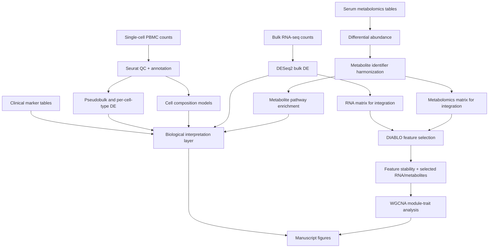

# multiomics-canine-aging

> Quarto/R manuscript workflow for analyzing canine aging across clinical labs, single-cell RNA-seq, bulk RNA-seq, serum metabolomics, and cross-omics integration.

## Overview

`multiomics-canine-aging` is a computational biology analysis repo for a young-versus-senior canine aging cohort. The study combines clinical markers, PBMC single-cell RNA-seq, PBMC bulk RNA-seq, and untargeted serum metabolomics. The repository is organized as Quarto notebooks for each analysis modality plus figure-generation scripts for manuscript panels.

The portfolio value is the breadth of decomposition: each assay has its own statistical workflow, quality-control assumptions, feature engineering, annotation strategy, and output tables, then the integration notebook aligns matched samples across RNA and metabolite matrices for DIABLO feature selection and WGCNA module analysis.

## Table Of Contents

- [Problem Statement](#problem-statement)
- [Features](#features)
- [Access And Getting Started](#access-and-getting-started)
- [Tech Stack](#tech-stack)
- [Architecture](#architecture)
- [Pipeline And Workflow](#pipeline-and-workflow)
- [Project Structure](#project-structure)
- [Configuration](#configuration)
- [Testing And Validation](#testing-and-validation)
- [Security And Privacy](#security-and-privacy)
- [Key Design Decisions](#key-design-decisions)
- [Tradeoffs](#tradeoffs)
- [What I Learned](#what-i-learned)
- [Next Improvements](#next-improvements)
- [Contribution Model](#contribution-model)
- [License](#license)
- [Acknowledgements](#acknowledgements)
- [Author](#author)
- [Links](#links)

## Problem Statement

Aging biology is multi-system and multi-scale. Clinical lab values can show physiological shifts, single-cell RNA-seq can reveal immune-cell composition and cell-type-specific expression, bulk RNA-seq can measure cohort-level transcriptional changes, and metabolomics can capture systemic biochemical remodeling. The challenge is to analyze each modality correctly while still producing an integrated interpretation across matched animals.

The workflow decomposes that into a reproducible analysis:

1. Process PBMC single-cell RNA-seq into a curated Seurat object with QC, normalization, clustering, UMAP, marker discovery, and lineage/subcluster annotation.
2. Run pseudobulk and per-cell-type differential expression on single-cell counts.
3. Test cell-type composition changes with propeller-style models and calculate focused immune ratios.
4. Run bulk RNA-seq differential expression with DESeq2 while controlling for sex.
5. Map transcript/gene identifiers back to canine gene annotations.
6. Run GO/KEGG enrichment and overlap bulk signals with pseudobulk, cell-type, phenotype, and GWAS-derived evidence.
7. Run metabolomics differential abundance with limma/edgeR-style modeling across imputed and non-imputed matrices.
8. Harmonize metabolite identifiers across KEGG, HMDB, PubChem, ChEBI, and vendor annotations.
9. Run metabolite pathway enrichment with RaMP and metabolite-set enrichment with fgsea.
10. Align matched RNA and metabolomics samples, filter features, tune DIABLO models, and assess feature stability.
11. Use WGCNA to connect RNA modules with selected metabolite traits.
12. Regenerate manuscript figures from analysis outputs.

## Features

- Quarto notebooks for single-cell, bulk RNA-seq, metabolomics, and cross-omics integration.
- Seurat workflow for PBMC single-cell analysis.
- SCTransform normalization with mitochondrial-content regression.
- PCA, neighbor graph construction, clustering, UMAP, marker discovery, and literature-guided cell annotation.
- Subclustering for major immune lineages.
- Pseudobulk differential expression across all cells.
- Per-cell-type pseudobulk DESeq2 workflow with sample-count and gene-count safeguards.
- Propeller cell-composition testing at major and high-resolution cell-type levels.
- Focused immune ratio modeling.
- Bulk RNA-seq DESeq2 analysis with metadata/count synchronization checks.
- Gene annotation waterfall for transcript and gene-symbol reconciliation.
- GO and KEGG enrichment with canine annotation support.
- Phenotype-mining and GWAS/orthology overlays for biological interpretation.
- Metabolomics differential abundance with limma/edgeR-style modeling.
- KEGG, HMDB, PubChem, ChEBI, and cleaned-name mapping for metabolite annotation.
- RaMP pathway enrichment and fgsea metabolite-set enrichment.
- RNA/metabolomics sample alignment checks before integration.
- mixOmics DIABLO model tuning across design weights and feature counts.
- Jaccard-based feature-selection stability analysis.
- WGCNA module-trait analysis linking RNA modules to metabolite traits.
- R and Python scripts for manuscript-style figure panels and custom UpSet plots.

## Access And Getting Started

Source repo: [aa9gj/multiomics-canine-aging](https://github.com/aa9gj/multiomics-canine-aging)

Typical setup:

```bash
git clone git@github.com:aa9gj/multiomics-canine-aging.git
cd multiomics-canine-aging
```

The repository is notebook-centered. Typical render/run order:

```bash
quarto render analysis/complete_analysis_single_cell.qmd
quarto render analysis/complete_analysis_bulk_RNAseq.qmd
quarto render analysis/complete_analysis_metabolomics.qmd
quarto render analysis/complete_analysis_integration.qmd
```

Important external resources include:

- Clinical marker tables.
- PBMC single-cell count matrices and metadata.
- PBMC bulk RNA-seq count matrix and sample metadata.
- Serum metabolomics abundance, annotation, and sample metadata tables.
- Canine gene annotation resources.
- Phenotype, GWAS, and orthology support tables.
- Pathway databases exposed through Bioconductor, RaMP, and fgsea inputs.

## Tech Stack

| Area | Stack |
|---|---|
| Authoring | Quarto, R Markdown-style executable notebooks |
| Core language | R |
| Single-cell | Seurat, SCTransform, sctransform, glmGamPoi, presto, Matrix, SparseArray |
| Differential expression | DESeq2, Seurat pseudobulk, clusterProfiler |
| Cell composition | speckle/propeller-style modeling |
| Bulk RNA-seq | DESeq2, rtracklayer, org.Cf.eg.db |
| Metabolomics | edgeR, limma-style modeling, RaMP, fgsea |
| Multi-omics integration | mixOmics DIABLO, BiocParallel |
| Network analysis | WGCNA, matrixStats |
| Data handling | data.table, tidyverse, dplyr, tidyr, tibble, qs |
| Visualization | ggplot2, ggrepel, ggpubr, patchwork, ComplexHeatmap, circlize, matplotlib |
| Execution support | SLURM helper script, Docker-backed upstream preprocessing support |

Deeper stack notes: [stack.md](stack.md).

## Architecture



The architecture keeps each assay statistically independent until sample identity and feature matrices are ready for integration. That keeps the single-cell, bulk, metabolomics, and clinical assumptions visible instead of hiding them inside a single monolithic notebook.

Full architecture notes: [architecture.md](architecture.md).

## Pipeline And Workflow

| Stage | Purpose |
|---|---|
| Single-cell setup | Load count matrix, metadata, helper functions, and serialized object utilities |
| Single-cell QC | Create Seurat object, filter low-quality cells/features, remove high mitochondrial-content cells |
| Single-cell annotation | Normalize, reduce dimensions, cluster, discover markers, annotate major and high-resolution immune cell types |
| Single-cell DE | Run all-cell pseudobulk and per-cell-type DESeq2 comparisons |
| Cell composition | Test age-associated shifts in cell-type fractions and focused immune ratios |
| Bulk RNA-seq | Synchronize metadata/counts, run DESeq2, annotate genes, and summarize significant genes |
| Bulk interpretation | Run GO/KEGG enrichment, phenotype mining, GWAS/orthology overlays, and per-cell-type GSEA comparisons |
| Metabolomics | Clean metadata and metabolite IDs, run differential abundance, summarize pathways |
| Metabolite enrichment | Run RaMP pathway enrichment and fgsea metabolite-set enrichment |
| Multi-omics integration | Align matched RNA/metabolomics samples, filter features, tune DIABLO, assess feature stability |
| Network analysis | Run WGCNA and test RNA module relationships with selected metabolite traits |
| Figures | Regenerate manuscript panels and custom visualizations |

Full pipeline notes: [pipelines.md](pipelines.md).

## Project Structure

The source repo is compact: analysis notebooks in `analysis/`, figure scripts in `figures/`, and a root README that describes modalities and FAIR-style data availability.

Detailed project map: [project-structure.md](project-structure.md).

## Configuration

Configuration is currently embedded in notebooks and scripts. Important surfaces include:

- Data directories for clinical, single-cell, bulk RNA-seq, and metabolomics inputs.
- R library paths on the analysis environment.
- Seurat QC thresholds.
- PCA dimensions and clustering resolution.
- Cell-type annotation marker references.
- DESeq2 formulas and factor reference levels.
- Differential abundance model contrasts.
- Metabolite identifier mapping files.
- DIABLO design-weight grid, `keepX` grid, cross-validation folds, repeats, and parallel workers.
- WGCNA feature filters, soft-threshold power, and module-trait settings.
- Figure output paths and panel-specific styling.

## Testing And Validation

The repo is an analysis codebase, so validation is mostly embedded as checks inside notebooks:

- Metadata/count matrix synchronization checks.
- Hard stops when sample names do not align.
- Filtering of low-support genes and low-quality cells.
- Safeguards for missing condition labels.
- Minimum sample and gene-count thresholds for per-cell-type DE.
- Near-zero-variance filtering before multi-omics modeling.
- DIABLO model tuning with repeated cross-validation.
- Feature-selection stability through Jaccard similarity.
- Enrichment analyses separated by direction and modality.
- Figure scripts that regenerate final panels from derived tables.

Future validation could add small fixture datasets for sample alignment, identifier mapping, per-cell-type aggregation, metabolite ID harmonization, DIABLO input construction, and figure smoke tests.

## Security And Privacy

This is a public portfolio summary, so it intentionally avoids non-technical attribution language, local filesystem paths, and any private/raw sample-level tables. The case study focuses on architecture, methods, and analysis decomposition.

Full notes: [security-privacy.md](security-privacy.md).

## Key Design Decisions

| Decision | Rationale |
|---|---|
| Separate notebooks by modality | Keeps assay-specific assumptions and outputs inspectable |
| Use Seurat object checkpoints | Avoids rerunning expensive single-cell stages during annotation and downstream analysis |
| Use pseudobulk for cell-type DE | Treats animal/sample as the replicate unit instead of individual cells |
| Control bulk RNA-seq DE for sex | Reduces confounding in young-versus-senior comparisons |
| Harmonize metabolite IDs before enrichment | Prevents pathway analysis from depending on a single incomplete identifier namespace |
| Require exact sample alignment before DIABLO | Avoids cross-omics leakage from mismatched animals |
| Tune DIABLO across design weights | Tests how strongly RNA and metabolomics blocks should be coupled |
| Use WGCNA after integration | Moves from selected features to module-level biological interpretation |

## Tradeoffs

- The notebooks are transparent and manuscript-friendly, but a workflow engine would make reruns more automated.
- Local path configuration is easy during active analysis, but it should be externalized for portability.
- DIABLO and WGCNA provide rich cross-omics interpretation, but they require careful feature filtering and stability checks.
- Some external biological evidence tables are analysis assets rather than code, so reproducibility depends on clear data manifests.
- Figure scripts are flexible for publication, but panel generation could be made more parameterized.

## What I Learned

- How to organize a multi-assay aging analysis without collapsing everything into one opaque script.
- How much cross-omics analysis depends on sample identity hygiene before modeling begins.
- Why pseudobulk design matters for single-cell studies with subject-level comparisons.
- How to connect transcript, metabolite, pathway, phenotype, and clinical evidence into a coherent biological narrative.
- Where workflow packaging and configuration would most improve future reproducibility.

## Next Improvements

- Add a `config/` directory with path, contrast, and threshold settings.
- Add a data manifest with file roles, accessions, expected columns, and checksums.
- Add small synthetic fixtures for notebook smoke tests.
- Convert repeated differential analysis utilities into reusable R functions.
- Add a workflow wrapper for rendering notebooks and figures in dependency order.
- Add a container or renv lockfile for R/Bioconductor package reproducibility.

## Contribution Model

This repo primarily supports a manuscript analysis. Contributions should preserve modality boundaries, document changed public data versions, and avoid mixing exploratory notebook state with final reproducible outputs.

## License

The source README references MIT licensing, but a standalone license file was not present in the inspected clone. Confirm licensing before reuse outside portfolio review.

## Acknowledgements

The workflow builds on open-source scientific computing tools and public annotation resources across Bioconductor, Seurat, mixOmics, WGCNA, RaMP, fgsea, and canine genome annotation ecosystems.

## Author

Arby Abood.

## Links

- Source repo: [aa9gj/multiomics-canine-aging](https://github.com/aa9gj/multiomics-canine-aging)
- Architecture notes: [architecture.md](architecture.md)
- Pipeline notes: [pipelines.md](pipelines.md)
- Stack notes: [stack.md](stack.md)
