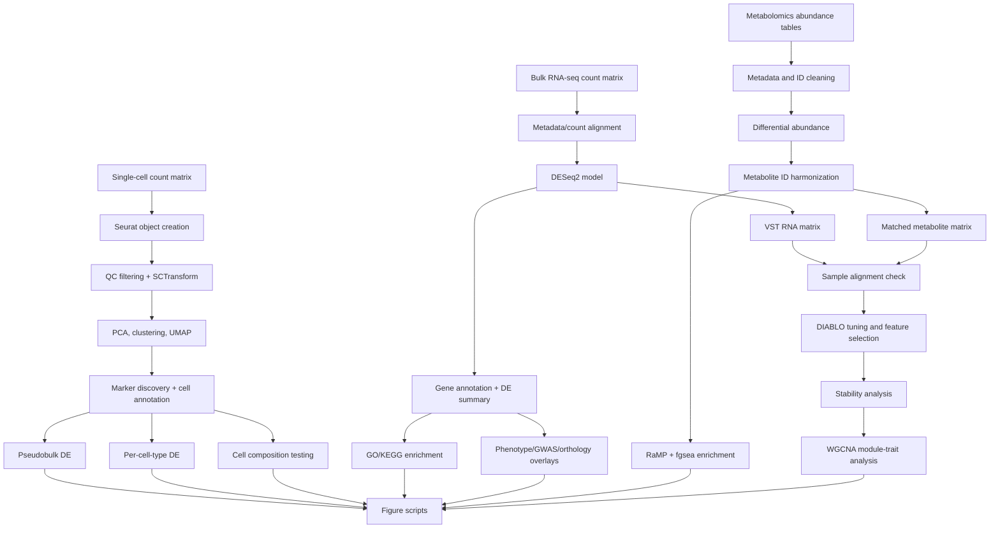

# Architecture

## System Shape

This repository is a notebook-driven multi-omics analysis system. It has four major evidence streams:

1. Clinical laboratory measurements.
2. Single-cell PBMC RNA-seq.
3. Bulk PBMC RNA-seq.
4. Untargeted serum metabolomics.

The integration layer aligns matched samples across bulk RNA-seq and metabolomics, then applies supervised multi-block modeling and network analysis to find coordinated RNA/metabolite signatures of aging.

## Data Flow

## Component Responsibilities

| Component | Responsibility |
|---|---|
| `analysis/complete_analysis_single_cell.qmd` | Single-cell QC, normalization, clustering, annotation, pseudobulk DE, per-cell-type DE, composition testing |
| `analysis/complete_analysis_bulk_RNAseq.qmd` | Bulk RNA-seq DESeq2 analysis, gene annotation reconciliation, enrichment, phenotype/GWAS overlays |
| `analysis/complete_analysis_metabolomics.qmd` | Metabolomics cleaning, differential abundance, identifier harmonization, pathway enrichment |
| `analysis/complete_analysis_integration.qmd` | RNA/metabolomics matrix construction, sample alignment, DIABLO tuning, feature stability, WGCNA |
| `analysis/run_combine.slurm` | Cluster helper for upstream containerized single-cell preprocessing |
| `figures/` | Manuscript panel regeneration and custom visualizations |

## Evidence Layers

The project builds an interpretation layer from multiple evidence types:

- Cell-type abundance shifts from single-cell composition models.
- Cell-type-specific expression changes from pseudobulk DESeq2.
- Cohort-level transcriptional changes from bulk RNA-seq.
- Pathway-level transcriptomic changes from GO/KEGG enrichment.
- Metabolite abundance changes from limma/edgeR-style modeling.
- Metabolite pathway changes from RaMP and fgsea.
- RNA/metabolite joint signatures from DIABLO.
- Gene-module/metabolite-trait associations from WGCNA.
- Clinical markers, phenotype resources, GWAS targets, and orthology tables as interpretation overlays.

## Boundary Conditions

The important technical boundaries are:

- Subject/sample identifiers across clinical, RNA-seq, and metabolomics tables.
- Different replicate units between cells and animals.
- Canine annotation maturity compared with human/mouse resources.
- Mixed file provenance across raw data, derived tables, and manually curated support files.
- High-dimensional feature selection with limited cohort size.
- Notebook statefulness during exploratory manuscript development.

## Why This Architecture Works

The modality-first structure keeps each assay honest. Single-cell, bulk RNA-seq, metabolomics, and clinical analyses are each allowed to use their appropriate statistical machinery before integration. The integration notebook then works with aligned, derived matrices rather than raw heterogeneous inputs.
