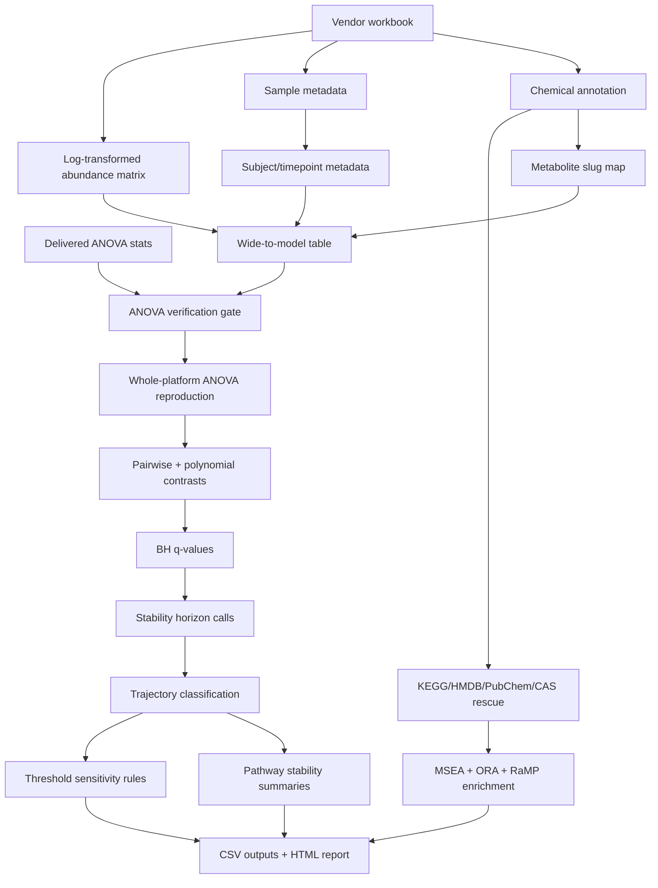

# stability-metabolon

> Quarto/R workflow for validating metabolomics storage-stability statistics, classifying degradation trajectories, and stress-testing stability thresholds.

## Overview

`stability-metabolon` is a private computational biology analysis repo for a fecal metabolomics storage-stability study. The core workflow ingests a vendor workbook, reconstructs the analysis tables, validates a per-metabolite ANOVA model against delivered statistics, scales the model across the platform, classifies storage trajectories, rescues metabolite identifiers for pathway analysis, and runs threshold-sensitivity analyses for alternative stability rules.

The important portfolio angle is the testing discipline inside the analysis. This is not packaged as a formal R package with `testthat`; instead, the notebooks contain analytical validation gates: file and schema checks, duplicate-ID assertions, a single-metabolite ANOVA reproduction gate, whole-platform p-value agreement metrics, per-metabolite `tryCatch` isolation, package/API shape checks, and threshold-sensitivity notebooks that function like decision-rule tests.

## Table Of Contents

- [Problem Statement](#problem-statement)
- [Features](#features)
- [Access And Getting Started](#access-and-getting-started)
- [Tech Stack](#tech-stack)
- [Architecture](#architecture)
- [Pipeline And Workflow](#pipeline-and-workflow)
- [Project Structure](#project-structure)
- [Configuration](#configuration)
- [Testing And Validation](#testing-and-validation)
- [Security And Privacy](#security-and-privacy)
- [Key Design Decisions](#key-design-decisions)
- [Tradeoffs](#tradeoffs)
- [What I Learned](#what-i-learned)
- [Next Improvements](#next-improvements)
- [Contribution Model](#contribution-model)
- [License](#license)
- [Acknowledgements](#acknowledgements)
- [Author](#author)
- [Links](#links)

## Problem Statement

Storage and handling can change metabolite measurements before biology is even interpreted. For a storage-stability study, the practical question is not only whether time affects metabolite abundance, but when each metabolite first deviates, whether changes are monotonic or complex, which pathways are most vulnerable, and whether the rules used to call instability are robust to threshold choices.

The workflow decomposes that into a reproducible analysis:

1. Parameterize the workbook path and expected worksheet names.
2. Load chemical annotation, sample metadata, log-transformed abundance data, and delivered ANOVA statistics.
3. Normalize column names and create stable metabolite slugs from chemical display names.
4. Abort if required workbook tabs, columns, IDs, or sample keys do not line up.
5. Reproduce the delivered ANOVA for a single spot-check metabolite before scaling.
6. Refit `value ~ TIME + subject_id` for every metabolite and compare p-values against delivered statistics.
7. Run pairwise timepoint contrasts and orthogonal polynomial contrasts with `emmeans`.
8. Apply BH-adjusted q-values across metabolites within each contrast family.
9. Define stability horizons using both statistical and effect-size criteria.
10. Classify trajectories by first-break timing and curve shape.
11. Summarize instability at platform, super-pathway, and sub-pathway levels.
12. Rescue KEGG identifiers through HMDB, PubChem, and CAS mappings.
13. Run KEGG MSEA/ORA and cross-database pathway enrichment.
14. Rerun stability calls under alternative p-value/q-value/effect-size thresholds.
15. Save derived CSVs and presentation-ready plots while keeping raw data out of Git.

## Features

- Quarto notebooks with executable narrative and embedded validation.
- Workbook-driven ingestion from raw vendor deliverables.
- Required-column checks for chemical annotation and statistical outputs.
- Duplicate metabolite slug detection.
- Sample metadata checks for sample, timepoint, and subject identifiers.
- Data-tab header resolution from numeric IDs to stable metabolite slugs.
- Single-metabolite ANOVA reproduction gate before full-platform modeling.
- Whole-platform ANOVA reproducibility report with Pearson and Spearman agreement metrics.
- Per-metabolite model fitting with `tryCatch` failure isolation.
- Pairwise timepoint contrasts and polynomial time-course contrasts through `emmeans`.
- BH q-value adjustment across metabolites within each comparison family.
- Stability horizon calls using `q < 0.05` plus effect-size thresholds.
- Trajectory classes for stable, early, mid, late, progressive, saturation, cliff, and complex behavior.
- Pathway-level stability summaries.
- Storage-horizon decision table for practical recommendation thresholds.
- PCA views for sample clustering by subject and timepoint.
- KEGG ID rescue from direct KEGG, HMDB, PubChem, and CAS mappings.
- KEGG MSEA with `fgsea` and ORA with `fora`.
- Cross-database enrichment with pinned RaMP v3.0.7 API behavior.
- Threshold-sensitivity notebook for alternative decision rules.
- Git hygiene for excluding raw workbooks, processed tables, and generated outputs.

## Access And Getting Started

Source repo: [aa9gj/stability-metabolon](https://github.com/aa9gj/stability-metabolon)

The source repository is private. The public portfolio case study summarizes the technical approach without exposing raw data, local paths, or proprietary sample-level tables.

Typical local use:

```bash
git clone git@github.com:aa9gj/stability-metabolon.git
cd stability-metabolon
quarto render reports/ssid1_analysis.qmd
quarto render reports/ssid1_threshold_sensitivity.qmd
```

The workbook path and tab names are supplied through Quarto `params`. Raw data is expected locally and is intentionally ignored by Git.

## Tech Stack

| Area | Stack |
|---|---|
| Authoring | Quarto executable notebooks |
| Core language | R |
| Workbook ingestion | readxl |
| Data handling | dplyr, tidyr, tibble, purrr, readr, stringr |
| Modeling | base R `aov`, formula interfaces |
| Contrasts | emmeans pairwise and polynomial contrasts |
| Multiple testing | `p.adjust(..., method = "BH")` |
| Validation/testing | `stopifnot`, required-column checks, duplicate-ID aborts, ANOVA reproduction gate, whole-platform correlation checks, threshold-sensitivity notebooks |
| Pathway mapping | metaboliteIDmapping, KEGGREST |
| Enrichment | fgsea, `fora`, RaMP v3.0.7 |
| Visualization | ggplot2, knitr tables, rendered HTML reports |
| Output | CSV result tables, self-contained HTML, derived figures |
| Data hygiene | `.gitignore` for raw workbooks, derived tables, R objects, and generated outputs |

Deeper stack notes: [stack.md](stack.md).

## Architecture



The architecture is deliberately gate-based. The workflow validates workbook shape and model reproducibility before trusting downstream stability calls.

Full architecture notes: [architecture.md](architecture.md).

## Pipeline And Workflow

| Stage | Purpose |
|---|---|
| Parameter setup | Define workbook path, sheet names, delivered-statistics path, and spot-check metabolite |
| Workbook ingestion | Load chemical annotation, metadata, log-transformed values, and delivered ANOVA outputs |
| Schema validation | Check required columns, duplicate metabolite slugs, sample keys, and unresolved data headers |
| Verification gate | Reproduce a single-metabolite ANOVA before running platform-scale models |
| Platform reproducibility | Run ANOVA across metabolites and compare p-values to delivered statistics |
| Contrast modeling | Fit pairwise and polynomial time-course contrasts with `emmeans` |
| Stability classification | Apply q-value/effect-size break rules and classify trajectories |
| Pathway summaries | Summarize stability by platform, super-pathway, and sub-pathway |
| Identifier rescue | Improve KEGG coverage through HMDB, PubChem, and CAS mappings |
| Enrichment | Run KEGG MSEA, KEGG ORA, and RaMP cross-database pathway tests |
| Sensitivity testing | Rerun stability calls under alternative p-value/q-value/effect-size thresholds |
| Output generation | Write CSV tables, HTML reports, and derived figures |

Full pipeline notes: [pipelines.md](pipelines.md).

## Project Structure

The source repo is compact: Quarto notebooks in `reports/`, derived presentation assets in `reports/` and `figures/`, and placeholder directories for ignored results.

Detailed project map: [project-structure.md](project-structure.md).

## Configuration

Important configuration surfaces include:

- Quarto `params$workbook_path`.
- Worksheet names for log-transformed data, batch-normalized data, sample metadata, and chemical annotation.
- Delivered ANOVA statistics path.
- Spot-check metabolite name.
- Required chemical annotation columns.
- Required metadata columns.
- `ALPHA`.
- `MIN_ABS_DIFF`.
- KEGG cache path.
- RaMP database version.
- Sensitivity rule definitions.

## Testing And Validation

This repo uses analytical tests embedded directly in Quarto notebooks. That is a meaningful testing layer for a data-analysis project, even though it is not a formal package test suite.

Validation mechanisms include:

- `file.exists()` and `stopifnot()` guards for required external files.
- Required-column checks with explicit error messages.
- Duplicate metabolite slug aborts.
- Spot-check metabolite existence checks.
- Metadata schema checks for sample, timepoint, and subject columns.
- Header-resolution checks that abort if abundance columns do not resolve to chemical IDs.
- A single-metabolite ANOVA reproduction gate against delivered statistics.
- Whole-platform p-value agreement checks using Pearson/Spearman correlations.
- P-value flooring to avoid infinite `-log10(p)` diagnostics.
- `tryCatch` wrappers around per-metabolite model fits.
- Contrast-family BH correction checks.
- Zero-estimate checks in the threshold-sensitivity notebook.
- Alternative decision-rule tests for q-value, p-value, and effect-size thresholds.
- RaMP API result-shape handling and fallback behavior for enrichment filtering.

The next step would be adding small synthetic workbooks and automated Quarto render checks so these analytical tests can run in CI without private data.

## Security And Privacy

This case study intentionally avoids raw workbook names, local paths, non-technical organization identifiers, and sample-level tables. The source repo is private and `.gitignore` excludes raw workbooks, processed data, generated CSVs, R objects, and generated figures.

Full notes: [security-privacy.md](security-privacy.md).

## Key Design Decisions

| Decision | Rationale |
|---|---|
| Use workbook parameters instead of hard-coded shared objects | Keeps each notebook render self-contained |
| Normalize workbook headers immediately | Reduces fragility across vendor deliverable formatting changes |
| Use metabolite slugs as join keys | Avoids mixing display names, numeric IDs, and vendor IDs throughout the analysis |
| Gate on ANOVA reproduction | Prevents downstream stability calls from relying on a mismatched model |
| Include effect-size thresholds in break calls | Distinguishes statistically detectable changes from practically meaningful storage shifts |
| Use sensitivity notebooks as tests | Makes threshold assumptions visible and auditable |
| Rescue KEGG IDs before enrichment | Improves pathway coverage for metabolomics data with incomplete direct KEGG annotation |
| Keep raw and derived data ignored | Protects proprietary sample-level data while preserving code reviewability |

## Tradeoffs

- Notebook-embedded tests are transparent, but they are not as easy to run automatically as a formal CI test suite.
- Self-contained Quarto notebooks are reviewer-friendly, but repeated helper code could be extracted into shared R functions.
- The pipeline is strong for one study arm; additional arms and cross-arm notebooks would make the architecture more complete.
- Pathway enrichment improves with ID rescue, but metabolomics identifier coverage remains imperfect.
- The source README references environment pinning, but the inspected clone did not include a lockfile; committing one would strengthen reproducibility.

## What I Learned

- How to turn a vendor deliverable into an auditable statistical workflow.
- Why analytical reproducibility gates matter before interpreting metabolomics stability calls.
- How threshold sensitivity can function as a practical test suite for scientific decision rules.
- How to separate raw proprietary data from public-safe architecture documentation.
- Where a notebook workflow benefits from package-style utilities and CI smoke tests.

## Next Improvements

- Add a small synthetic workbook fixture that can exercise the validation gates without private data.
- Add automated Quarto render checks for the synthetic fixture.
- Extract workbook parsing, modeling, classification, and enrichment helpers into R scripts.
- Add or verify a committed environment lockfile.
- Add a CI workflow that runs schema tests and renders the synthetic reports.
- Add planned long-term storage arm notebooks and cross-arm interaction analysis when data is available.

## Contribution Model

This is a private analysis repo around proprietary source data. Contributions should preserve privacy boundaries, keep raw/sample-level files out of Git, and treat validation gates as part of the analysis contract.

## License

No standalone license file was present in the inspected clone. Confirm licensing before external reuse.

## Acknowledgements

The workflow builds on Quarto, R, Bioconductor metabolite-mapping resources, KEGG, RaMP, fgsea, and the tidyverse analysis ecosystem.

## Author

Arby Abood.

## Links

- Source repo: [aa9gj/stability-metabolon](https://github.com/aa9gj/stability-metabolon)
- Architecture notes: [architecture.md](architecture.md)
- Pipeline notes: [pipelines.md](pipelines.md)
- Stack notes: [stack.md](stack.md)
