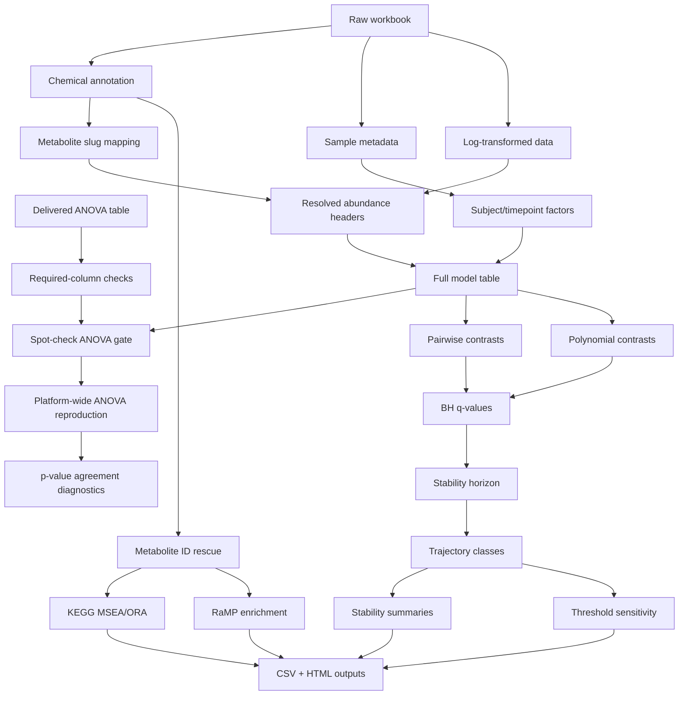

# Architecture

## System Shape

This project is a Quarto-based analytical validation system for metabolomics storage stability. It has three main layers:

1. Data ingestion and schema validation from a vendor workbook.
2. Statistical reproduction and stability classification.
3. Pathway interpretation and decision-rule sensitivity testing.

The main architectural feature is that statistical interpretation is gated by reproducibility checks. The notebook does not jump directly from workbook to biological conclusions; it first proves that the local ANOVA specification can reproduce delivered statistics.

## Data Flow

## Component Responsibilities

| Component | Responsibility |
|---|---|
| `reports/ssid1_analysis.qmd` | Main storage-stability analysis, validation gates, classification, pathway enrichment, outputs |
| `reports/ssid1_threshold_sensitivity.qmd` | Alternative threshold rules for testing stability-call robustness |
| `reports/ssid1_analysis.html` | Rendered self-contained report for review |
| `reports/trajectory_exemplars.png` | Derived figure illustrating trajectory classes |
| `figures/` | Placeholder for generated presentation figures |
| `results/` | Placeholder for generated CSV outputs, ignored by Git |
| `.gitignore` | Privacy and data hygiene boundaries |

## Testing Layer

The testing layer is embedded in the analysis:

- File existence checks block missing private inputs.
- Required-column checks block workbook schema drift.
- Duplicate metabolite slug checks block ambiguous joins.
- Header-resolution checks block unmapped abundance columns.
- Spot-check ANOVA blocks downstream scale-up if the model does not reproduce delivered statistics.
- Platform-wide correlation diagnostics test whether the model holds across all metabolites.
- Threshold-sensitivity notebooks test the robustness of stability decisions.
- `tryCatch` prevents one failed metabolite or enrichment call from crashing the entire report without trace.

## Boundary Conditions

Important boundaries:

- Raw and processed data are not committed.
- Rendered HTML can be reviewed without requiring direct access to raw workbook files.
- External database behavior is partly controlled by version pinning and package-shape diagnostics.
- The notebook is private-data dependent, so future CI requires synthetic fixtures.

## Why This Architecture Works

The design treats scientific assumptions as testable gates. Each major conclusion depends on a prior check: workbook schema, identifier resolution, model reproduction, q-value/effect-size decision rules, and threshold sensitivity.
