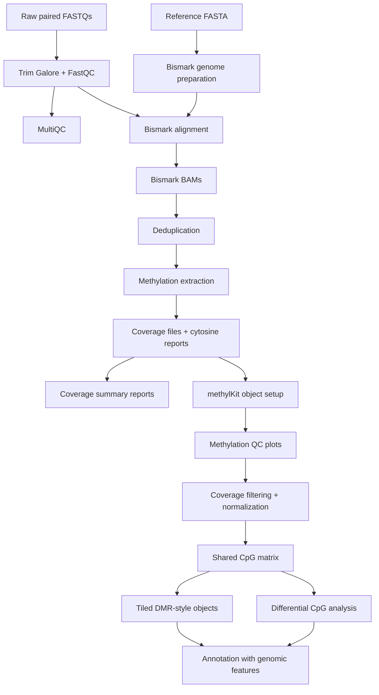

# Whole-Genome-Bisulfite-Sequencing-Pipeline

> Modular SLURM workflow for whole-genome bisulfite sequencing preprocessing, Bismark alignment, CpG methylation extraction, QC reporting, and differential methylation analysis.

## Overview

`Whole-Genome-Bisulfite-Sequencing-Pipeline` is a research-oriented WGBS pipeline for turning paired-end bisulfite sequencing reads into methylation calls, quality-control summaries, and differential methylation analysis artifacts.

The project is organized as a set of independent SLURM modules backed by shared shell and R configuration files. The shell side handles FASTQ trimming, reference indexing, Bismark alignment, duplicate removal, methylation extraction, and coverage summaries. The R side turns Bismark coverage files into methylKit objects, creates QC plots, filters and normalizes CpG methylation data, builds tiled regions for DMR-style analysis, and annotates significant CpGs or regions with gene features.

## Table Of Contents

- [Problem Statement](#problem-statement)
- [Features](#features)
- [Access And Getting Started](#access-and-getting-started)
- [Tech Stack](#tech-stack)
- [Architecture](#architecture)
- [Pipeline And Workflow](#pipeline-and-workflow)
- [Project Structure](#project-structure)
- [Configuration](#configuration)
- [Testing And Validation](#testing-and-validation)
- [Security And Privacy](#security-and-privacy)
- [Key Design Decisions](#key-design-decisions)
- [Tradeoffs](#tradeoffs)
- [What I Learned](#what-i-learned)
- [Next Improvements](#next-improvements)
- [Contribution Model](#contribution-model)
- [License](#license)
- [Acknowledgements](#acknowledgements)
- [Author](#author)
- [Links](#links)

## Problem Statement

Whole-genome bisulfite sequencing is powerful because it measures DNA methylation at nucleotide resolution, but the workflow is operationally demanding. Each run involves large FASTQ files, bisulfite-aware reference preparation, special alignment assumptions, PCR duplicate handling, CpG/CHG/CHH methylation extraction, per-sample coverage evaluation, statistical filtering, and biological annotation.

The pipeline decomposes that into explicit stages:

1. Configure project paths, reference assets, tool paths, sample counts, SLURM resources, methylKit parameters, and annotation inputs.
2. Trim adapters and low-quality bases from paired-end reads with Trim Galore while running FastQC.
3. Aggregate raw and trimmed read QC with MultiQC.
4. Prepare a Bismark-compatible bisulfite genome reference.
5. Align bisulfite-converted reads with Bismark using either HISAT2 or Bowtie2 support.
6. Deduplicate aligned BAM files with Bismark duplicate handling.
7. Extract CpG methylation calls, cytosine reports, and bedGraph-style outputs.
8. Build coverage summaries across CpG thresholds and chromosomes.
9. Load Bismark coverage outputs into methylKit.
10. Generate methylation and coverage QC plots.
11. Filter, normalize, unite shared CpG loci, optionally remove SNP-overlapping CpGs, and create tiled regions.
12. Annotate differential CpGs or DMR-like regions against genomic features.

## Features

- Modular SLURM scripts grouped by pipeline stage.
- Central shell configuration for project paths, output paths, tool paths, resource defaults, array settings, and Bismark/Trim Galore parameters.
- Central R configuration for methylKit, filtering, tiling, annotation, metadata, and output directories.
- Paired-end trimming with Trim Galore, Cutadapt, and FastQC.
- MultiQC aggregation for QC reports.
- Bismark genome preparation for bisulfite-aware reference indexing.
- Bismark alignment with configurable HISAT2 or Bowtie2 behavior.
- SLURM arrays for sample-parallel alignment, deduplication, and methylation extraction.
- Deduplication of aligned BAM files before methylation calling.
- Methylation extraction with gzip, bedGraph, cytosine report, and paired/single-end detection.
- Coverage reporting across 1x, 5x, 10x, 15x, and 30x CpG thresholds.
- methylKit object creation from Bismark coverage files.
- Per-sample methylation and coverage summaries.
- QC plots for methylation distributions, coverage distributions, correlations, clustering, and PCA.
- Coverage filtering, coverage normalization, shared CpG unification, SD-based variability filtering, and optional SNP-overlap filtering.
- Tiled methylation objects for DMR-style analysis.
- Genomic annotation of significant CpGs or regions using GenomicRanges and rtracklayer.
- Legacy analysis script preserved separately for audit/context while the modular workflow evolves.

## Access And Getting Started

Source repo: [aa9gj/Whole-Genome-Bisulfite-Sequencing-Pipeline](https://github.com/aa9gj/Whole-Genome-Bisulfite-Sequencing-Pipeline)

Typical setup:

```bash
git clone git@github.com:aa9gj/Whole-Genome-Bisulfite-Sequencing-Pipeline.git
cd Whole-Genome-Bisulfite-Sequencing-Pipeline
```

Configure the shell and R settings:

```bash
nano config/config.sh
nano config/config.R
```

Prepare the reference and run modules in order:

```bash
sbatch modules/01_reference/index_reference.slurm
sbatch modules/00_QC/trimgalore.slurm
sbatch modules/00_QC/multiqc.slurm
sbatch modules/02_alignment/bismark_align.slurm
sbatch modules/03_deduplication/deduplicate.slurm
sbatch modules/04_methylation/extract_methylation.slurm
sbatch modules/05_reports/coverage_report.slurm
```

Run the R analysis scripts after methylation extraction:

```bash
Rscript modules/06_post_processing/step0_setup_differential_methylation.R
Rscript modules/06_post_processing/step1_methylation_QC.R
Rscript modules/06_post_processing/step2_methylation_filtering.R
Rscript modules/06_post_processing/step3_annotate_cpgs.R
```

## Tech Stack

| Area | Stack |
|---|---|
| Orchestration | Bash, SLURM, SLURM array jobs |
| Configuration | `config/config.sh`, `config/config.R` |
| Read trimming/QC | Trim Galore, Cutadapt, FastQC |
| QC aggregation | MultiQC |
| Reference preparation | Bismark genome preparation, HISAT2 or Bowtie2 backing index |
| Alignment | Bismark |
| BAM processing | Bismark deduplication, SAMtools |
| Methylation extraction | Bismark methylation extractor |
| Coverage reporting | Bash, awk, bedtools-style coverage summaries |
| Differential methylation | R, methylKit |
| Genomic intervals/annotation | GenomicRanges, genomation, rtracklayer |
| Visualization | ggplot2, methylKit plotting utilities |
| Data handling | data.table, tidyverse, dplyr, tidyr, matrixStats |

Deeper stack notes: [stack.md](stack.md).

## Architecture



The architecture intentionally separates cluster execution from statistical post-processing. That keeps the high-memory file transformations in SLURM while allowing the methylation modeling and annotation steps to evolve in R.

Full architecture notes: [architecture.md](architecture.md).

## Pipeline And Workflow

| Stage | Purpose |
|---|---|
| Configuration | Define project paths, references, sample counts, resources, methylKit settings, and annotation inputs |
| FASTQ QC/trimming | Remove adapters and low-quality sequence while producing FastQC output |
| MultiQC | Aggregate read-level QC reports |
| Reference preparation | Build Bismark bisulfite genome indexes |
| Alignment | Map bisulfite-converted paired-end reads with Bismark |
| Deduplication | Remove PCR duplicates from Bismark BAMs |
| Methylation extraction | Generate CpG methylation coverage files, bedGraph files, and cytosine reports |
| Coverage reporting | Summarize CpG coverage thresholds and per-chromosome methylation/coverage |
| methylKit setup | Load coverage files, map samples to metadata/treatment labels, and save raw methylKit objects |
| Methylation QC | Produce per-sample coverage, methylation, boxplot, and QC-summary outputs |
| Filtering/normalization | Filter coverage, normalize, unite CpGs across samples, filter low-variance CpGs, optionally remove SNP-overlapping CpGs |
| DMR preparation | Tile methylation counts into genomic windows |
| Annotation | Attach genomic feature context to significant CpGs or DMR-style regions |

Full pipeline notes: [pipelines.md](pipelines.md).

## Project Structure

The source repo uses stage-numbered module directories:

- `config/` central shell and R configuration.
- `modules/00_QC/` trimming and MultiQC.
- `modules/01_reference/` Bismark reference preparation.
- `modules/02_alignment/` Bismark alignment.
- `modules/03_deduplication/` duplicate removal.
- `modules/04_methylation/` methylation extraction.
- `modules/05_reports/` coverage and methylation reporting utilities.
- `modules/06_post_processing/` methylKit QC, filtering, DMR preparation, and annotation.
- `legacy/` earlier methylKit analysis script kept for historical context.

Detailed project map: [project-structure.md](project-structure.md).

## Configuration

The main configuration surfaces are:

- `PROJECT_DIR`
- `GENOME_REF_DIR`
- `OUTPUT_DIR`
- `NUM_SAMPLES`
- `MAX_CONCURRENT_ALIGNMENT`
- `MAX_CONCURRENT_DEDUP`
- `MAX_CONCURRENT_EXTRACTION`
- `BISMARK_ALIGNER`
- `BISMARK_PARALLEL`
- `TRIM_QUALITY`
- `TRIM_LENGTH`
- `IGNORE_R2`
- `config$genome_assembly`
- `config$gtf_file`
- `config$sample_sheet`
- `config$metadata_file`
- `config$methylkit`
- `config$filtering`
- `config$tiling`
- `config$diff_meth`
- `config$annotation`

The configuration files make the workflow portable across datasets while keeping the defaults visible enough for review.

## Testing And Validation

The repo emphasizes runtime validation in the module scripts:

- Missing FASTQ, BAM, deduplicated BAM, reference, and coverage inputs fail early.
- Placeholder config paths are detected before expensive jobs run.
- Tool commands are checked before execution.
- SLURM array scripts resolve one file per task and validate file existence.
- R scripts check required packages, readable coverage files, empty files, output directories, and object handoff between steps.

The next validation step would be adding a tiny public WGBS fixture plus automated smoke tests for config parsing, coverage-summary generation, and R post-processing on a reduced coverage file.

## Security And Privacy

WGBS files can expose sample identifiers, study metadata, organism context, genomic coordinates, and large derived genomic artifacts. The public portfolio case study focuses on architecture and workflow decisions, not private data or result values.

Full notes: [security-privacy.md](security-privacy.md).

## Key Design Decisions

| Decision | Rationale |
|---|---|
| Use Bismark for alignment and methylation extraction | Bismark is a standard WGBS tool and preserves bisulfite-specific assumptions across reference prep, alignment, deduplication, and extraction |
| Keep SLURM modules stage-specific | Makes long-running jobs resumable, inspectable, and easier to rerun from the last completed stage |
| Split shell config and R config | Separates cluster/file-processing concerns from statistical modeling and annotation parameters |
| Use methylKit for downstream methylation analysis | Provides mature abstractions for coverage filtering, normalization, CpG unification, differential methylation, and QC plotting |
| Produce coverage reports before statistical modeling | Coverage quality drives whether methylation calls are reliable enough for downstream inference |
| Preserve legacy analysis separately | Keeps historical analysis context available without turning the modular workflow into a single ad hoc script |

## Tradeoffs

- Modular SLURM scripts are transparent and cluster-friendly, but they do not provide automatic DAG scheduling or resumability like Nextflow or Snakemake.
- Bismark is well established for WGBS, but it is resource-intensive for large genomes and deep cohorts.
- Supporting HISAT2 or Bowtie2 through configuration improves portability, but different aligners can affect performance and comparability.
- methylKit is practical and interpretable, but very large whole-genome methylation matrices can pressure R memory.
- Stage-by-stage file lists are easy to audit, but they require careful bookkeeping between modules.
- Annotation logic is powerful but depends heavily on the quality and compatibility of the provided GTF/GFF reference.

## What I Learned

- How WGBS differs from regular DNA-seq or RNA-seq at the alignment and methylation-calling layers.
- How to design cluster jobs around high-memory, long-running genomic transformations.
- How CpG coverage, methylation distribution, and sample clustering drive downstream trust.
- How to turn Bismark outputs into methylKit objects for statistical methylation analysis.
- How to structure methylation filtering around coverage, variability, shared loci, and optional SNP overlap.
- How to connect differential CpGs or regions back to genomic feature annotations.

## Next Improvements

- Add a minimal public fixture dataset for smoke testing.
- Add automated checks for shell config validation and coverage-report parsing.
- Convert hard-coded legacy paths in exploratory R scripts into config-driven inputs.
- Add a workflow runner or makefile that records stage dependencies while preserving manual SLURM control.
- Add container or Conda environment files for the shell tools and R package stack.
- Add example sample sheets and metadata templates.
- Document expected output file naming conventions between stages.

## Contribution Model

This is a personal research pipeline. Contributions should focus on reproducibility, parameterization, small test fixtures, clearer setup docs, and additional validation rather than dataset-specific logic.

## License

The source repository README lists the project as MIT licensed.

## Acknowledgements

The pipeline builds on widely used genomics tools including Bismark, Trim Galore, FastQC, MultiQC, SAMtools, methylKit, GenomicRanges, and rtracklayer.

## Author

Arby Abood

## Links

- Source repository: [aa9gj/Whole-Genome-Bisulfite-Sequencing-Pipeline](https://github.com/aa9gj/Whole-Genome-Bisulfite-Sequencing-Pipeline)
- Portfolio index: [../../README.md](../../README.md)
