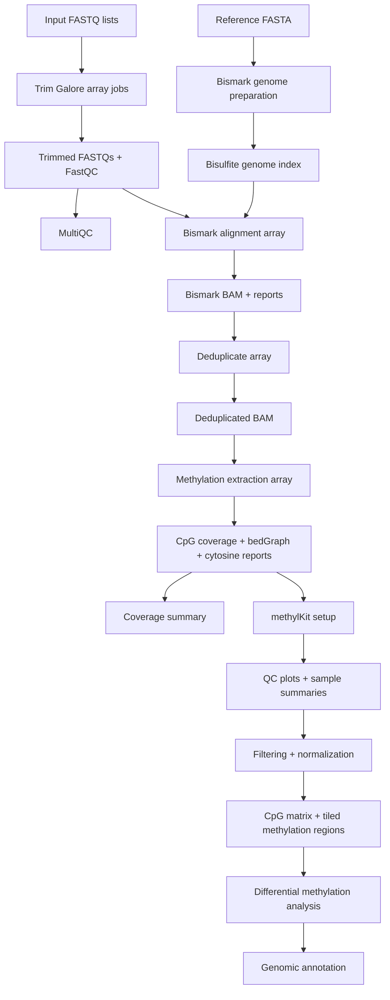

# Architecture

`Whole-Genome-Bisulfite-Sequencing-Pipeline` is organized around a clear split between HPC file-processing modules and R-based methylation analysis.

## System Shape

## Layer Responsibilities

| Layer | Responsibility |
|---|---|
| Configuration | Centralize project paths, reference paths, tool paths, SLURM resources, sample counts, methylKit settings, filtering thresholds, and annotation parameters |
| SLURM modules | Run large file transformations as resumable stage-specific jobs |
| Bismark toolchain | Handle bisulfite-aware reference preparation, alignment, duplicate removal, and methylation extraction |
| Reporting utilities | Summarize coverage and methylation extraction outputs into human-readable TSVs |
| R post-processing | Convert coverage files into analysis objects, perform QC, filter/normalize methylation data, create tiled windows, and annotate findings |
| Legacy analysis | Preserve exploratory or historical methylation analysis without blocking the cleaner modular workflow |

## Data Flow

1. Users create input file lists for paired FASTQs.
2. Trim Galore reads those lists through SLURM array tasks and writes trimmed FASTQs plus FastQC reports.
3. MultiQC aggregates the QC output.
4. Bismark genome preparation builds the bisulfite reference index.
5. Bismark alignment maps trimmed reads to the prepared reference.
6. Deduplication removes likely PCR duplicates from Bismark BAM files.
7. Methylation extraction emits CpG methylation coverage, bedGraph, and cytosine-report files.
8. Coverage reporting summarizes total CpGs and depth thresholds per sample and chromosome.
9. R scripts load coverage files into methylKit, create QC plots, normalize and filter data, build tiled objects, and annotate significant CpGs or DMR-style regions.

## Why This Architecture Works

WGBS analysis has a natural boundary between heavy sequence processing and statistical methylation analysis. The shell/SLURM layer handles large files, long wall times, and cluster scheduling. The R layer handles tabular methylation matrices, metadata, QC visualization, and genomic ranges.

That split makes the work easier to debug. If alignment fails, the user can inspect Bismark reports and SLURM logs. If statistical analysis looks odd, the user can inspect methylKit objects, coverage plots, PCA, clustering, or annotation results without rerunning FASTQ processing.

## Important Design Constraints

- WGBS alignment is not interchangeable with ordinary DNA-seq alignment because bisulfite conversion changes the read/reference matching problem.
- Methylation calls are only useful if coverage and conversion-specific QC are acceptable.
- Sample metadata must be mapped carefully into treatment/group labels before differential methylation analysis.
- R memory usage can become the limiting factor when many whole-genome CpGs are united across samples.
- Annotation quality depends on matching genome assembly, chromosome names, and GTF/GFF feature definitions.

## Failure Boundaries

| Boundary | Failure Mode | Mitigation In Repo |
|---|---|---|
| Input lists | Array task points to missing FASTQ/BAM | Per-task file existence checks |
| Reference prep | Alignment starts before Bismark index exists | Alignment script checks for `Bisulfite_Genome` |
| Tool setup | Tools are absent from `PATH` or configured paths | Scripts verify commands before running |
| Methylation extraction | Paired/single-end flag mismatch | Extractor infers paired-end mode from BAM naming |
| Coverage files | Empty or missing Bismark coverage output | R setup validates file count, readability, and size |
| Metadata | Sample metadata not available | R setup can generate default sample IDs, while warning that treatment assignments need review |
| Annotation | Reference annotation path or assembly mismatch | R config exposes genome assembly and GTF path as explicit parameters |

## Interview Signal

This project shows:

- Decomposition of a complex epigenomics workflow into auditable stages.
- Practical HPC scripting with resource-aware SLURM arrays.
- Awareness of WGBS-specific processing needs.
- Understanding of methylation-specific QC and statistical preprocessing.
- Ability to bridge command-line bioinformatics and R/Bioconductor analysis.
- Sensible separation of reusable workflow code from dataset-specific metadata.
