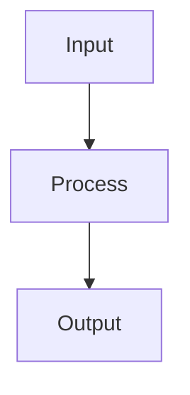

# Project Folder Template

Use this template as the `README.md` inside `projects/project-name/`.

# Project Name

> One-sentence project tagline.

## Snapshot

Short description of what the project does and who it is for.

## Problem Statement

What specific pain point or workflow problem does this solve?

## Goals

- Goal 1
- Goal 2
- Goal 3

## Features

- Feature 1
- Feature 2
- Feature 3

## Access And Getting Started

How can someone view, run, or review this project?

```bash
# Example setup commands, if applicable
```

## Non-Goals

- What the project intentionally avoids.
- What is out of scope for this version.

## Stack

| Layer | Tools |
|---|---|
| Language/runtime |  |
| Frontend |  |
| Backend |  |
| Data/storage |  |
| APIs/integrations |  |
| Testing |  |
| CI/CD |  |
| Deployment |  |

## Architecture



## Key Components

| Component | Responsibility |
|---|---|
| `component` | What it owns |

## Pipelines

| Pipeline | Purpose |
|---|---|
| Runtime |  |
| CI/CD |  |
| Data/maintenance |  |

## Key Design Decisions

| Decision | Rationale |
|---|---|
|  |  |

## Tradeoffs

- Tradeoff 1
- Tradeoff 2

## What I Learned

- Learning 1
- Learning 2

## Interview Talking Points

- "Short explanation of an engineering decision."
- "Short explanation of a tradeoff."

## Next Improvements

- Improvement 1
- Improvement 2

## Contribution Model

Who can contribute, and what kind of contributions make sense?

## License

Project license and any important usage limits.

## Acknowledgements

People, datasets, APIs, libraries, or references worth crediting.

## Author

Name and optional contact/profile links.

## Links

- Repo:
- Live demo:
- Screenshots:

## Suggested Supporting Files

For larger projects, add these files beside the project `README.md`:

- `architecture.md`: system context, data flow, components, diagrams.
- `pipelines.md`: runtime, CI/CD, data, maintenance, and release workflows.
- `stack.md`: language, frameworks, APIs, infrastructure, testing, deployment.
- `security-privacy.md`: secrets, personal data, access control, operational risks.
- `project-structure.md`: source tree and ownership map.
- `screenshots/`: images, diagrams, or redacted product screenshots.
